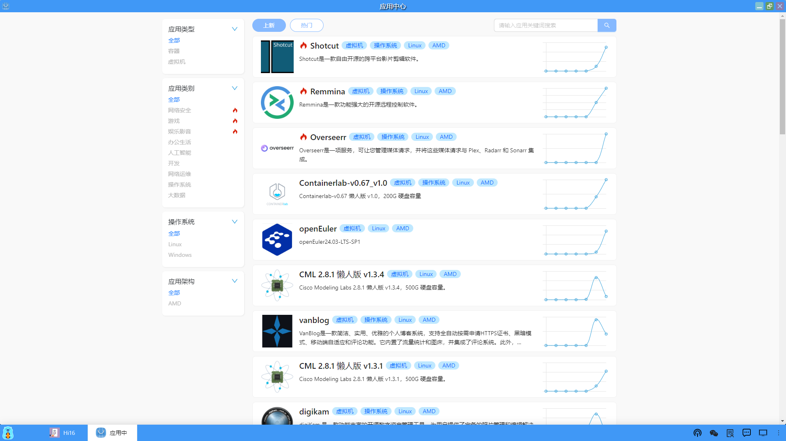

### 应用列表
点击进入“应用中心”，应用中心中展现了所有各种类型的应用列表，是深算工场应用模版的展现区，默认显示的是最新上线的应用，也可以显示当前的热门应用。在页面的左侧是根据不同标签进行应用分类，包括如下：

#### 1、应用类型
<li>容器</li>
<li>虚拟机</li>

#### 2、应用类别
<li>网络安全</li>

<li>游戏</li>

<li>娱乐影音</li>

<li>办公生活</li>

<li>人工智能</li>

<li>开发</li>

<li>网络运维</li>

<li>操作系统</li>

<li>大数据</li>

#### 3、操作系统
<li>Linux</li>

<li>Windows</li>

#### 4、应用架构
<li>AMD</li>

用户可以根据不同的标签进行筛选查找相关的应用，也可以通过搜索框输入关键字进行查找应用。
在应用列表中会是实时更新最新和最热门的应用，供用户选择使用。