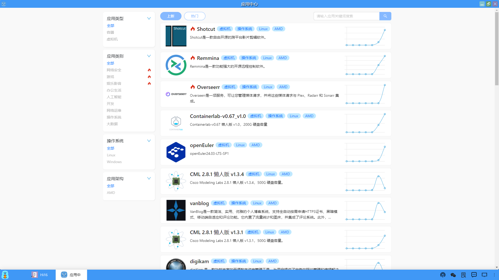

### 应用列表
点击进入“应用中心”，应用中心中展现了所有各种类型的应用列表，是Hi168平台应用模版的展现区，根据不同标签进行分类，包括如下：

#### 1、应用类型
（1）容器

（2）虚拟机

#### 2、应用类别
（1）网络安全

（2）游戏

（3）娱乐影音

（4）办公生活

（5）人工智能

（6）开发

（7）网络运维

（8）操作系统

（9）大数据

#### 3、操作系统
（1）Linux

（2）Windows

#### 4、应用架构
（1）AMD

用户可以根据不同的标签进行筛选查找相关的应用，也可以通过搜索框输入关键字进行查找应用。
在应用列表中会是实时更新最新和最热门的应用，供用户选择使用。