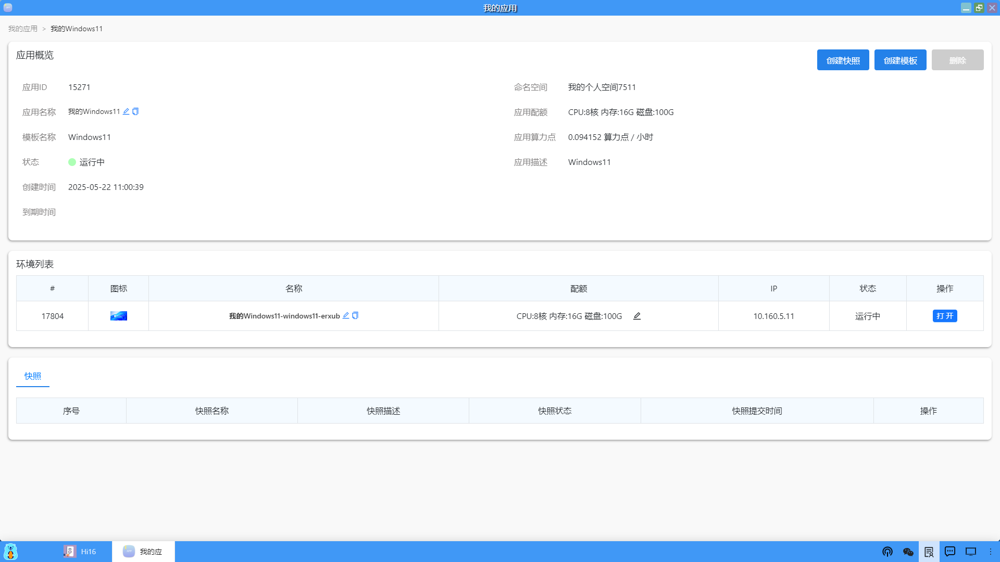
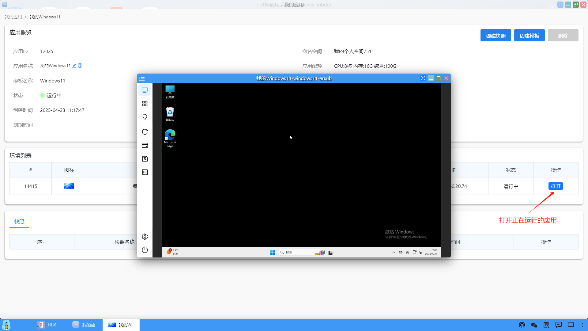

### 应用详情
点击某个运行的应用，进入到这个应用的详情页面，在此页面上，用户可以进行很多操作，包括：应用信息概览、修改名称、修改配额、打开应用、创建/回滚/删除快照、创建模板、删除应用等。

#### 1、应用概览
在应用概览中，可以显示应用的ID、应用名称、模板名称、状态、创建时间、到期时间、命名空间、应用配额、应用算力点、应用描述，以及对应的环境列表和快照等信息。其中，应用名称、环境名称和配额可以点击修改。

#### 2、打开应用
在应用详情页面中，用户也可以直接打开正在运行的应用。

