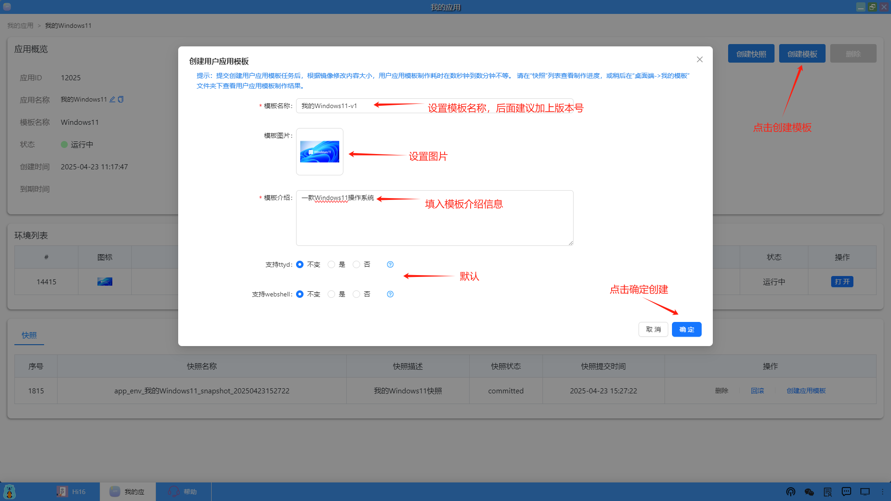
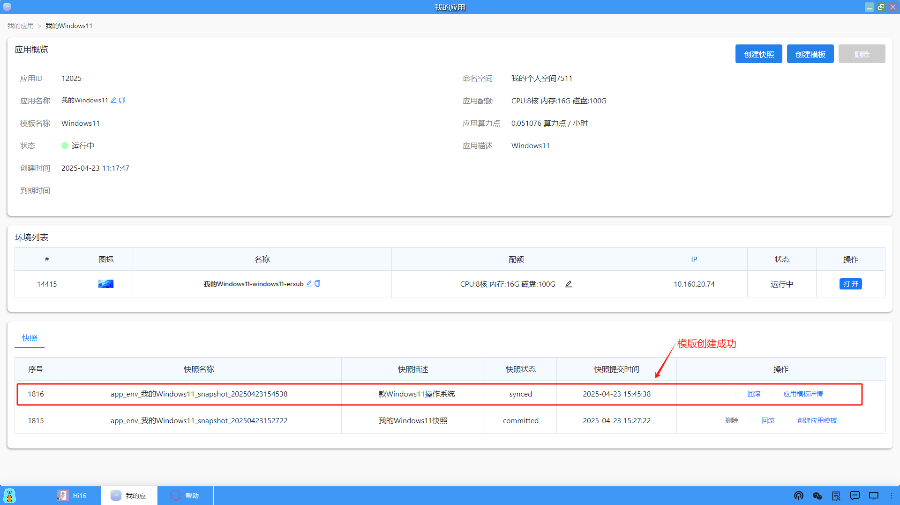
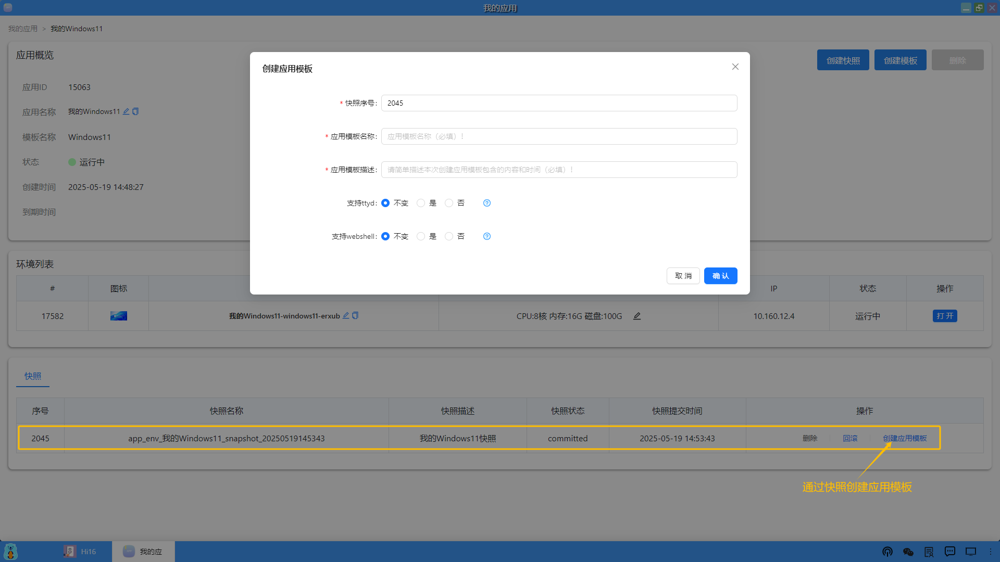

### 创建模板
同样在应用详情页面中，为用户提供了创建模板（template）的功能。用户可以将当前应用的状态和设置保存为模板，以便将来快速创建相似的环境。创建模板可以通过应用和快照两种方式创建，流程都一样，通过快照创建模板的方式，速度会更快一些。

#### 1、通过应用创建模板
**<li>进入应用</li>**
在我的应用概览界面中，找到并点击 “创建模板”，打开 “创建用户应用模板” 窗口。

**<li>填写模板名称</li>**
在 “模板名称” 输入框中，输入一个能标识该模板的名称，必填项。

**<li>上传模板图片（可选）</li>**
若希望为模板添加展示图片，点击 “上传图片” 按钮，从本地选择合适的图片文件进行上传。图片有助于更直观地识别模板用途。

**<li>填写模板介绍</li>**
在 “模板介绍” 文本框中，输入对该模板的详细描述，如模板基于的应用环境、包含的软件、适用场景等信息，必填项。方便后续使用者了解模板内容。

**<li>设置功能支持选项</li>**
（1）支持 ttyd：根据需求选择 “不变”“是”“否” 。“不变” 表示沿用默认设置；“是” 表示模板支持 ttyd 功能；“否” 表示不支持。

（2）支持 webshell：同样根据需求选择 “不变”“是”“否” 。“不变” 沿用默认；“是” 开启 webshell 功能支持；“否” 关闭。

**<li>确认创建</li>**
（1）检查填写的各项信息无误后，点击 “确定” 按钮提交创建任务。系统会根据镜像修改内容大小进行处理，制作时间可能从数秒到数分钟不等。可在 “快照” 列表查看制作进度，制作完成后，前往 “桌面端 -> 我的模板” 文件夹下查看用户应用模板制作结果。

（2）模板创建成功后，会生成一条记录，同样包括快照名称、快照描述、快照状态、快照提交时间、快照操作（回滚、应用模板详情查看）。

（3）模板创建成功后，用户可以从桌面上进入"我的模板"，可以看到创建成功的模板信息。

#### 2、通过快照创建模板
同样可以通过快照创建应用模板，除了无需提供模版图片，其它流程和上述是相同的。

