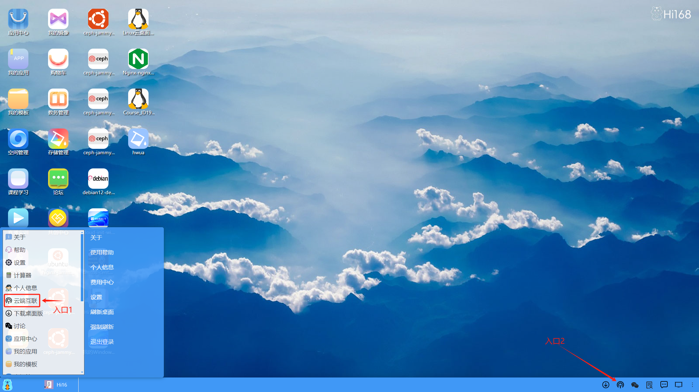
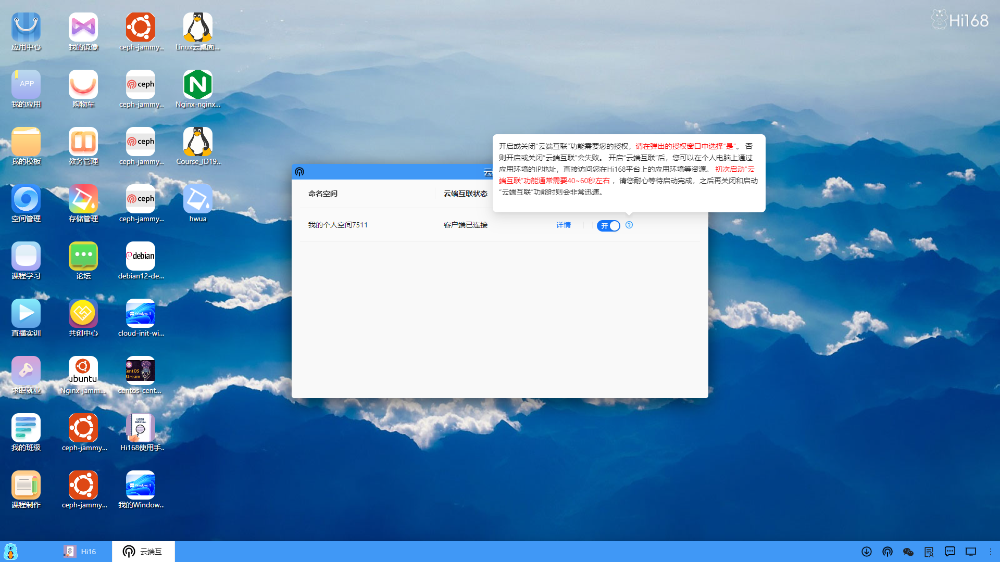
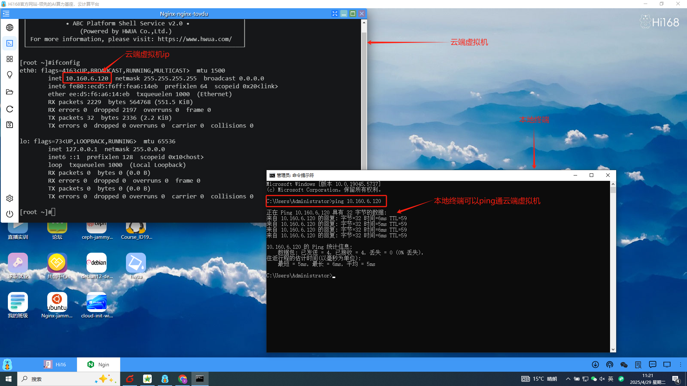
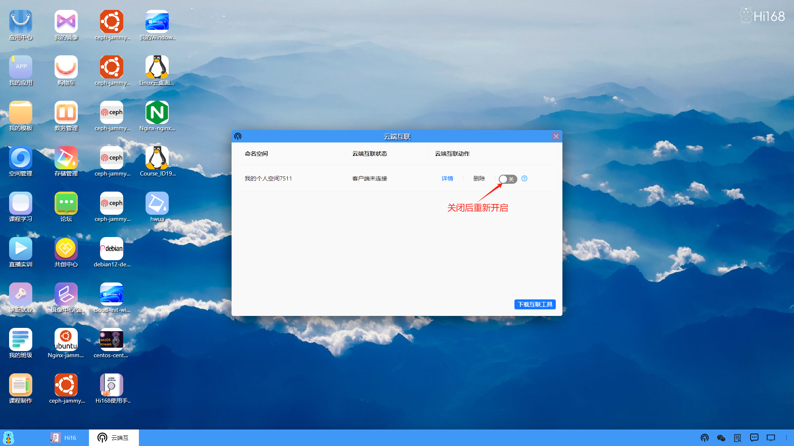
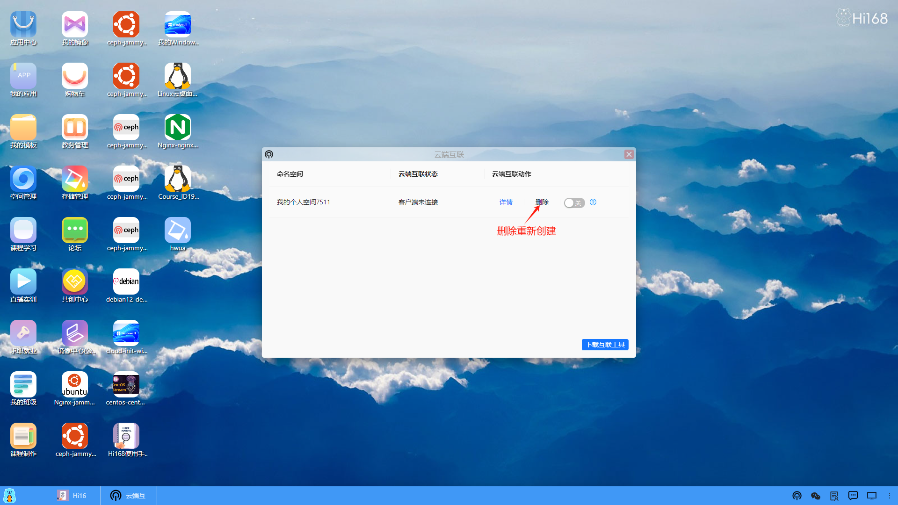
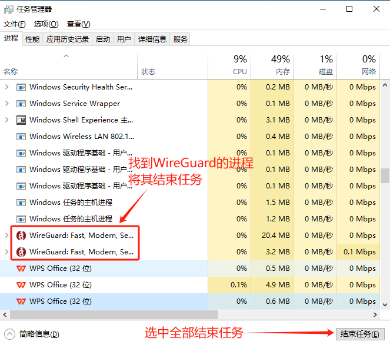

### 默认方式
进入“存储管理”，显示当前用户的存储桶列表，包括存储桶的名称、类型、操作时间等信息。

#### 云端互联不通的解决方式：
##### 1、关闭重新开启

##### 2、删除重新创建（若步骤1无效）

##### 3、任务管理器杀掉相关进程（若步骤2也无效）
<li>先按步骤1和2关闭删除，然后在本地计算机启动任务管理器找到对应的进程将其杀掉。</li>

<li>然后重新创建启动</li>