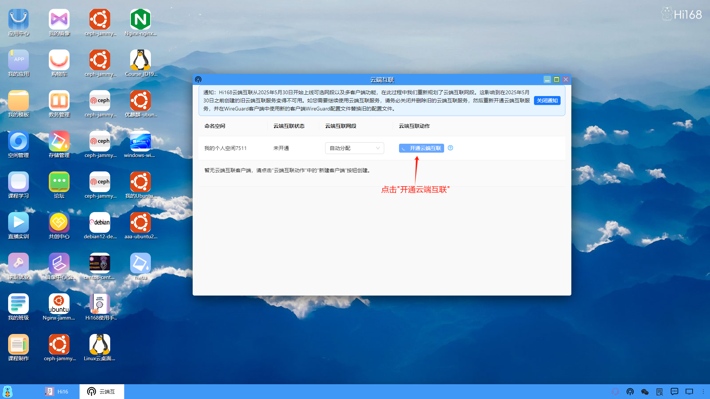
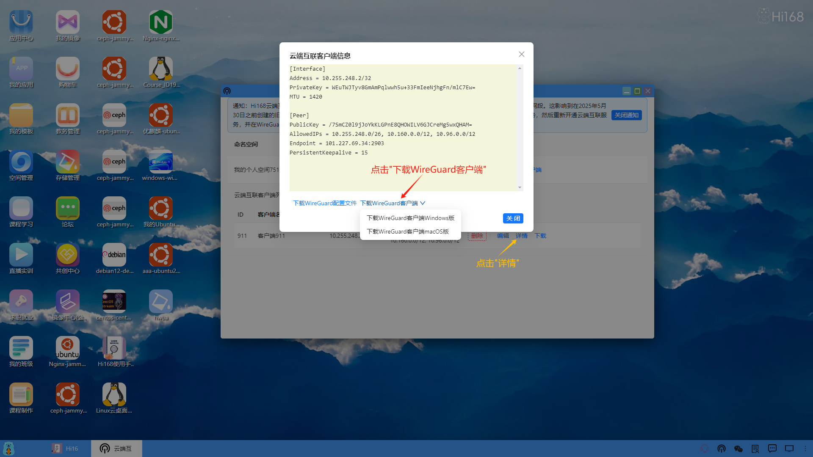

### 默认方式
开启云端互联默认会启动一个WireGuard的VPN服务，帮助用户在本地和云端建立一个虚拟的VPN隧道。

<li>两种方式进入云端互联</li>

<li>打开云端互联开关（默认已开启）</li>

<li>获取云端虚拟机ip（也可以通过服务端口中的网络信息获取），打开本地的命令终端（搜索框输入cmd后打开命令提示符），ping一下云端虚拟机的ip，是否互通。</li>

#### 云端互联不通的解决方式：
##### 1、关闭重新开启

##### 2、删除重新创建（若步骤1无效）

##### 3、任务管理器杀掉相关进程（若步骤2也无效）
<li>先按步骤1和2关闭删除，然后在本地计算机启动任务管理器找到对应的进程将其杀掉。</li>

<li>然后重新创建启动</li>