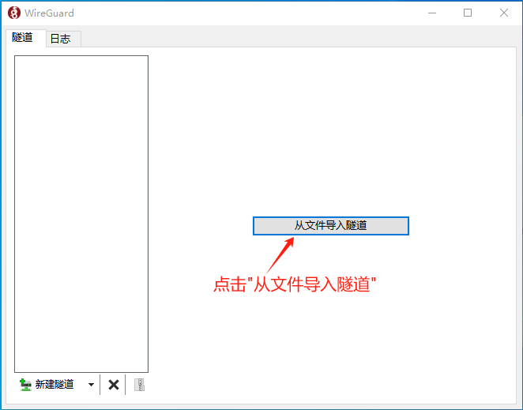
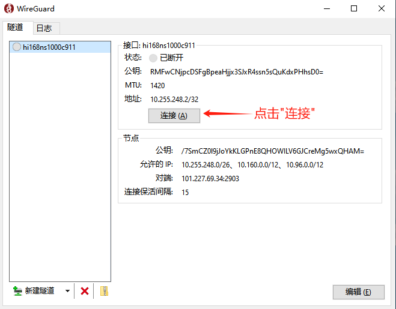

###  下载互联工具
针对较专业人士，可以自行下载安装VPN工具WireGuard进行个性化的配置和使用。 
#### 注意：采用此种方式，就不能采用默认方式开启云端互联，否则会产生冲突。

##### 1、官网下载WireGuard

##### 2、安装使用
（1）点击“详情”按钮，再点击“下载云端互联配置文件”将VPN配置文件下载到本地。

（2）双击下载好的安装包“wireguard-installer.exe”，它将自动完成安装。

（3）打开WireGuard软件，点击“从文件导入隧道”。

（4）选择下载好的配置文件，点击“打开”。

（5）再点击“连接”，状态将变为“已连接”。

这样与云端就建立好了VPN隧道，可以进行云端互联了。