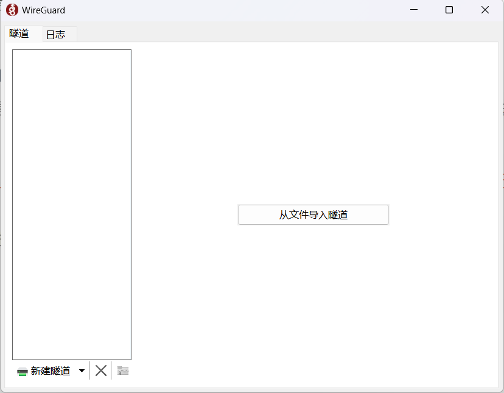

###  下载互联工具
进入“存储管理”，显示当前用户的存储桶列表，包括存储桶的名称、类型、操作时间等信息。

#### 下载互联工具（可选方式，针对较专业人士使用）
##### 1、官网下载WireGuard

##### 2、安装使用
（1）点击“详情”按钮，再点击“下载云端互联配置文件”将VPN配置文件下载到本地。

（2）双击下载好的安装包“wireguard-installer.exe”，它将自动完成安装。

（3）打开WireGuard软件，点击“从文件导入隧道”。

（4）选择下载好的配置文件，点击“打开”。

（5）再点击“连接”，状态将变为“已连接”。

这样与云端就建立好了VPN隧道，可以进行云端互联了。