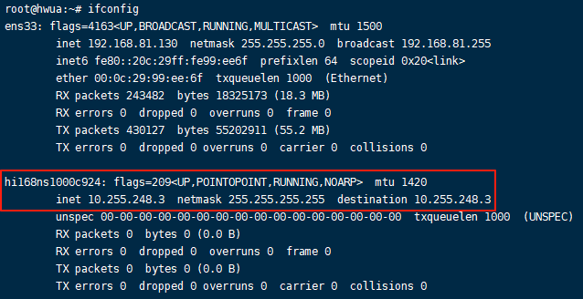
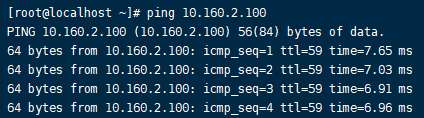

###  多客户端
云端互联可以创建多个客户端，可以是不同的操作系统终端，比如：Ubuntu、CentOS、MacOS，或者其它任何的智能终端，只要在客户端安装WireGuard，和云端打通VPN隧道，就可以实现万物互联。下面我们就以Ubuntu和CentOS作为两个不同的客户端来进行云端互联。

#### 1、准备环境
（1）首先，我们需要再新建两个客户端，分配两个不同的IP地址，用于Ubuntu和CentOS。新建完毕后，将两个客户端对应的WireGuard配置文件下载到本地，后面要分别上传到Ubuntu和CentOS中。

（2）然后，我们在本地Windows系统中使用VMware启动两个虚拟机，分别安装了Ubuntu和CentOS两种操作系统，这里的环境已经准备好了。
<li>Ubuntu: 这里以Ubuntu 22.04为例，虚拟机IP：192.168.81.130</li>

<li>CentOS：这里以CentOS 8.5为例，虚拟机IP：192.168.81.129</li>

（3）为了使用方便，我们利用SSH客户端分别连接到这两个虚拟机，如下。

下面我们就来具体介绍一下如何在Ubuntu和CentOS中使用WireGuard。

#### 2、Ubuntu使用WireGuard
（1）Ubuntu中任何版本安装WireGuard很简单，执行如下命令即可。

    apt install wireguard -y

（2）安装成功后，在/etc目录下面会自动新建一个wireguard目录，然后将之前下载的配置文件（客户端IP：10.255.248.3）上传到/etc/wireguard目录中。

（3）启动WireGuard连接，执行如下命令。

    wg-quick up hi168ns1000c924

（4）查看WireGuard连接状态，执行如下命令。

    wg

此时，多了一块WireGuard网卡。

（5）ping一下单客户端中使用的虚拟机IP(10.160.2.100)和分配的客户端911的IP(10.255.248.2)

全部可以互通。

#### 3、CentOS使用WireGuard
（1）由于WireGuard在CentOS的安装，对于内核版本比较高，CentOS 8.5及以下的内核版本比较低，需要额外安装内核的升级组件，安装命令如下。

    yum install yum-utils epel-release -y
    yum-config-manager --setopt=centosplus.includepkgs="kernel-plus, kernel-plus-*" --setopt=centosplus.enabled=1 --save
    sed -e 's/^DEFAULTKERNEL=kernel-core$/DEFAULTKERNEL=kernel-plus-core/' -i /etc/sysconfig/kernel
    yum install kernel-plus wireguard-tools -y
    reboot

（2）安装完毕要重启一下虚拟机，我们按此命令执行即可。安装成功后在/etc目录下自动生成一个wireguard的目录。

（3）将之前下载的配置文件（客户端IP：10.255.248.4）上传到/etc/wireguard目录中。

（4）启动WireGuard连接，执行如下命令。

    wg-quick up hi168ns1000c925

（5）查看WireGuard连接状态，执行如下命令。

    wg

此时，多了一块WireGuard网卡。

（6）ping一下单客户端中使用的虚拟机IP(10.160.2.100)和分配的客户端911的IP(10.255.248.2)及客户端924的IP(10.255.248.3)

全部可以互通。

（7）CentOS由于8.5及之前的版本不进行维护了，新的官方维护的版本从 CentOS Stream 9开始，因此在不同版本中安装WireGuard是有区别的。

<li>在CentOS Stream 9及以后的版本中安装WireGuard</li>

    yum install epel-release -y
    yum install wireguard-tools -y

<li>在CentOS 7中安装WireGuard</li>

    yum install yum-utils epel-release -y
    yum-config-manager --setopt=centosplus.includepkgs=kernel-plus --enablerepo=centosplus --save
    sed -e 's/^DEFAULTKERNEL=kernel$/DEFAULTKERNEL=kernel-plus/' -i /etc/sysconfig/kernel
    yum install kernel-plus wireguard-tools -y
    reboot

