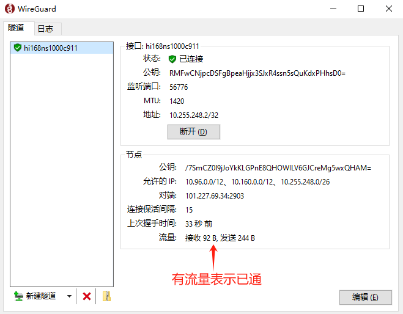
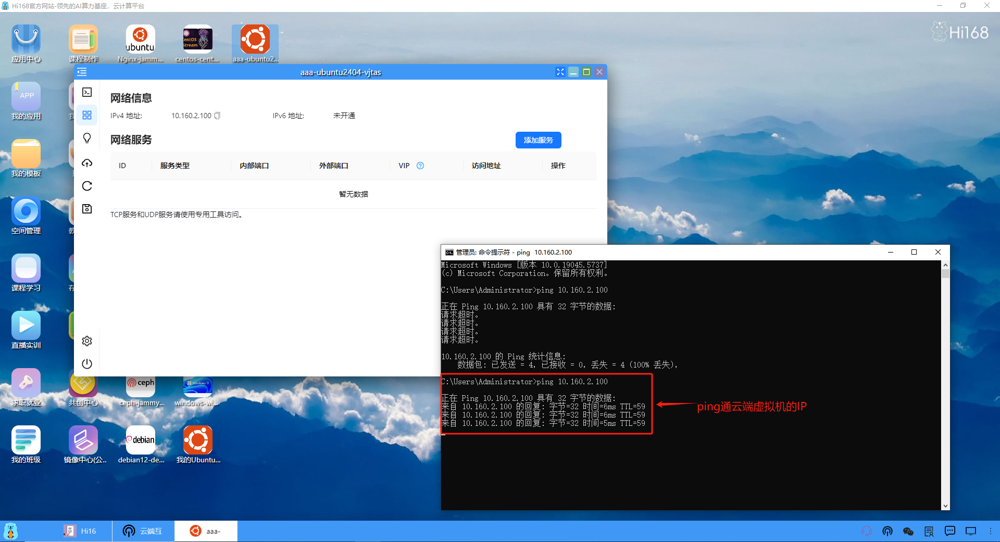
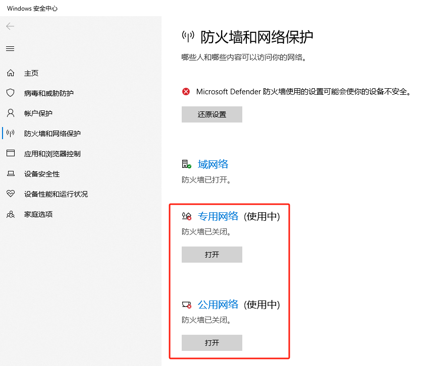
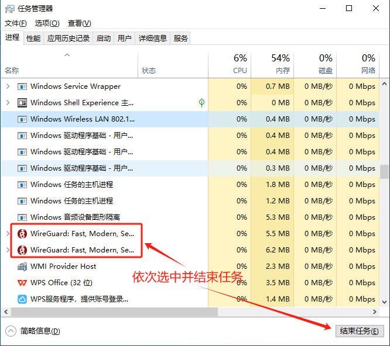

### 单客户端
大部分用户基本采用本地的Windows或Mac操作系统作为客户端进行云端互联，这里我们以Windows为例，介绍一下云端互联的流程。
#### 1、打开云端互联
我们点击进入云端互联，弹出一个通知，提示云端互联的网段重新规划了一下，提示在2025年5月30日之前使用的云端互联会有影响，这里建议先删除原有的客户端，全部清空，保持下图的初始状态。

#### 2、开通云端互联
（1）点击"开通云端互联"，需要等待40~60秒左右的时间。

（2）开通成功后，云端互联状态显示"云端网关已就绪"，并自动分配了云端互联的网段。同时，在云端互联客户端列表中，自动增加了一条客户端记录，信息包括客户端名称、客户端地址、允许IP和动作。其中，客户端地址是系统自动分配的IP，用于客户端去连接云端的虚拟机，允许IP是允许通过的指定网段流量，可以有多个，在同一个个人空间中，我们使用默认的，不用去编辑修改的。

（3）下载WireGuard

我们先点击"详情"，再点击"下载WireGuard客户端"，选择对应的操作系统版本，即可下载WireGuard的安装包，这里我们以Windows为例。

（4）安装WireGuard

正常下载下来的"wireguard-installer.exe"安装包，进行安装即可。

安装成功且运行的WireGuard界面。

（5）下载WireGuard配置文件

使用WireGuard云端互联，必须要导入配置文件，我们先将配置文件下载下来。

<li>方式一：直接点击"下载"，将文件类型为conf的配置文件下载到本地（第二次以后下载可以一直使用此种方式）。</li>

<li>方式二：先点击"详情"，再点击"下载WireGuard配置文件"，保存到本地即可。</li>

（6）WireGuard导入配置文件(文件名也可以修改，这里按默认文件名)

<li>方式一：点击"从文件导入隧道"。</li>

找到下载的配置文件，点击"打开"导入即可。

成功导入配置文件。

<li>方式二：点击"新建隧道"导入配置文件</li>

（7）本地连接云端的虚拟机

我们先打开本地的命令终端，去ping一个云端虚拟机的IP，当前是无法ping通的，也是就无法进行云端互联。

（8）WireGuard进行连接

我们点击"连接"，既可连接上云端的网关。 

有接收和发送流量表示已通。

WireGuard提示已连接。

本地命令终端执行命令"ipconfig"，可以看到多了一块WireGuard的网卡，IP就是之前云端互联分配的客户端地址。

此时就可以ping通云端虚拟机的IP了，表示云端互联成功了。

#### 3、云端互联不通的问题处理
在实际的环境使用中，由于每个用户的本地系统情况不同，可能会导致云端互联不通，那么我们可以作如下的处理。

（1）确保关闭本地操作系统的防火墙。

（2）断开并退出WierGuard，重新启动WireGuard连接。

（3）在任务管理器中彻底杀掉WireGuard进程，然后重新启动WireGuard连接。

