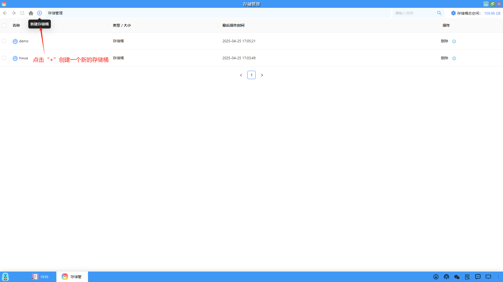
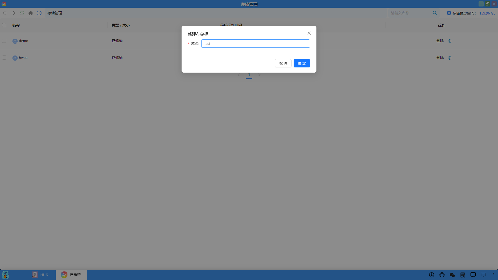
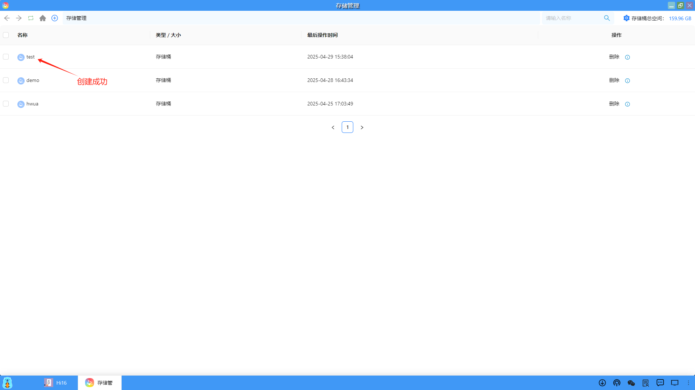
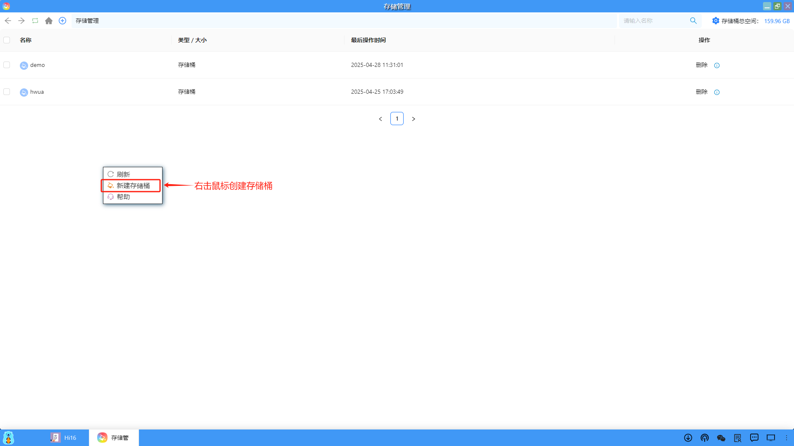
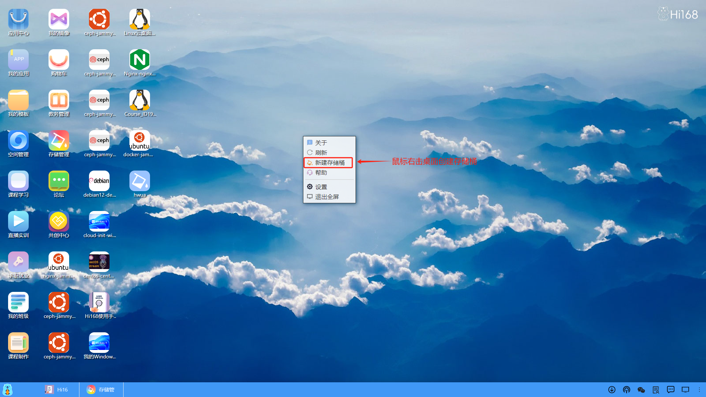
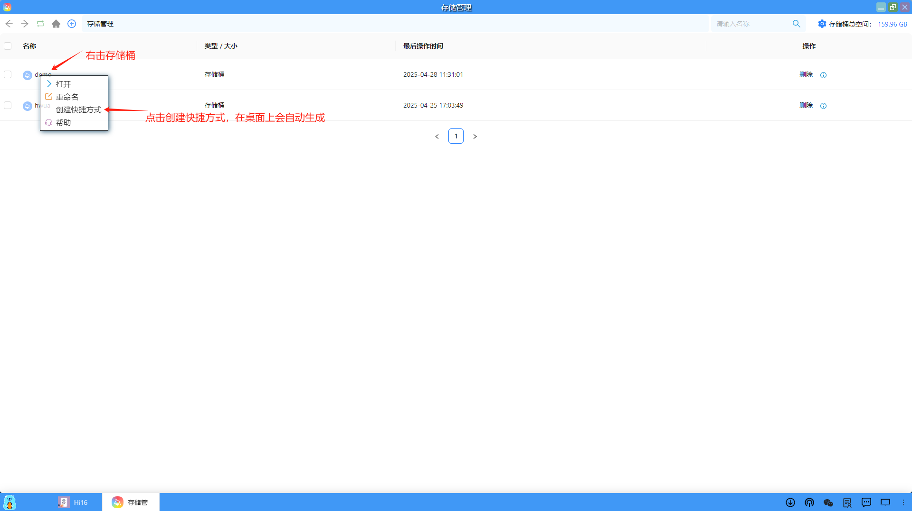
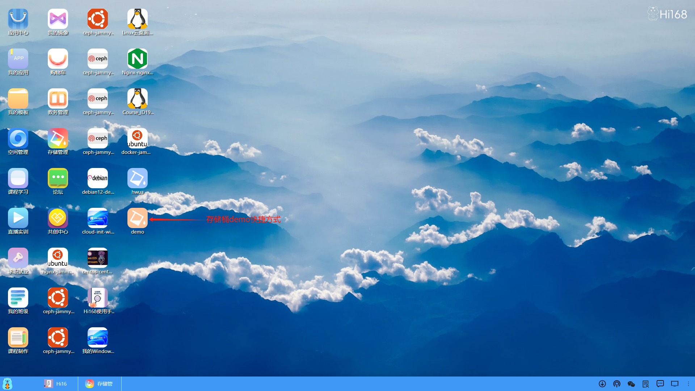

## 创建存储桶
在存储桶列表页面中可以创建新的存储桶，也可以在桌面上创建存储桶，同时也可以为存储桶在桌面上创建一个快捷方式。

#### 1、菜单创建
用户可以通过菜单中的"+"创建一个新的存储桶。

设置存储桶的名称。

创建成功后，自动会在存储管理中增加一条存储桶的记录。

#### 2、右击创建

用户也可以通过右击的方式，创建一个新的存储桶。

#### 3、桌面创建

最后一种方式可以通过在桌面上右击来创建一个新的存储桶。

#### 4、创建存储桶快捷方式
和Windows中的桌面快捷方式一样，用户也可以为存储桶在桌面上创建一个快捷方式，方便用户使用。

名称为demo的存储桶，在桌面上创建了一个快捷方式。

