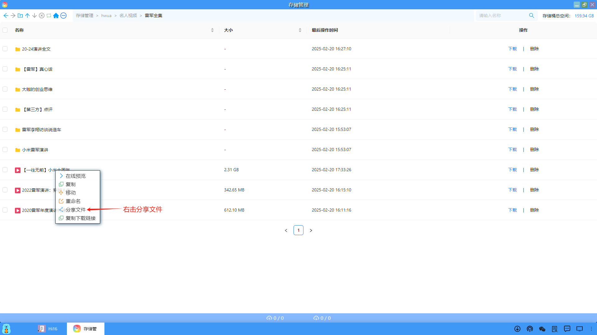
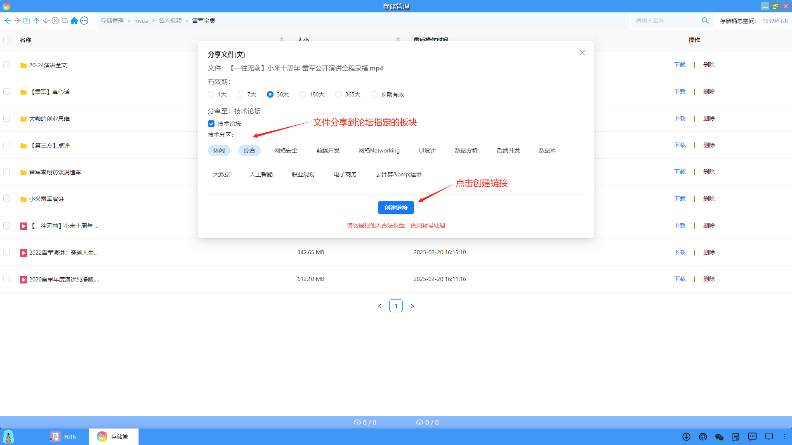
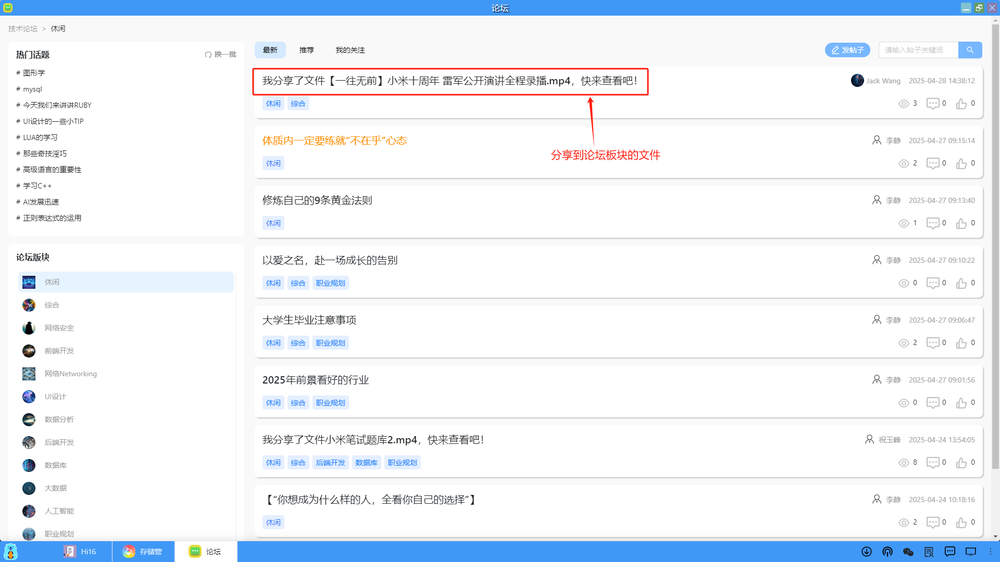
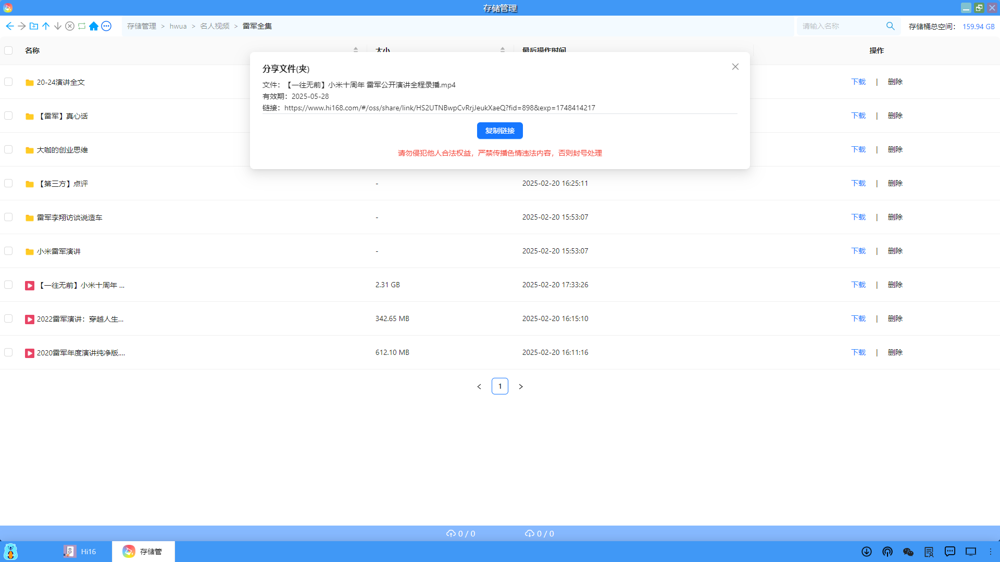
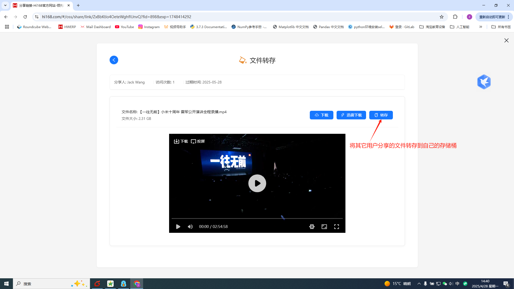
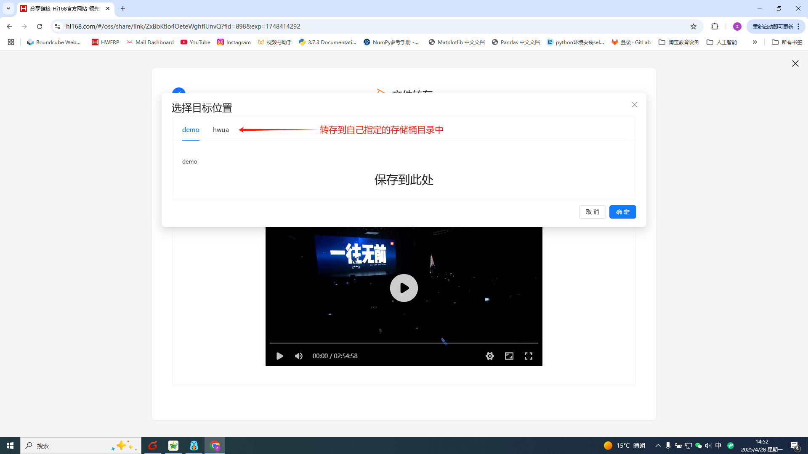

### 分享文件
存储桶的文件可以分享到论坛的板块中，也可以将文件创建的链接发给其它用户，通过浏览器打开分享的文件链接，将文件转存到自己的存储桶中。

#### 1、分享文件到论坛板块
（1）用户可以对指定的文件，右击鼠标选择分享文件，将文件分享到论坛。

（2）在分享文件弹出的页面中，用户可以指定分享的有效期、指定的论坛板块。

（3）分享成功后，在指定的论坛分享板块中，就可以看到用户分享的文件。

#### 2、分享文件链接和转存文件
（1）在分享文件成功后，会自动弹出一个复制链接的页面，用户可以点击"复制链接"，然后将此链接发送给其他想使用该文件的用户。

（2）其他用户通过浏览器打开该链接，会弹出一个文件转存的页面。此时，用户可以将分享的文件转存到自己的存储桶中。

（3）将分享的文件转存到指定的存储桶文件夹中。

