### 存储桶内容操作
存储桶类似个人网盘，可以对内容进行各种操作。下面以hwua存储桶为例，点击进入hwua存储桶。

#### 1、新建文件夹
用户可以通过右击鼠标选择新建一个文件夹。

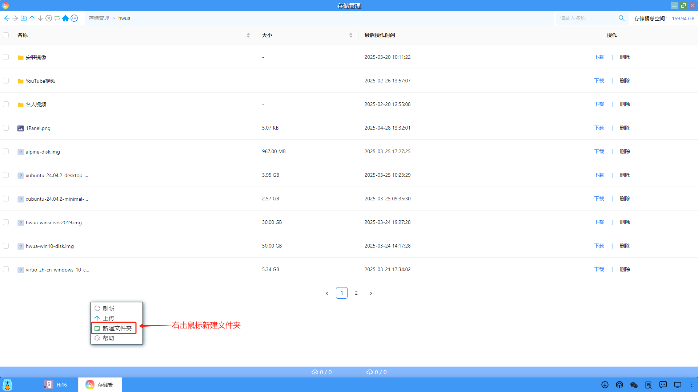

#### 2、删除文件/文件夹
用户可以在页面的右侧操作中，可以删除指定的文件/文件夹。

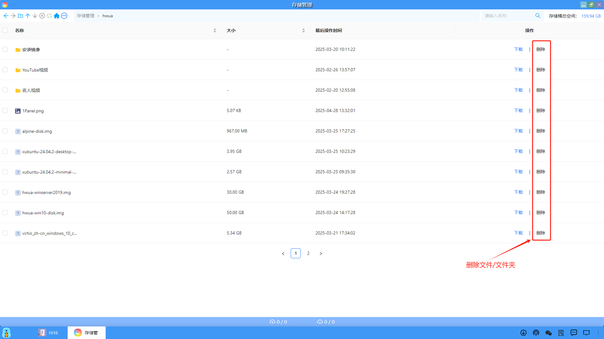

#### 3、上传文件/文件夹
（1）用户可以在页面的上排菜单中，选择上传文件或文件夹。

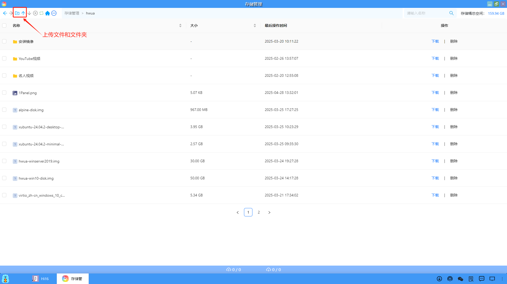

（2）用户也可以通过右击鼠标选择上传文件

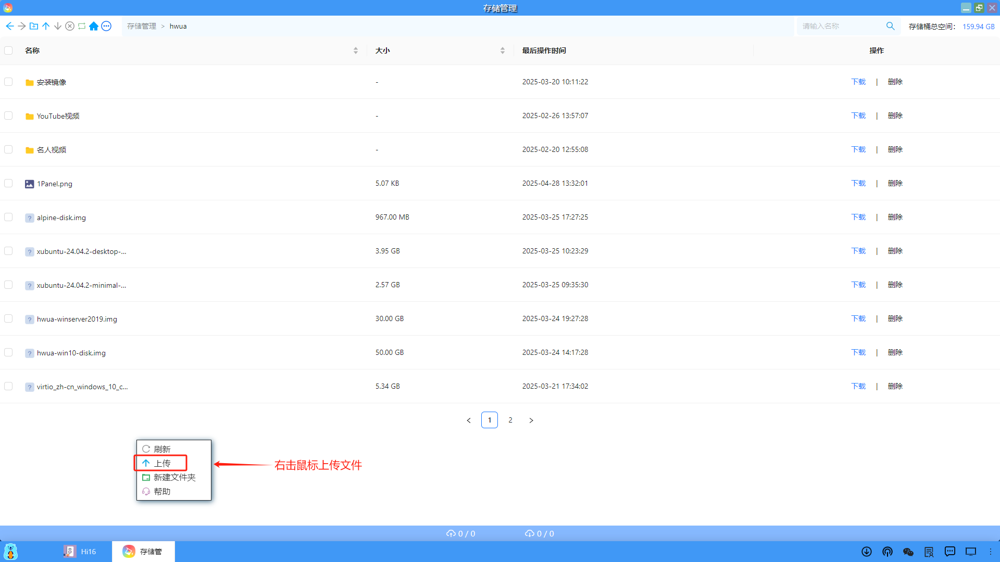

（3）在上传的页面中，显示当前待上传的文件或文件夹，用户可以选择开始全部任务、暂停全部任务、清空已完成任务、删除全部任务、上传和删除单个文件/文件夹。

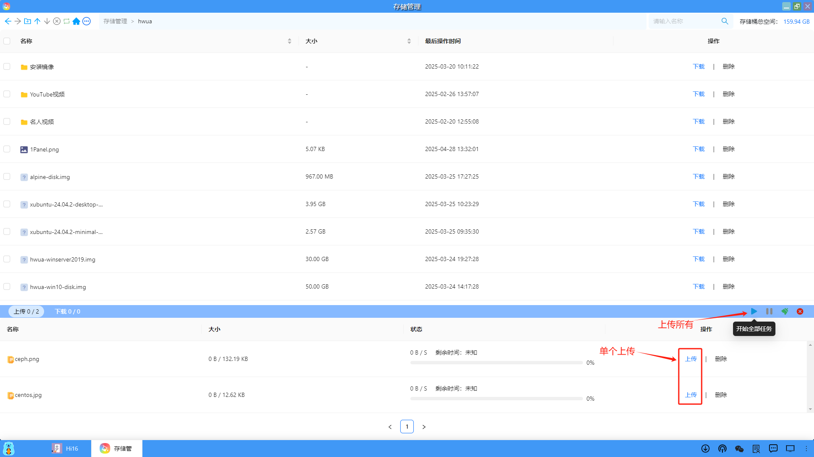

#### 4、下载文件/文件夹
用户可以在页面的右侧操作中，可以下载指定的文件/文件夹。

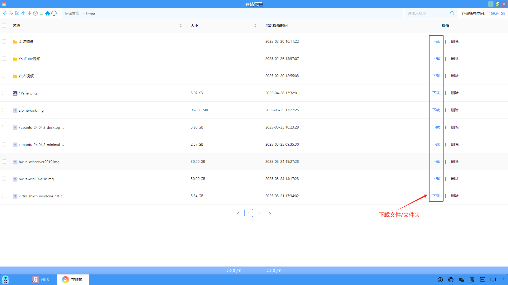

#### 5、复制文件下载链接
用户可以对指定的文件，右击鼠标选择复制文件下载链接，通过浏览器或迅雷等工具直接下载。

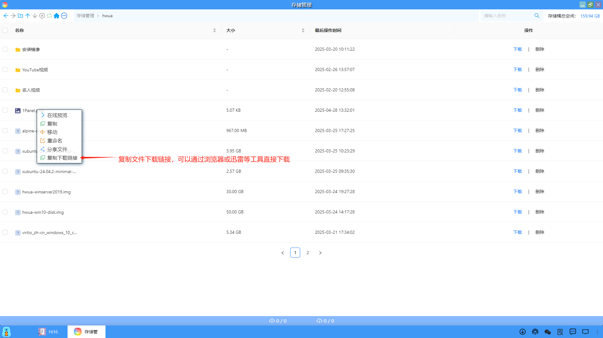

#### 6、复制/移动/重命名文件
（1）用户可以对指定的文件，右击鼠标选择复制、移动和重命名文件。

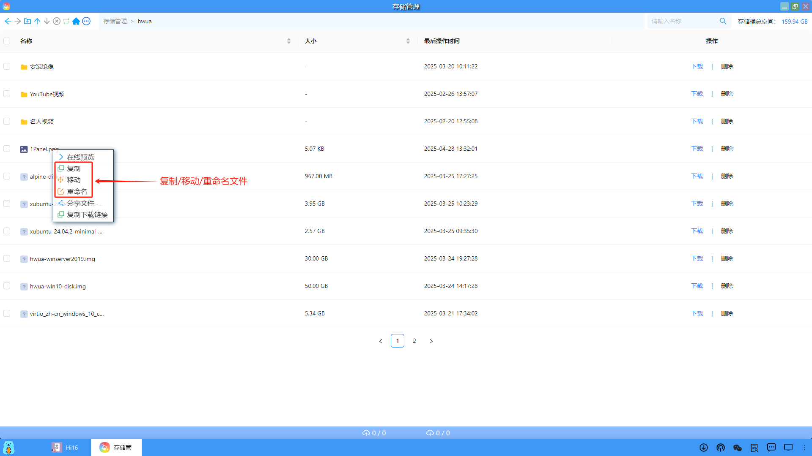

（2）将文件复制到指定的存储桶文件夹中

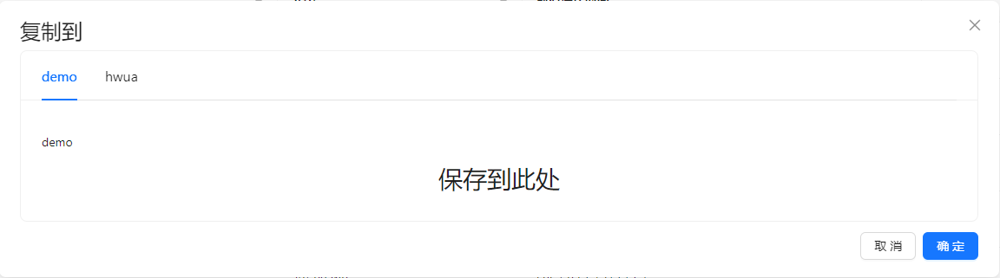

（3）将文件移动到指定的存储桶文件夹中

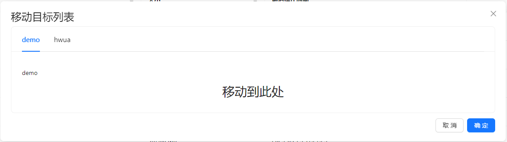

（4）重命名文件

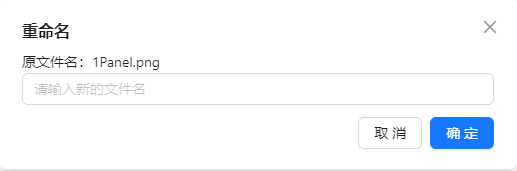

#### 7、在线预览
（1）对于部分文件类型，比如：视频，用户可以右击鼠标选择在线预览。

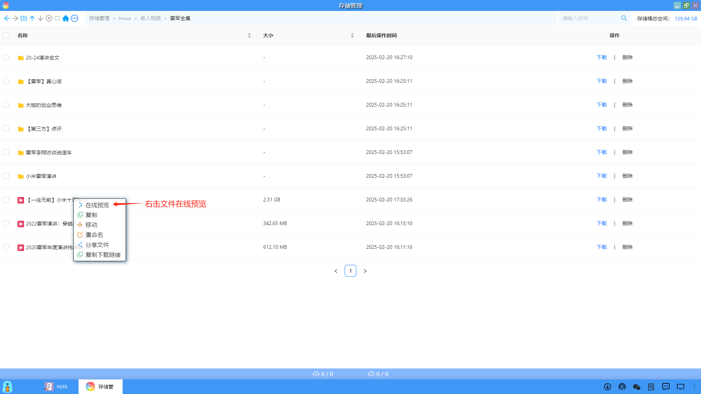

（2）自动启动一个在线播放器，在线播放视频。

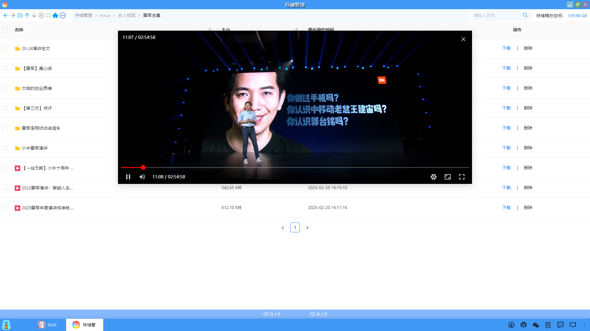