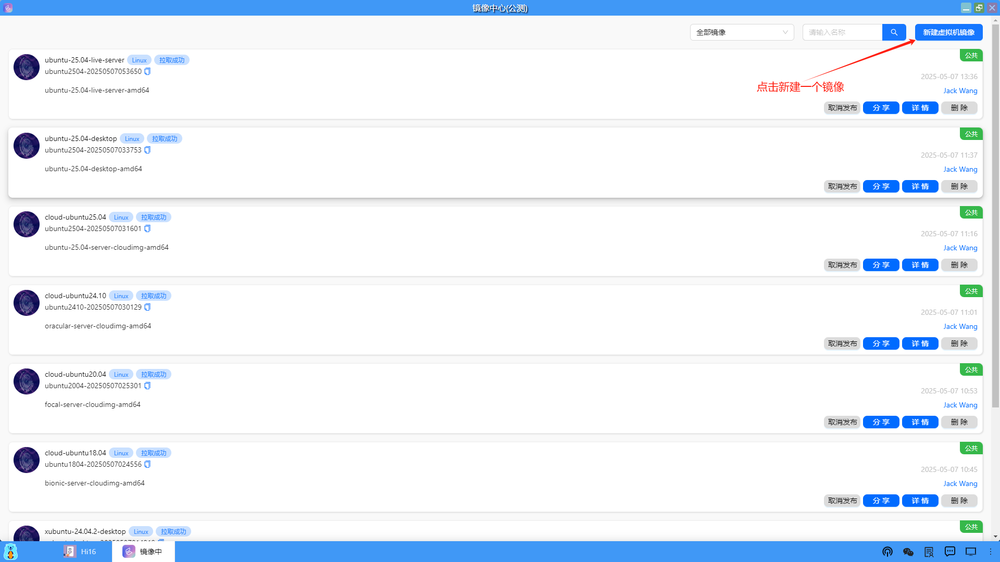
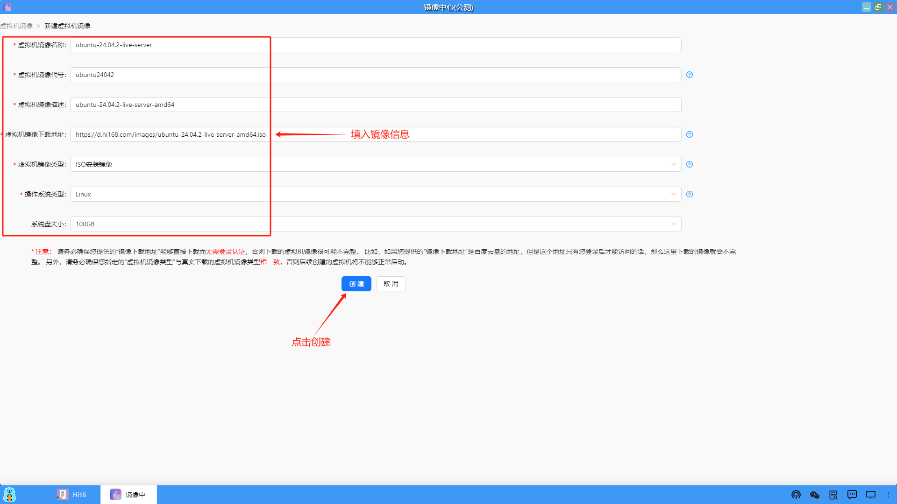
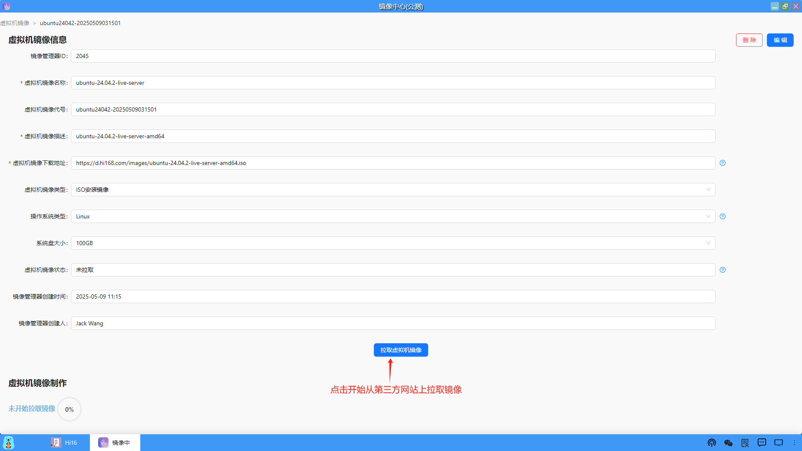
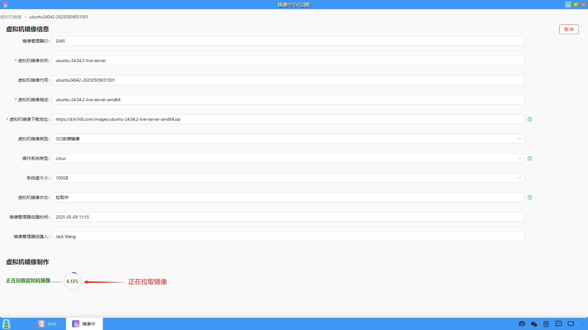
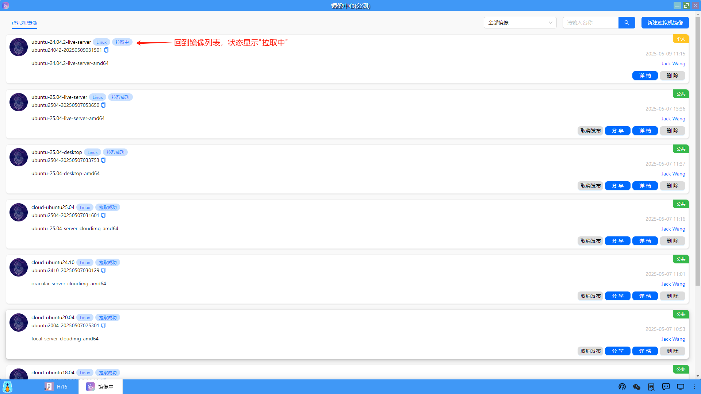
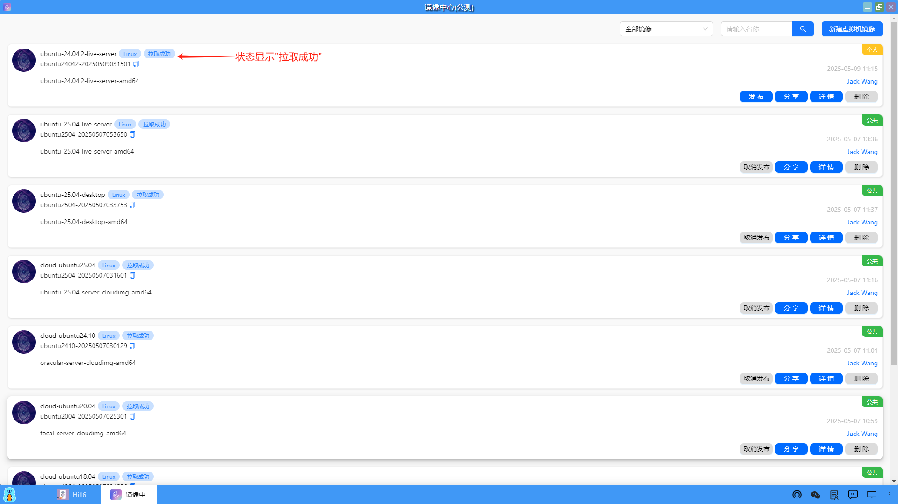
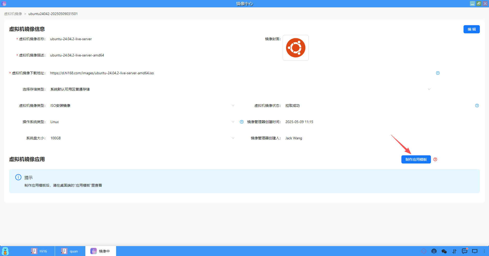

### 新建镜像
（1）新建镜像是先从第三方网站上把镜像拉取下来，用户可以点击"新建虚拟机镜像"。

（2）填写镜像相关信息，尤其是虚拟机镜像下载地址，一定是能直接访问到的，最后点击"创建"。

（3）创建成功后，就可以点击"拉取虚拟机镜像"，开始从第三方网站上拉取镜像了。

（4）只要镜像地址没有问题，就可以正常拉取，会显示拉取的进度。

（5）回到镜像列表页面，也可以看到镜像的拉取状态处于"拉取中"。

（6）在等待一段时间后，镜像就拉取成功，状态显示"拉取成功"。

（7）对于拉取成功的镜像，用户可以开始制作应用模板。

