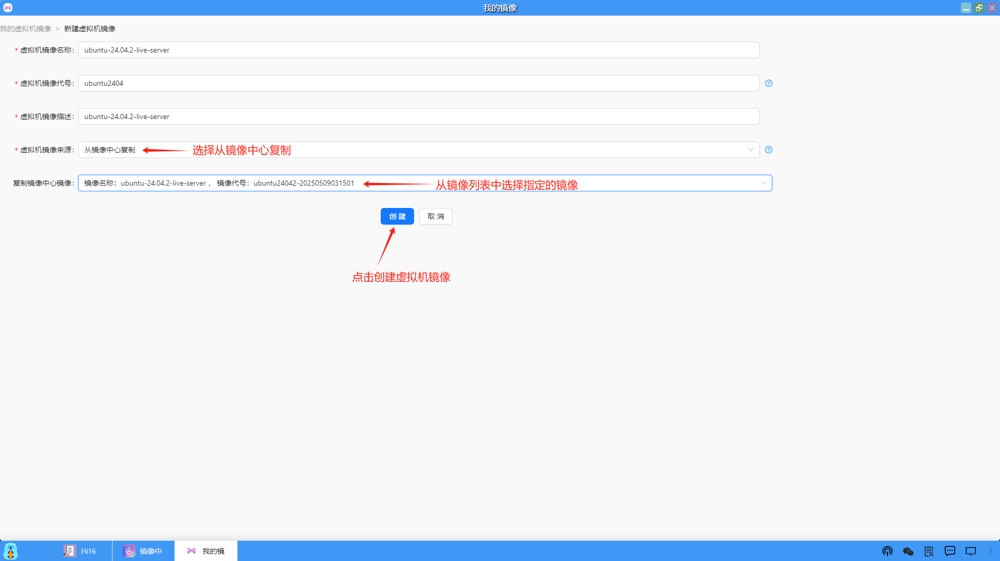

### 制作应用模板
（1）等到虚拟机镜像拉取成功后，虚拟机镜像状态就会显示"拉取成功"。此时，用户就可以点击页面右下角的"制作应用模板"。

（2）在制作应用模板页面中，按要求填入相关信息（没有特殊情况按默认设置）后点击“创建”。

（3）应用模板创建成功后，可以进入桌面端的“应用模板”查看。

（4）此时看到这个应用模板的记录信息，处于"制作中"，用户也可以点击"部署"按钮进行应用部署（安装Ubuntu系统），部署流程和从"应用中心"部署应用是相同的。

<b>注意：此镜像为操作系统的安装包，通过它制作的应用模板不具备发布功能，需要部署应用系统安装成功后再制作成应用模板方可发布，具体参考如下。</b>

