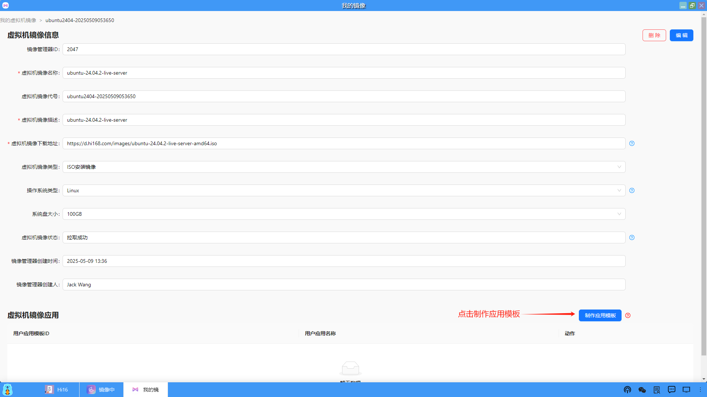

### 镜像操作
在镜像列表中，用户可以对指定的镜像进行如下的操作，十分方便。

#### 1、查看和编辑镜像
（1）点击"详情"，可以查看镜像的详细信息。

（2）在镜像详情页面中，显示了镜像的所有信息。同时，镜像所有者也可以编辑自己的镜像信息。

#### 2、查找镜像
在镜像列表页面中，用户可以输入关键字搜索所需要的镜像。

#### 3、分享镜像
在镜像详情页面中，用户也可以将镜像分享给指定的用户使用。

#### 4、发布镜像
（1）默认新建的镜像属于个人的，其他用户是看不见的，除非通过分享给其他用户使用。因此，创建镜像的用户可以将镜像发布为公共的，那么所有用户都可以使用了。

（2）用户也可以点击取消发布，使用范畴又变为个人的。

#### 5、删除镜像
镜像所有者可以删除自己的镜像。

#### 6、使用镜像
（1）用户从“我的镜像”进入，新建一个虚拟机镜像，这时虚拟机镜像来源可以不通过按指定的URL下载，可以直接从镜像中心复制。

（2）镜像复制成功，在"我的虚拟机镜像"页面中就会生成一条拉取成功的记录。

（3）接下来制作应用模板的流程和我的镜像——>新建虚拟机镜像和制作应用模板是相同的。

#### 7、同步镜像
（1）用户之前在"我的镜像"中通过URL下载并创建的镜像，也可以一键同步到镜像中心并发布，供所有用户使用。

（2）用户可以点击"同步到镜像中心"

（3）若同步成功，在"镜像中心"的镜像列表页面中，会生成一条同步过来的镜像记录。

