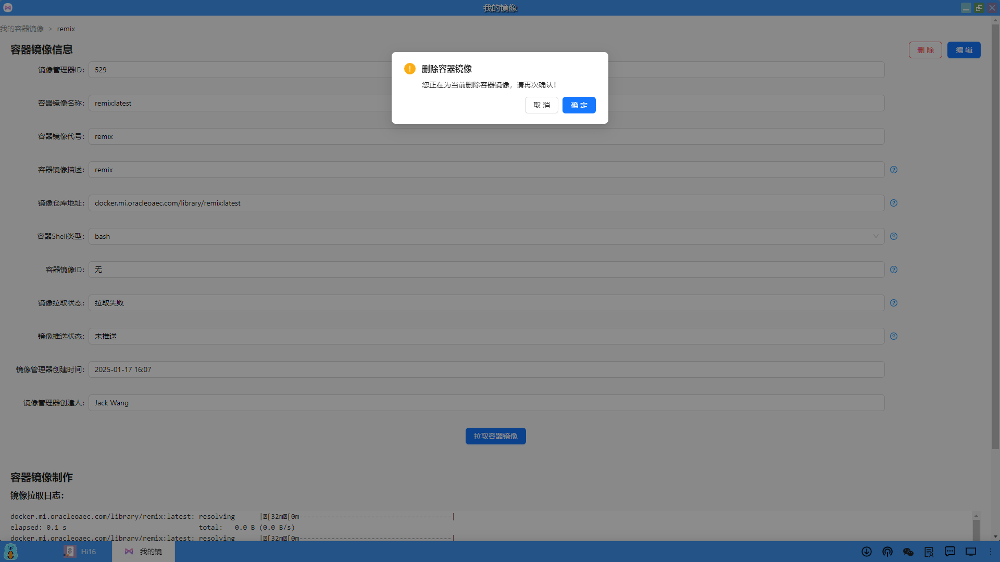

### 容器镜像详情
在容器镜像列表页面中，可以点击某个容器镜像详情进行查看，在详情页面同时也可以编辑和删除该容器镜像。

#### 1、容器镜像信息
（1）用户点击某个容器镜像的动作"详情"，可以进入查看详情信息。

（2）在容器镜像详情信息页面中，显示了镜像管理器ID、容器镜像名称、容器镜像代号、容器镜像描述、镜像仓库地址、容器Shell类型、容器镜像ID、镜像拉取状态、镜像推送状态、镜像管理器创建时间、镜像管理器创建人、镜像拉取日志等信息。用户在此页面的右上角也可以点击删除和编辑容器镜像。

#### 2、编辑容器镜像
（1）在容器镜像详情信息页面中，用户可以点击右上角的"编辑"，修改容器镜像的部分信息。

（2）容器镜像信息修改完毕后，点击"保存"即可。

#### 3、删除容器镜像
（1）在容器镜像详情信息页面中，用户可以点击右上角的"删除"，删除该容器镜像。

（2）弹出一个删除容器镜像的确认框，点击"确定"即可。

