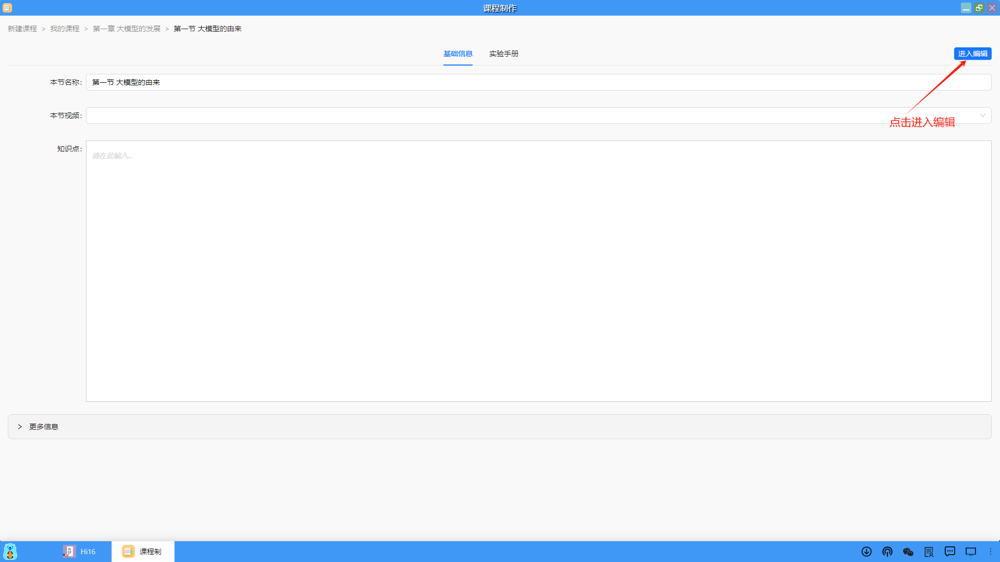
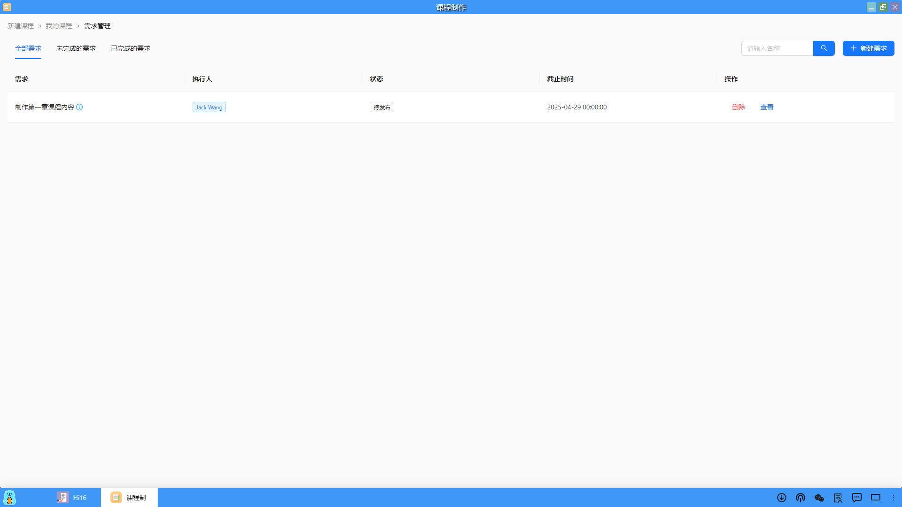

### 编辑课程
编辑课程内容包括：课程基础信息、课程大纲、知识点、实验手册、课程章节的应用模板、案例、练习、课件和视频等。

#### 1、课程基础信息
（1）进入到新创建的课程，点击✏️图标，用户就可以编辑课程的基础信息。

（2）在弹出的课程信息页面中，包括了课程详情中所有信息，以及一些和教学、考核相关的内容，用户按要求填完信息点击"保存"即可。

#### 2、课程大纲
（1）在课程章节板块中，用户点击"编辑章节"，可以设置课程的章节内容。

（2）在弹出的编辑章节页面中，点击"编辑章"和"编辑节"，分别可以创建章和节的内容。

（3）创建成功后，就会生成对应的章节记录，用户可以点击再次编辑修改或增加章节。

（4）用户可以点击"操作历史"，查看课程的制作历史信息。

（5）在操作历史页面中，显示了课程制作团队中所有成员的制作历史记录。

#### 3、编写知识点和实验手册
（1）在课程章节板块，用户点击"实验"图标，可以编辑课程章节的实验手册。

（2）进入到实验手册页面中，默认是只读状态，必须点击"进入编辑"，才能编写基础信息和实验手册的内容。

（3）基础信息一般是课程章节知识点的内容，实验手册一般是具体案例的配套指导手册。

（4）编写过程中或编写完毕后，切记点击"保存"，以免内容丢失。

#### 4、其它课程资料关联和上传
课程的每一节还配套有官方模板、案例题、练习题、课件和视频，用户可以关联或上传这些内容。

#### 5、添加课程协作开发成员
在课程开发过程中，在课程制作团队中可以点击"成员"，加入其他课程开发人员进来一起协作开发。

#### 6、课程权限管理
对于课程制作团队中的成员，可以设置不同的课程权限，包括：浏览权限、新建资源权限、编辑资源权限、删除资源权限。

#### 7、课程需求管理
（1）在课程开发之前或过程中，课程制作团队成员可以创建课程制作的需求，便于汇总讨论，能开发出高质量的课程，点击"需求管理"进入课程需求管理页面。

（2）点击"新建需求"来创建不同的需求内容

（3）在弹出的新建需求页面中，填写相关的信息，包括：需求标题、截止时间、状态、需求备注，点击"提交"即可。

（4）创建需求成功后，在课程需求管理页面中会生成一条需求记录，可以进行"删除"或"查看"的操作。
同时，根据创建需求的状态不同，分为未完成和已完成的需求，成员在完成某个需求后，可以点击"查看"进入到更新需求页面，修改需求的状态。

