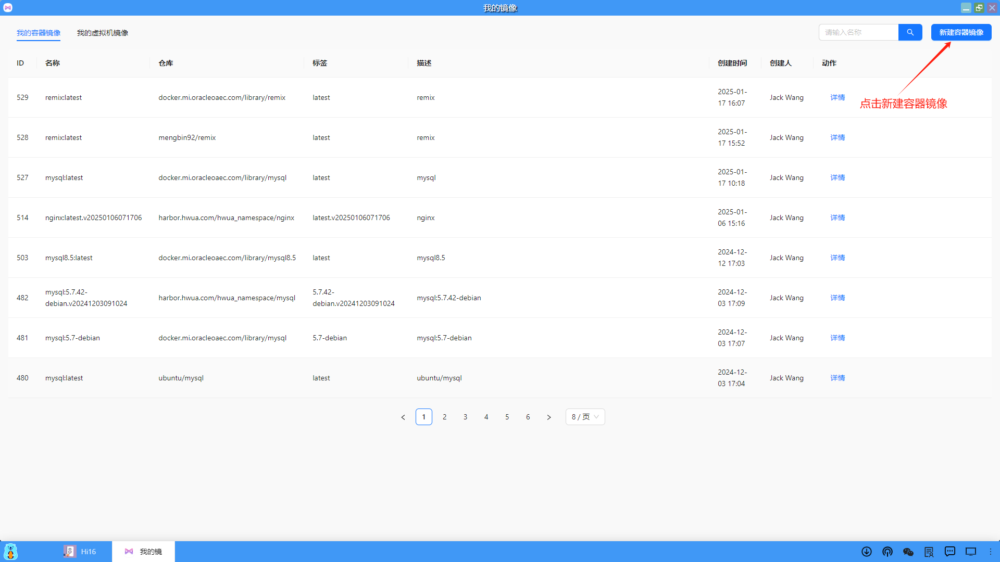
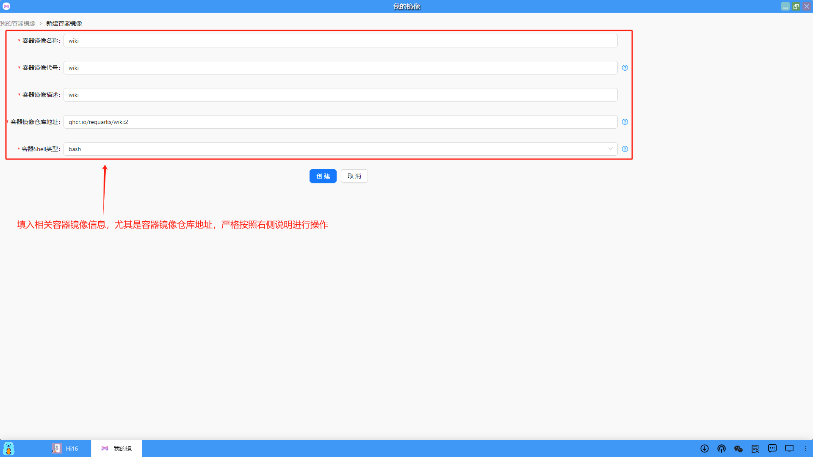
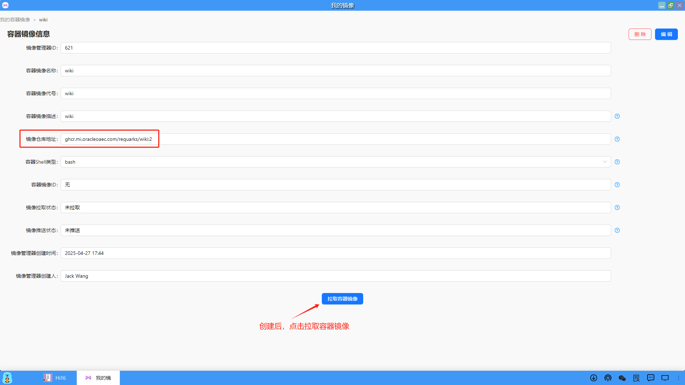

### 新建容器镜像和制作应用模板
（1）在容器镜像列表页面的右上角点击“新建容器镜像”，可以创建一个指定类型的容器镜像并制作应用模板进行部署。

（2）填入相关容器镜像信息，包括：容器镜像名称、容器镜像代号、容器镜像描述、容器镜像仓库地址、容器Shell类型，点击"创建"即可。

（3）创建完毕后，就可以点击"拉取容器镜像"，从指定的镜像仓库中拉取镜像了。

（4）拉取成功后即可同步容器镜像到本地仓库中，后面就可以使用容器镜像制作应用模板了。
