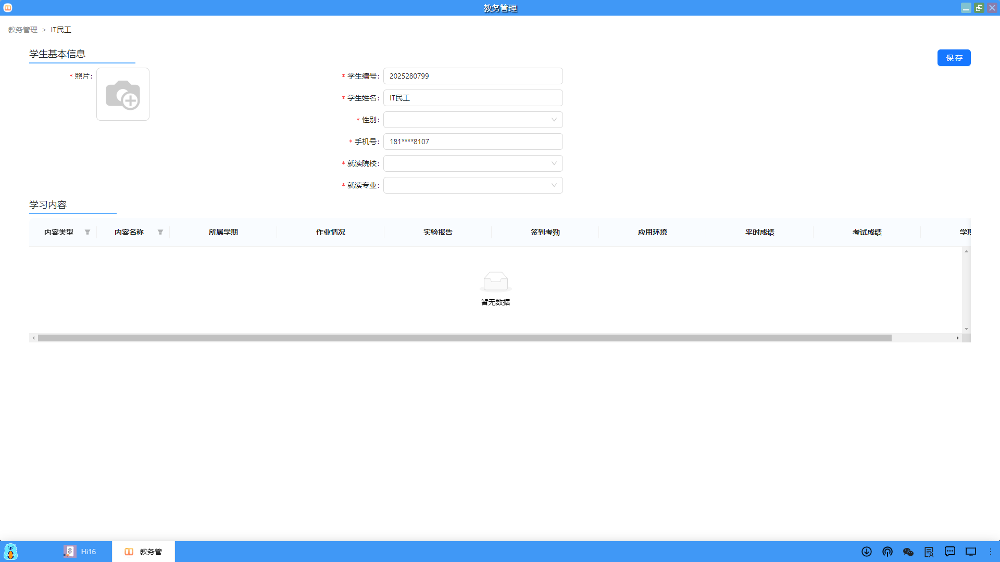

## 查看/编辑学生
在学生列表页面，用户可以查看或者编辑学生信息。

#### 1、查看学生
（1）在学生列表页面中，点击指定学生的"查看"操作，用户可以查看学生信息。

（2）在学生信息页面中，包括学生的基本信息和学习内容。同时，用户也可以再次进行学生编辑的操作。

#### 2、编辑学生
（1）在班级列表页面中，点击指定学生的"编辑"操作，用户可以编辑学生信息。

（2）进入到学生信息页面，用户可以修改信息并保存。

