### 课程播放
用户点击课程章节中的视频、练习或课件任何一个图标可以进入课程播放页面。

#### 1、视频播放
点击"视频"，可以播放任何一节的课程视频。

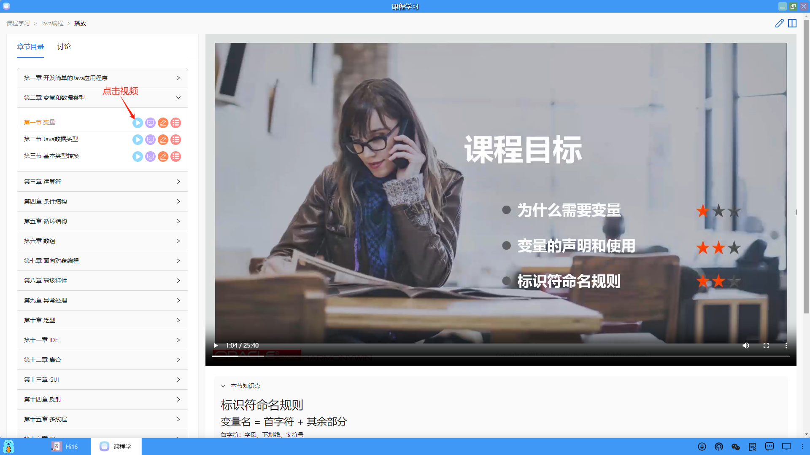

#### 2、实验手册
点击"实验手册"，可以显示当前这节课程的实验内容。

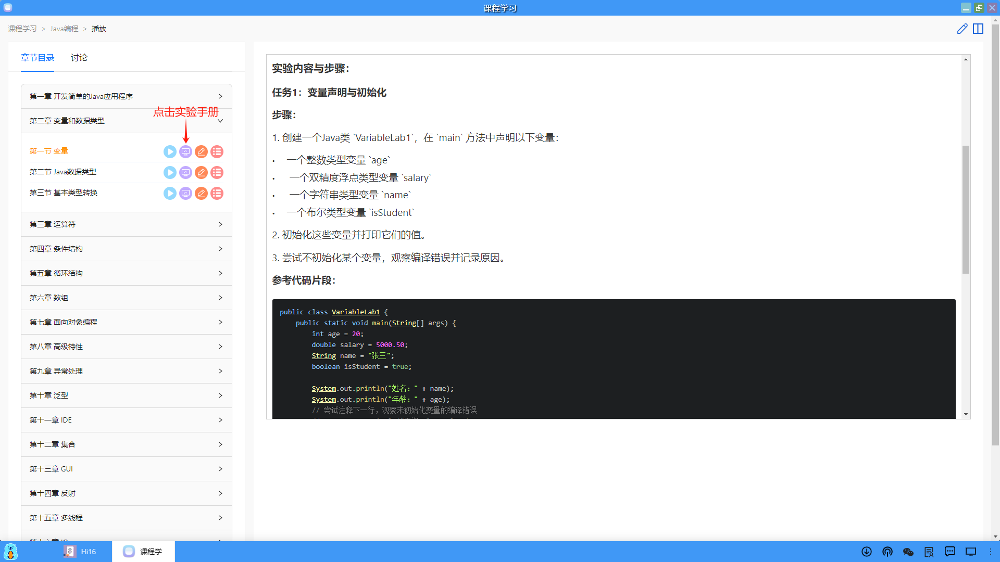

#### 3、课堂练习
点击"练习"，可以显示当前这节课程的在线课堂练习，用户可以在线完成提交，并可以查看分数。

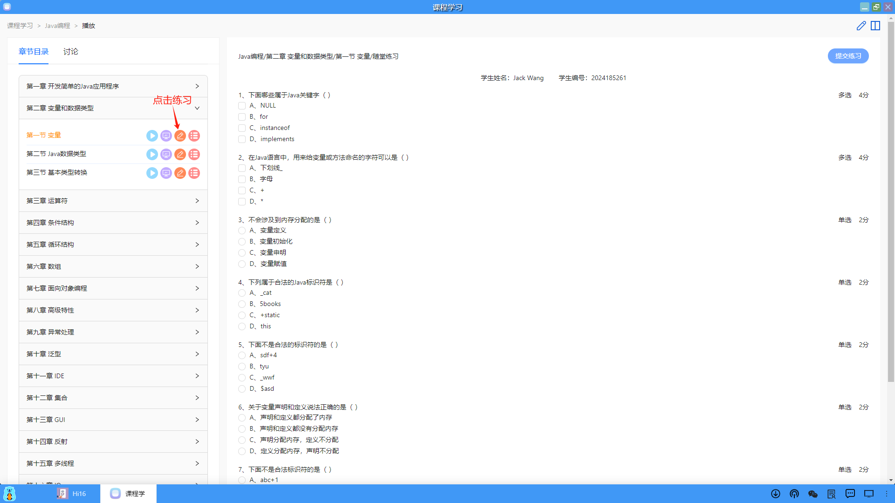

#### 4、课件预览
点击"课件"，可以在线预览当前这节课程的PPT。

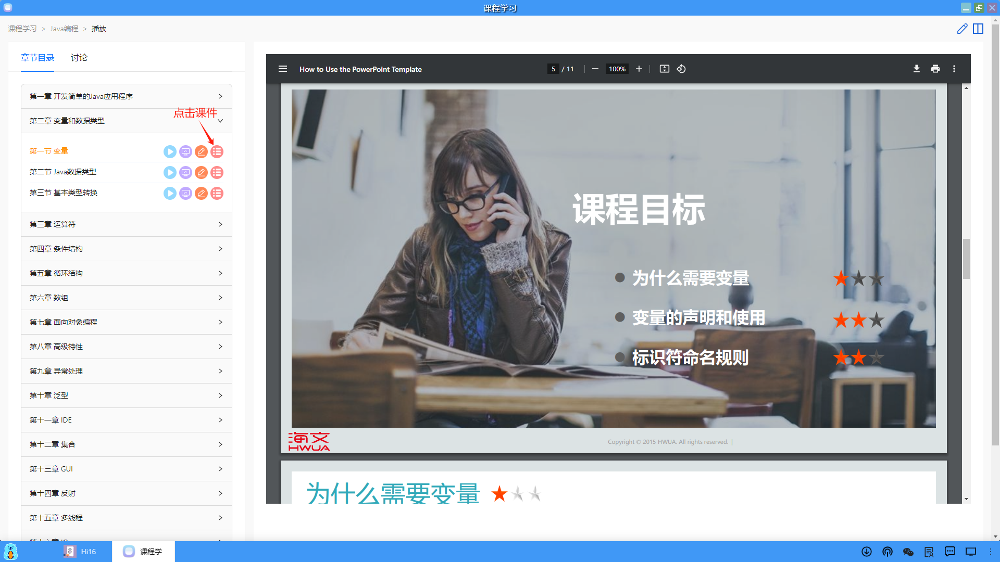

#### 5、课堂笔记
点击页面右上角的"新建笔记"，可以打开一个新建笔记的页面，用户可以在线做课堂笔记。

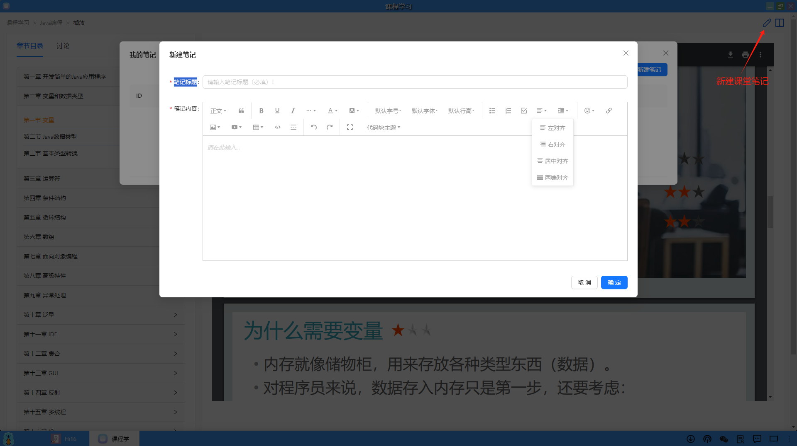

#### 6、分屏
用户可以点击页面右上角的"分屏"，将页面一分为二，左右侧屏可以切换视频、课件、实验手册、实验环境。

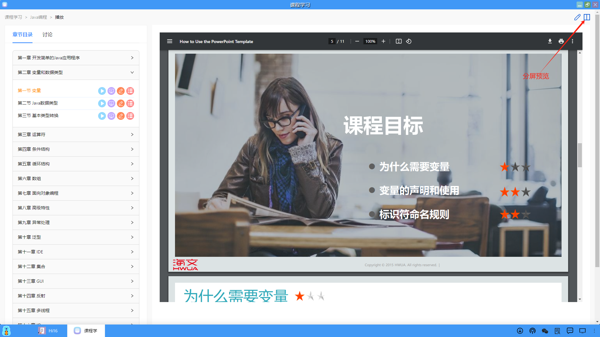

#### 7、创建实验环境
（1）在分屏后，在右侧屏点击"创建实验环境"，可以创建一个和课程关联的应用模板应用。

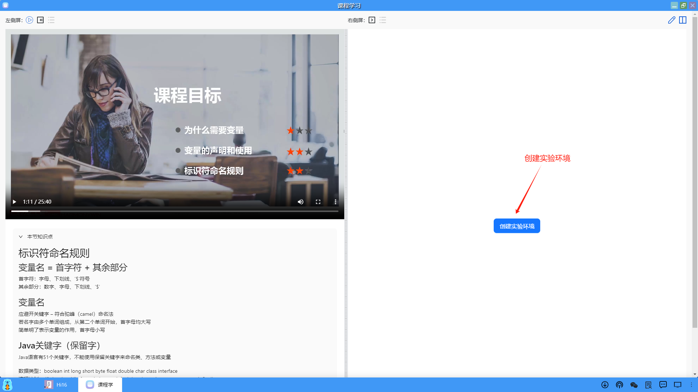

（2）在右侧屏点击"立方体"的图标，可以显示创建好的实验环境。

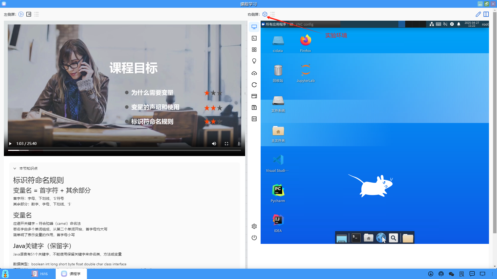

（3）在分屏后，默认左右侧屏是按50%对开的，用户可以拖动中间的竖栏进行左右移动，调整分屏的大小。

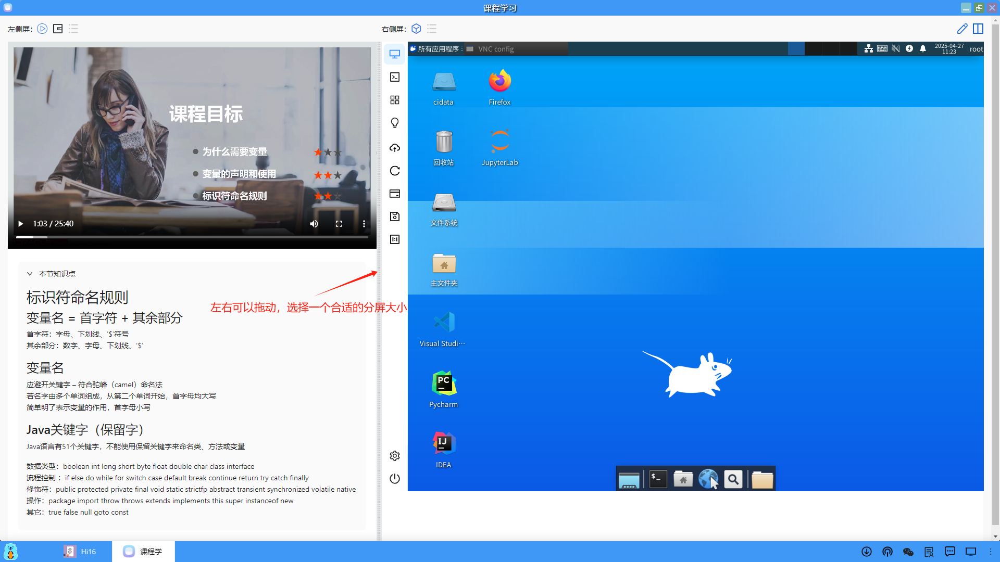

（4）在左侧屏可以点击左上角的图标，进行视频、实验手册和课件的切换。

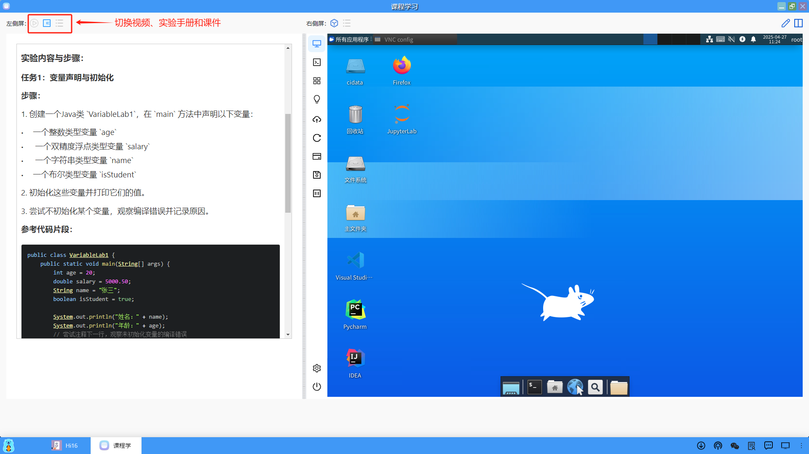

（5）左侧屏切换到课件的预览

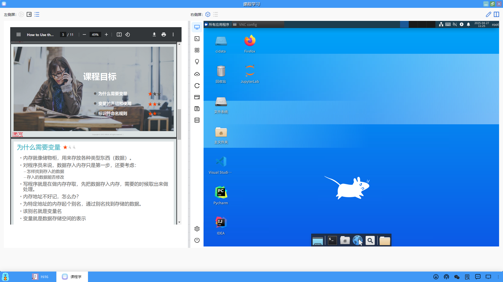