### 编辑课程
编辑课程内容包括：课程基础信息、课程大纲、知识点、实验手册、课程章节的应用模板、案例、练习、课件和视频等。

#### 1、课程基础信息
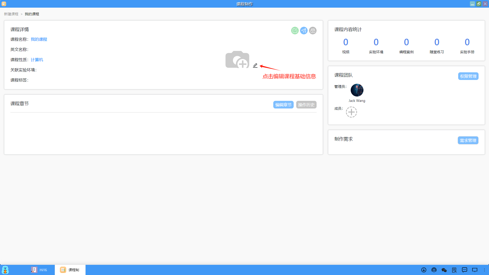

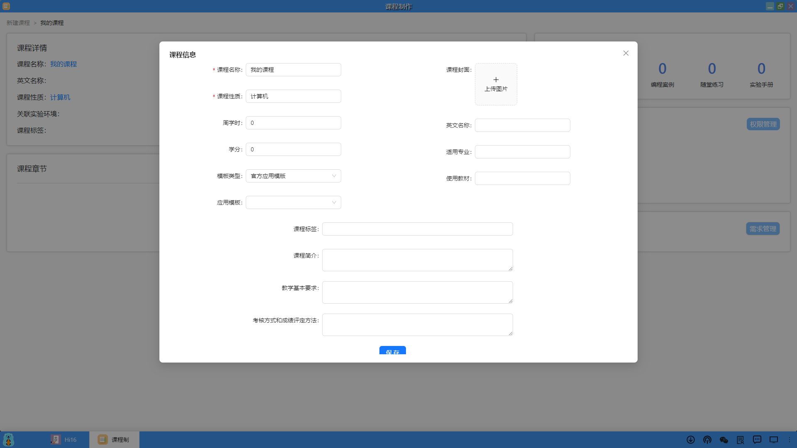

#### 2、课程大纲
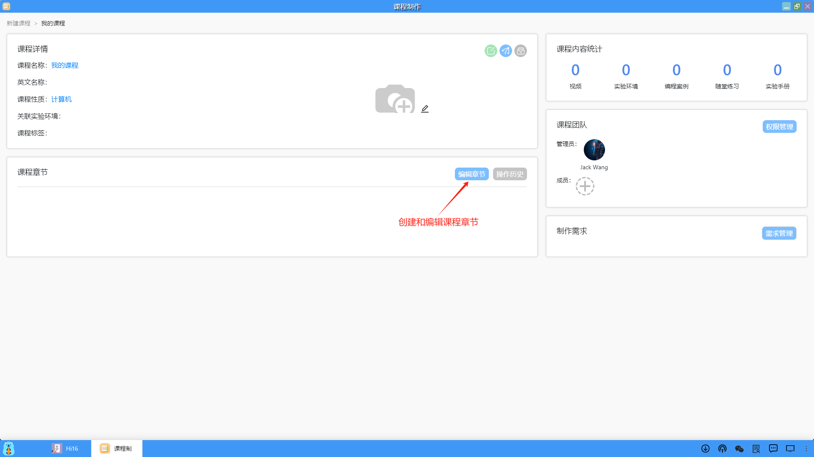

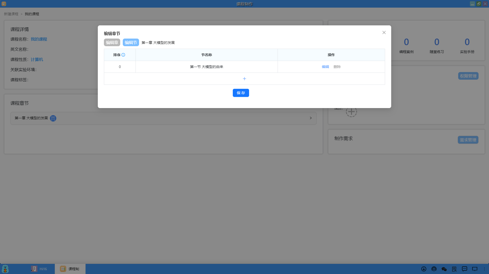

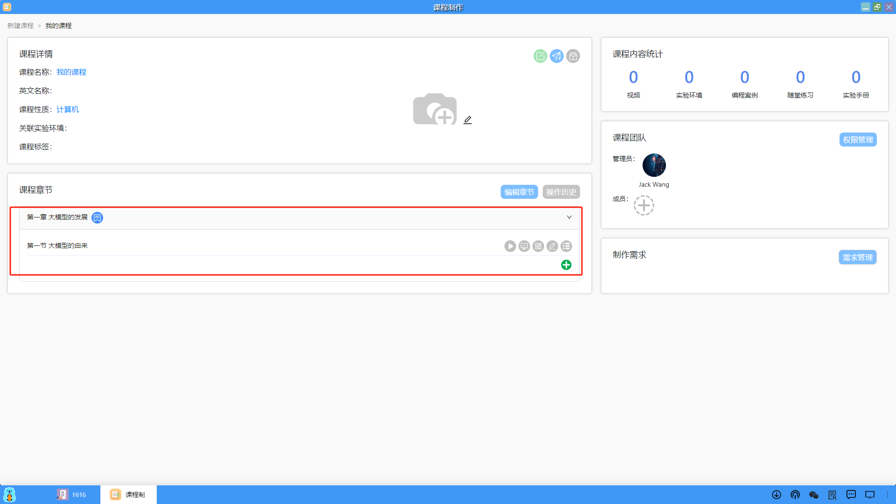

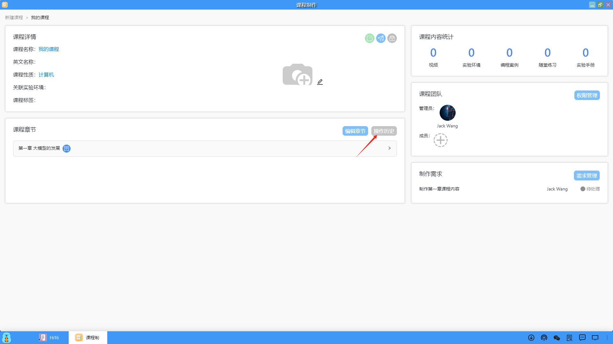

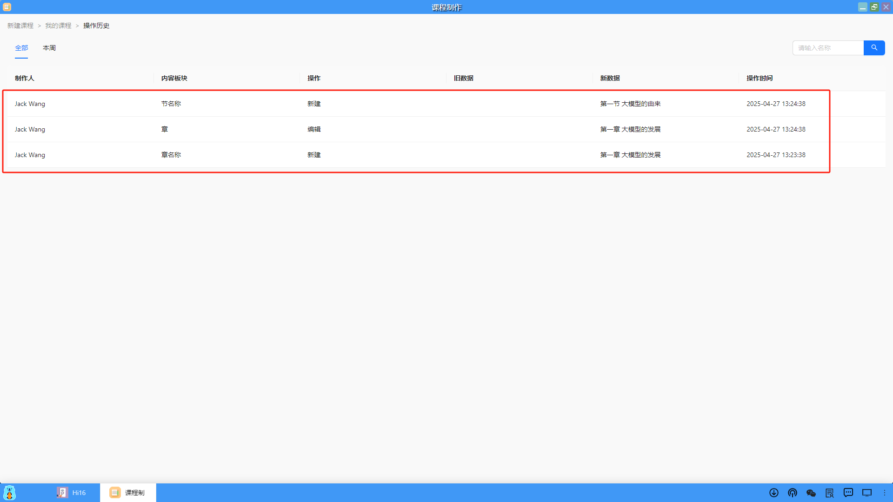

#### 3、编写知识点和实验手册
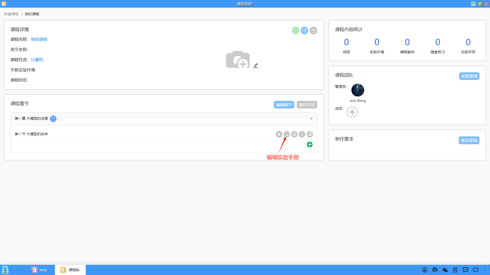

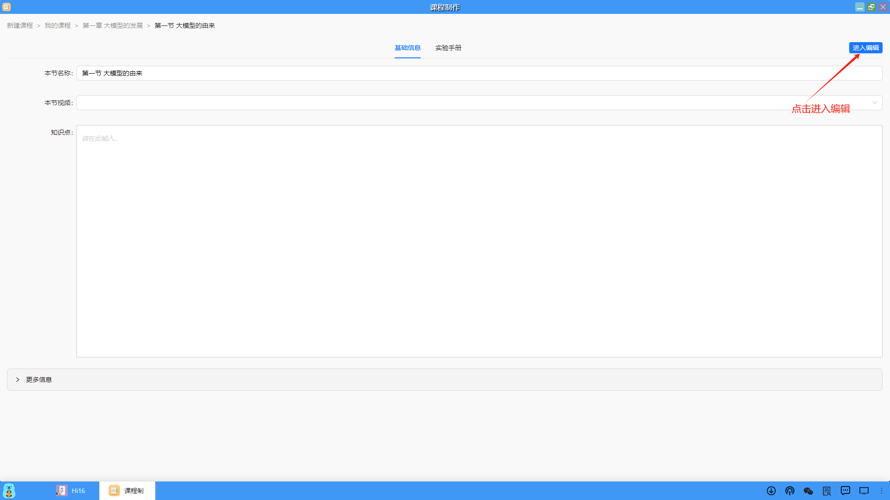

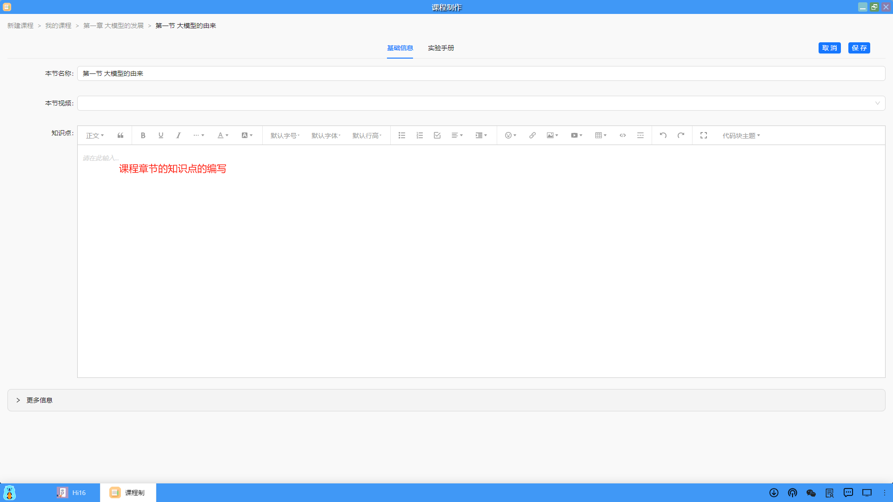

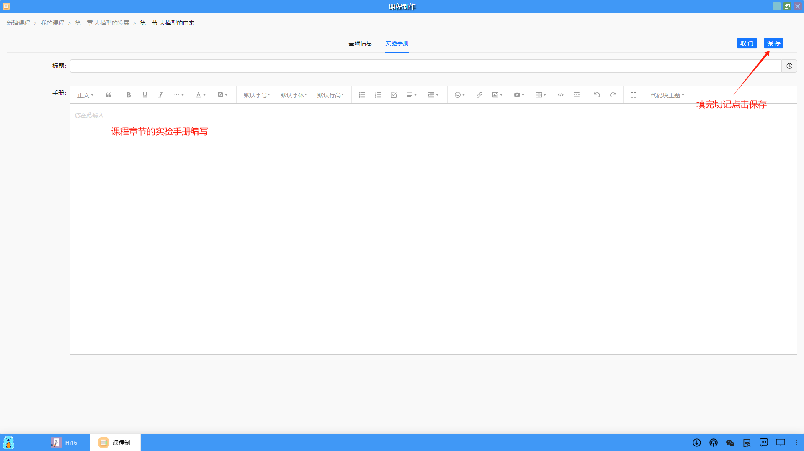

#### 4、其它课程资料关联和上传
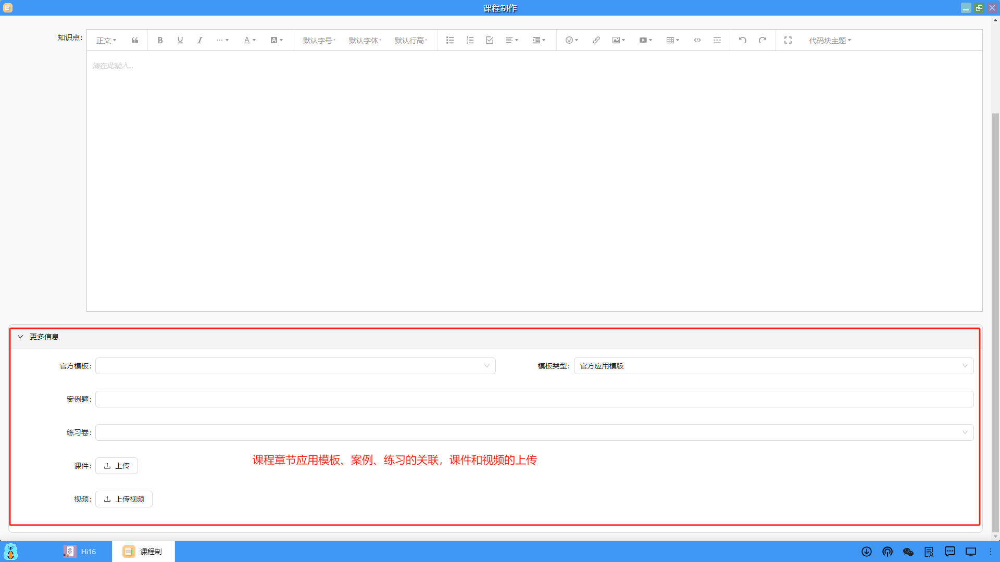

#### 5、添加课程协作开发成员
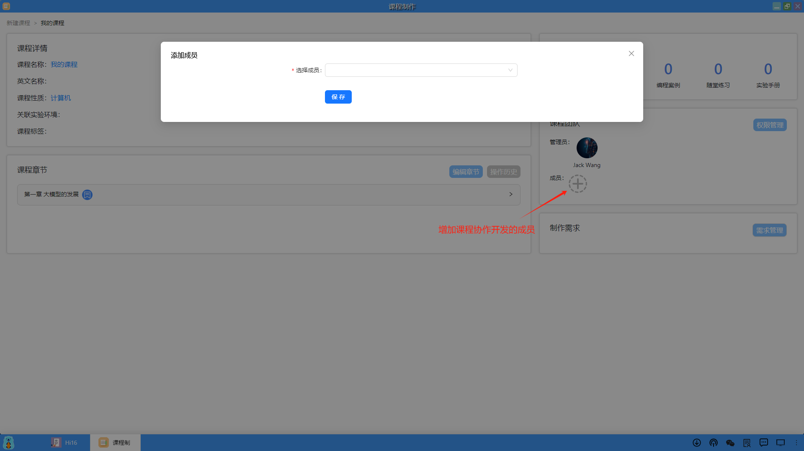

#### 6、课程权限管理
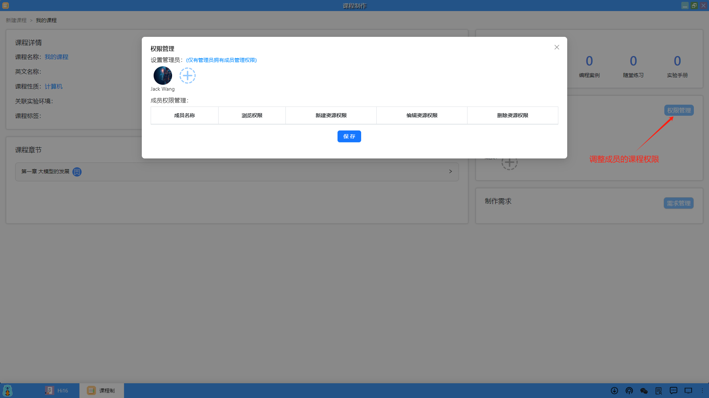

#### 7、课程需求管理
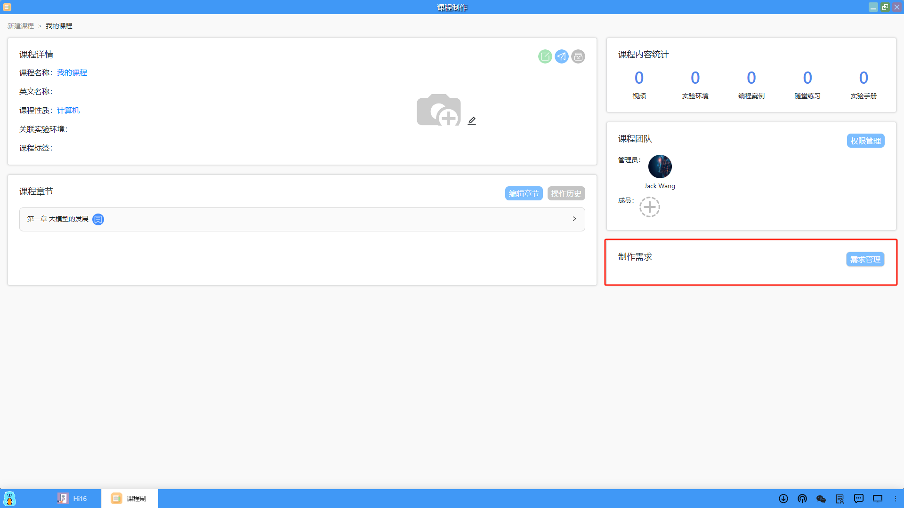

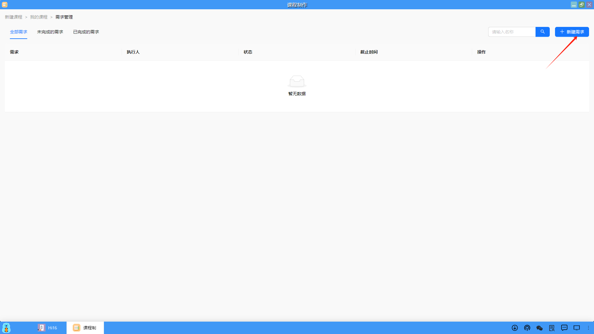

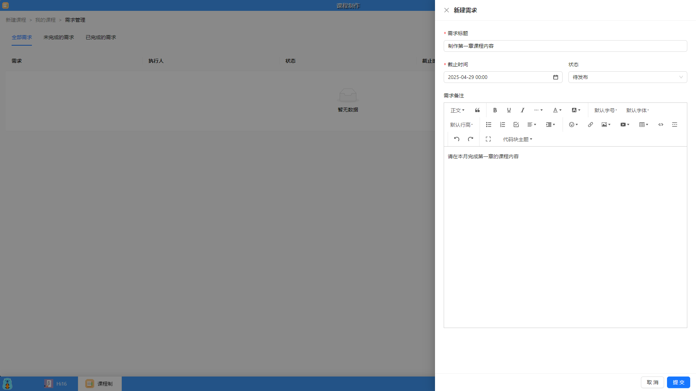

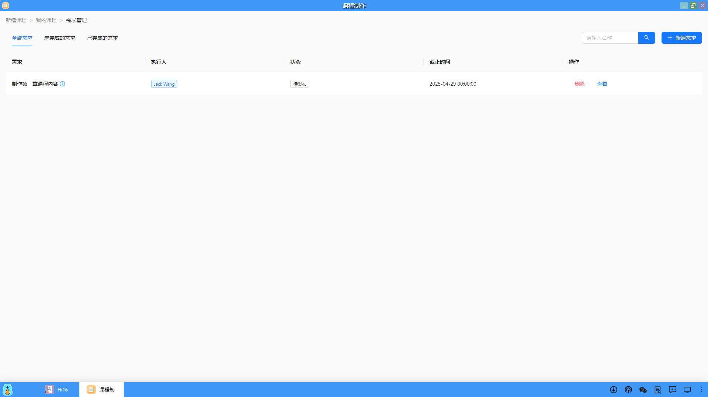