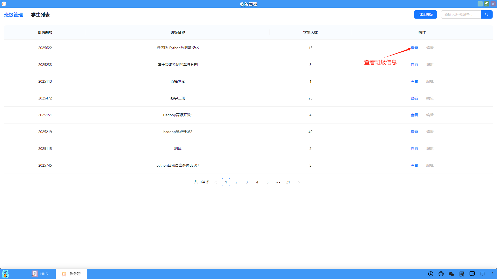
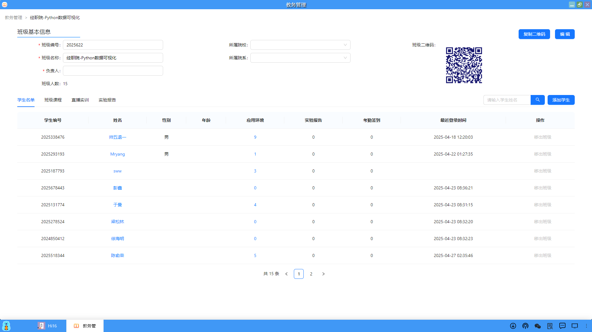
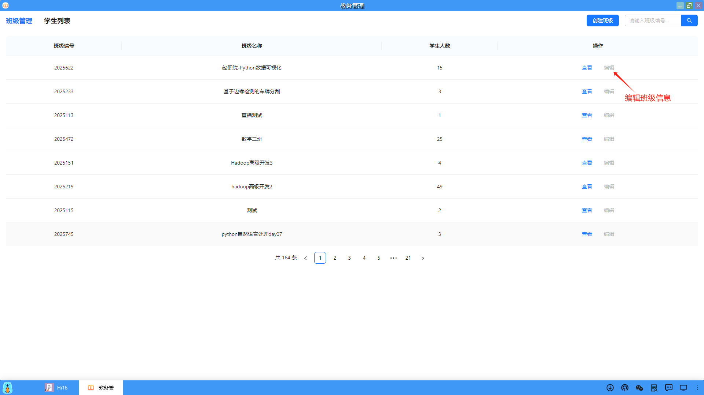

### 查看/编辑班级
在班级管理页面，用户可以查看或者编辑班级信息。

#### 1、查看班级
（1）在班级管理页面中，点击指定班级的"查看"操作，用户可以查看班级信息。

（2）在班级信息页面中，包括班级的基本信息、学生名单、班级课程、直播、实验报告等内容。同时，用户也可以再次进行班级编辑、添加学生的操作。

#### 2、编辑班级
（1）在班级管理页面中，点击指定班级的"编辑"操作，用户可以编辑班级信息。

（2）进入到班级信息页面，用户可以修改信息并保存。

