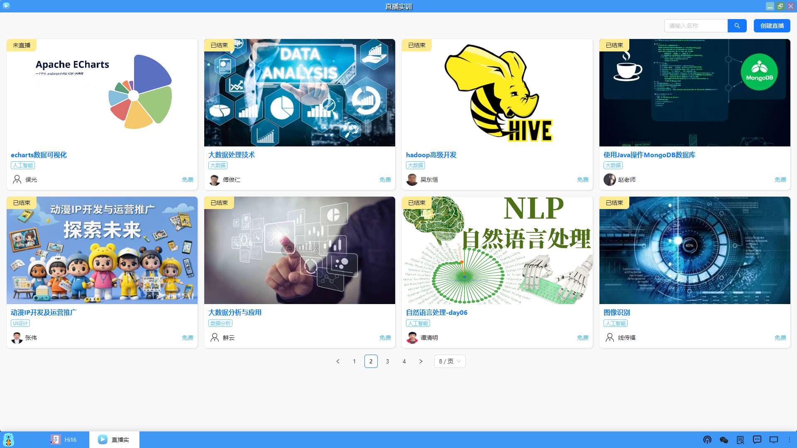
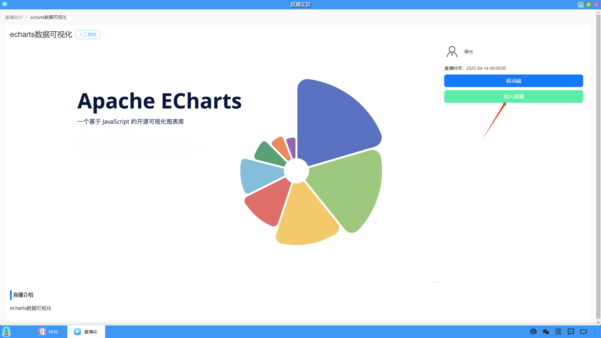
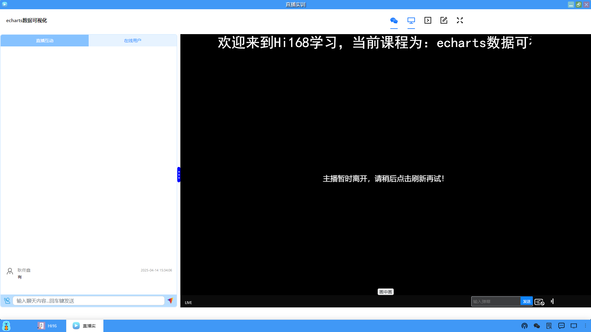
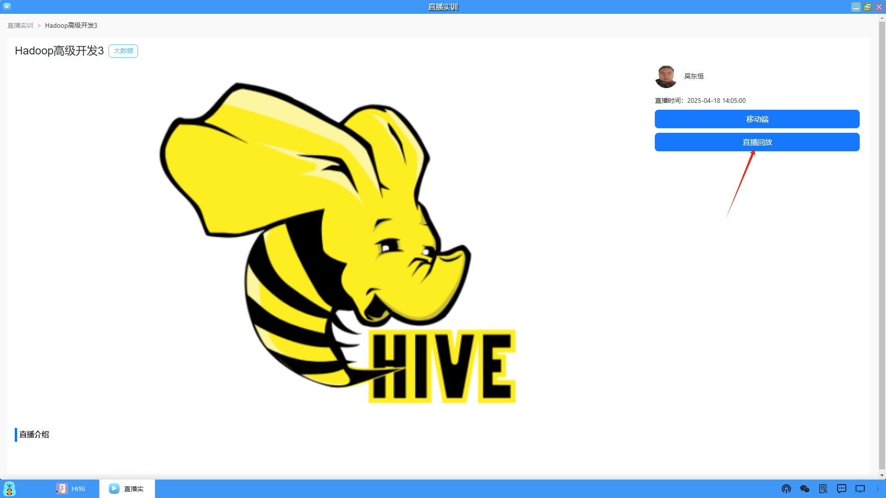

### 直播列表
进入桌面上的直播模块，列出了当前所有创建的直播课程，状态分为正在直播、未直播和已结束三种。

#### 1、加入直播
（1）对于未直播的课程，用户可以点击"加入直播"，然后等直播开始后进入直播间。

（2）直播开始后，按钮状态就变为"进入直播"，此时用户就可以进入直播间了。

（3）进入直播间，显示的是二分屏，右侧是直播画面，左侧是直播互动区和在线用户。

#### 2、直播回放
对于直播结束的课程，平台会自动将直播过程录制成视频上传到云端，老师可以将视频拉取下来供学生看直播回放。

