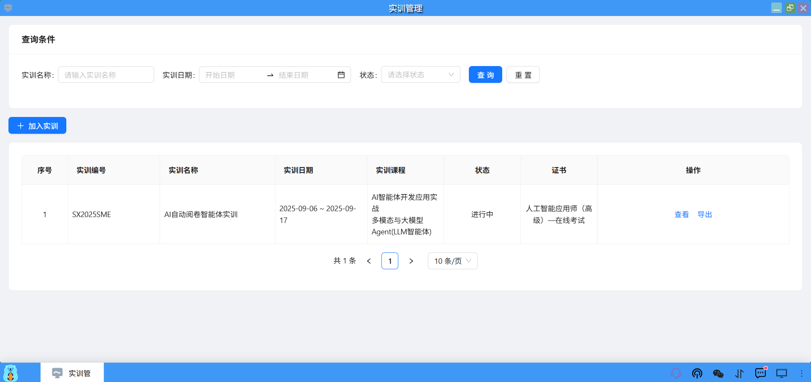
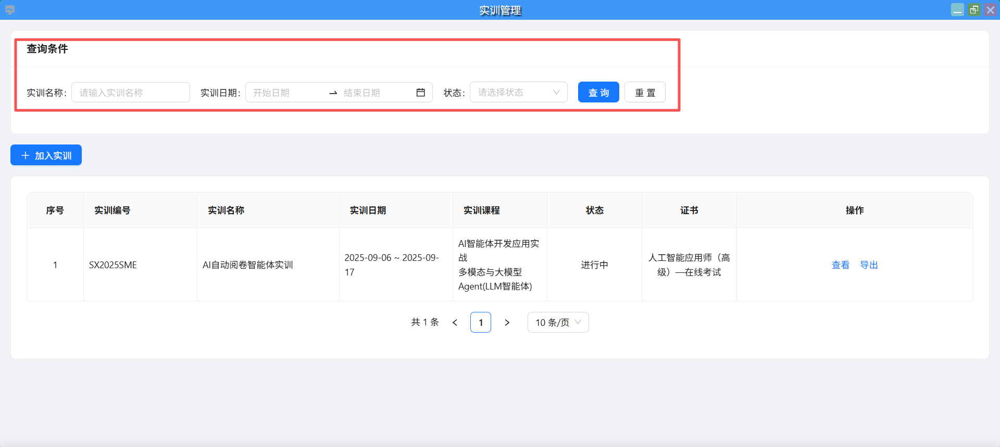
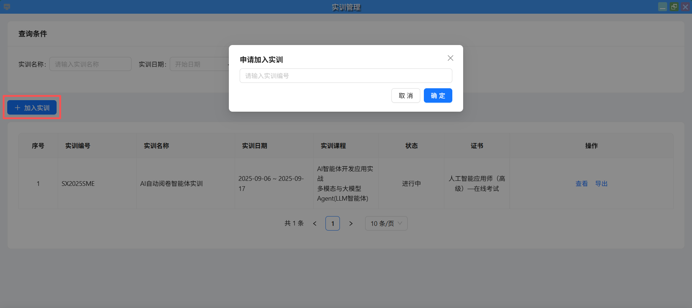
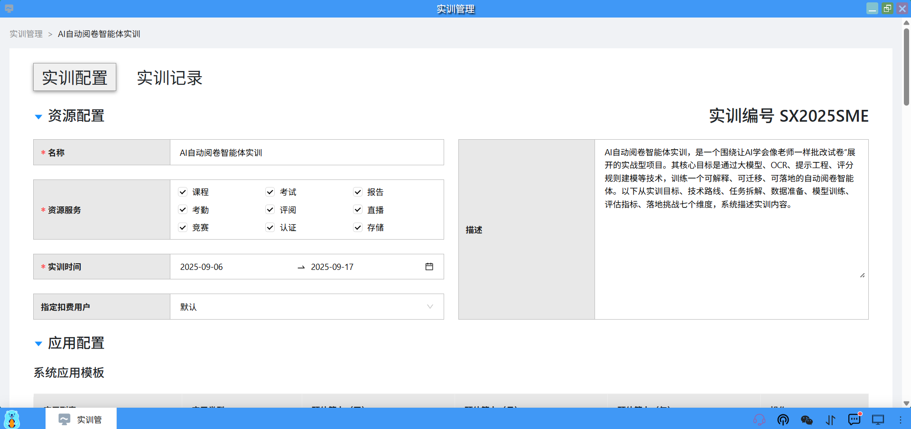
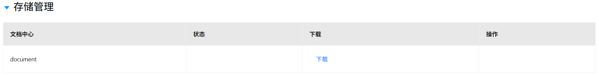
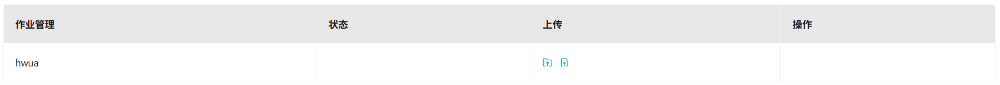
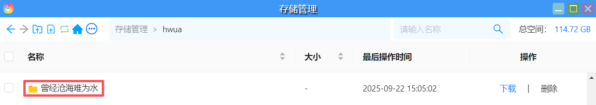

### 学生端
学生在桌面上点击“实训管理”进入实训应用平台，开始完成实训项目。

#### 1、查询实训
学生通过实训名称、日期和状态，可以查询对应的实训。

#### 2、加入实训
学生若已加入实训的班级，那么可以看到教师发布的实训项目，若没有加入实训的班级，那么可以通过点击【加入实训】按钮，输入实训编号，点击【确定】即可加入想要的实训。

#### 3、查看实训
点击【查看】可以进入实训，开始实训项目的任务完成。

#### 4、下载文档
学生可以在文档中心中点击【下载】，去下载教师发布的实训文档。

#### 5、上传作业
（1）学生每天完成的项目作业可以通过作业管理，点击【上传文件夹】和【上传文件】图标，上传到教师指定的存储桶中。

（2）上传成功后，每个学生会在教师的存储桶中自动创建以学生昵称命名的目录，用以存放学生上传的作业。
