### 教师端
教师在桌面上点击“实训管理”进入实训应用平台，创建新的实训项目。

#### 1、创建实训项目
（1）新增实训

点击【+新增实训】按钮创建一个新的实训项目。
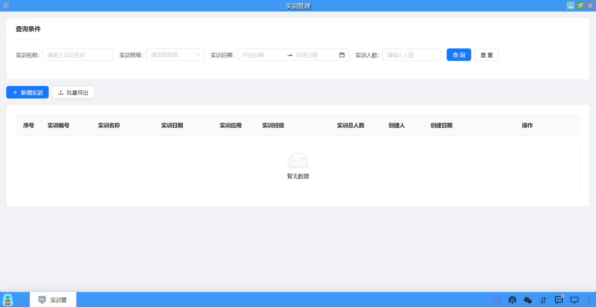

（2）实训配置

①　在实训配置页面中，进行资源配置，包括：名称、资源服务（需要在实训项目中使用的模块，可以在对应的服务前面打勾）、实训时间、指定扣费用户（默认即实训创建者）和描述，填写完毕后点击【创建】按钮即可创建一个新的实训项目。
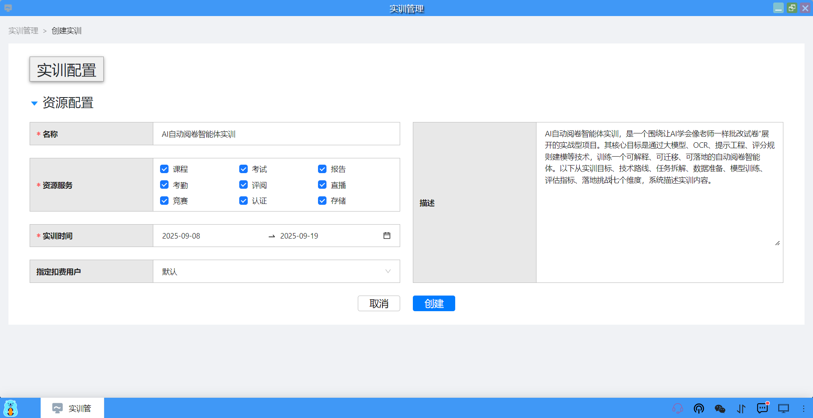

②　创建成功后，会自动生成一条实训记录，包括：实训编号、实训名称、实训日期、实训应用、实训班级、实训总人数、创建人、创建日期和操作等相关信息。
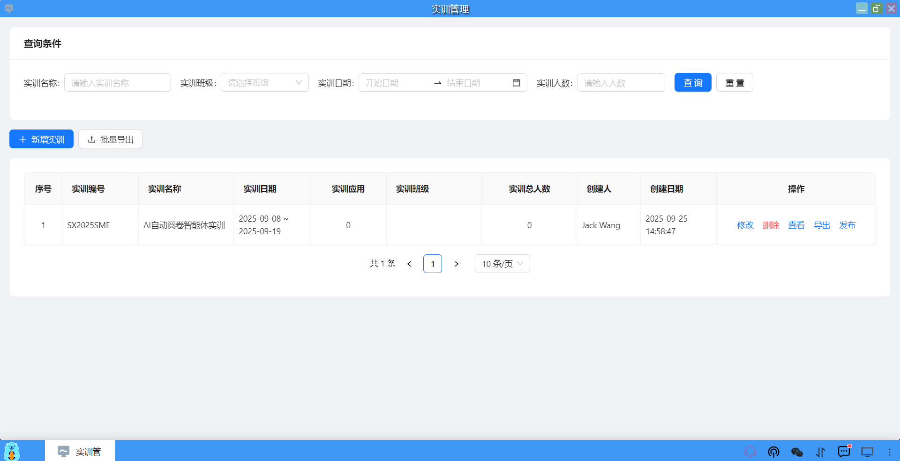

（3）应用配置

实训项目创建完成后，需要配置相应的应用（选择性配置），包括：系统应用模板、用户应用模板、直播配置、班级/用户、课程配置、认证管理、存储管理。

①　添加系统应用模板

点击【+】图标，选择一个或多个实训中需要使用的公共系统应用模板，点击【确定】按钮后添加。添加成功后，在应用列表中显示应用模板的名称、类型、预估算力（天、月、年）和操作（删除、部署）。
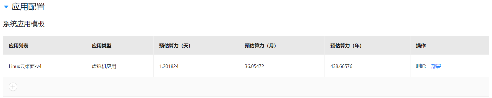

②　添加用户应用模板

点击【+】图标，选择一个或多个实训中需要使用的用户自己的应用模板，点击【确定】按钮后添加。添加成功后，在应用列表中显示应用模板的名称、类型、预估算力（天、月、年）和操作（删除、部署）。
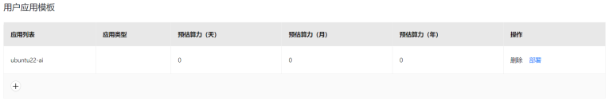

③　添加直播

点击【+】图标，选择一个或多个实训中需要使用的直播，点击【确定】按钮后添加。添加成功后，在直播列表中显示直播的名称、开始时间、结束时间、直播老师、适用班级、直播封面和操作（删除、进入）。
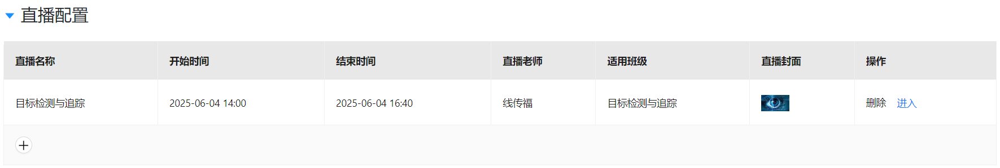

④　添加班级

点击【+】图标，选择一个或多个实训班级，点击【确定】按钮后添加。添加成功后，在班级列表中显示班级的名称、人数、班主任、授课老师和操作（删除、进入）。
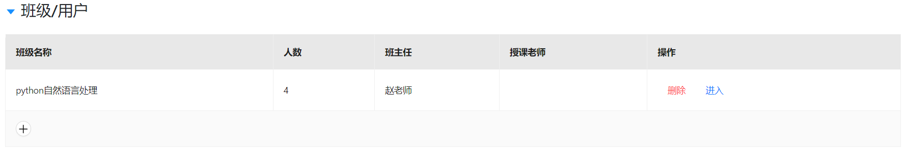

⑤　添加学生

也可以单独将学生加入到班级中，通过账号/昵称找到学生添加，或者通过扫班级的二维码加入班级。
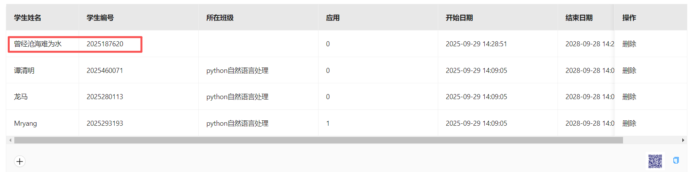

⑥　添加课程

点击【+】图标，选择一个或多个实训中使用的课程，点击【确定】按钮后添加。添加成功后，在课程列表中显示课程的名称、课时、学分、课程类别、上课时间、主讲教师、封面和操作（删除、进入）。
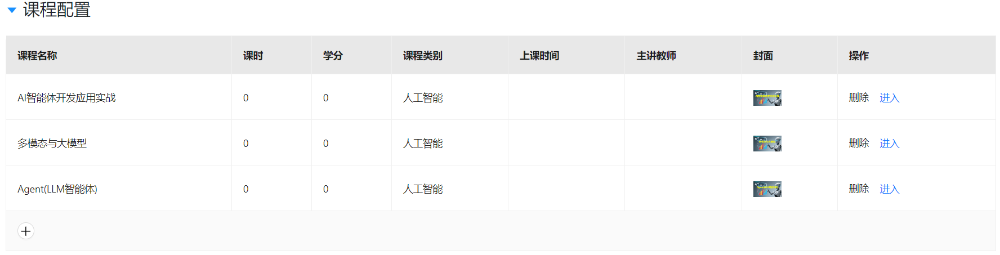

⑦　添加认证

点击【+】图标，选择一个或多个认证证书，点击【确定】按钮后添加。添加成功后，在证书列表中显示证书的名称、认证维度、认证开始时间、认证结束时间、认证机构和操作（删除、进入）。
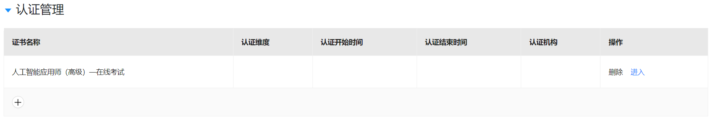

⑧　添加文档下载的存储桶

点击【+】图标，选择一个或多个用于下载文档资料的存储桶，点击【确定】按钮后添加。添加成功后，在列表中显示存储桶的名称、状态（禁止下载、开放下载）、下载链接（若禁止下载就没有此链接）和操作（删除）。
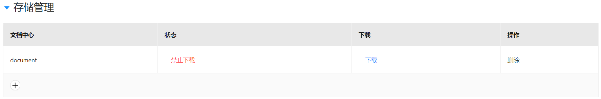

⑨　添加作业上传的存储桶

点击【+】图标，选择一个或多个用于学生上传作业的存储桶，点击【确定】按钮后添加。添加成功后，在列表中显示存储桶的名称、状态（禁止上传、开放上传）、上传文件夹和文件的链接（若禁止上传就没有此链接）和操作（删除）。
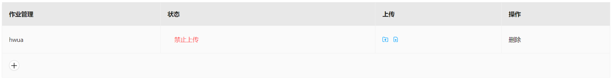

（4）保存和发布/下架实训

配置完成后点击【保存】按钮，最后点击【发布】按钮将实训项目发布，让所有学生可见并可以使用。

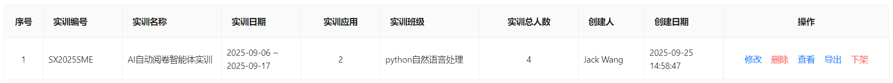

#### 2、查询实训
可以通过实训名称、班级、日期和人数来查询指定的实训。
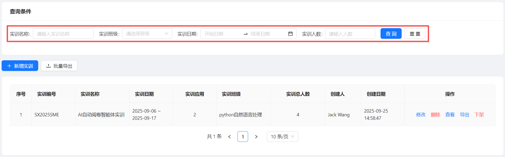

#### 3、批量/单个实训导出
可以对所有实训或单个实训的数据导出到Excel文件中。
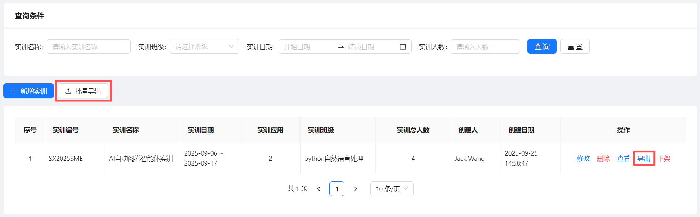