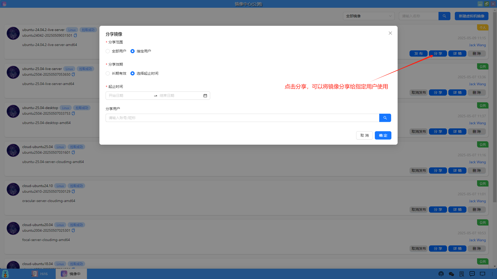
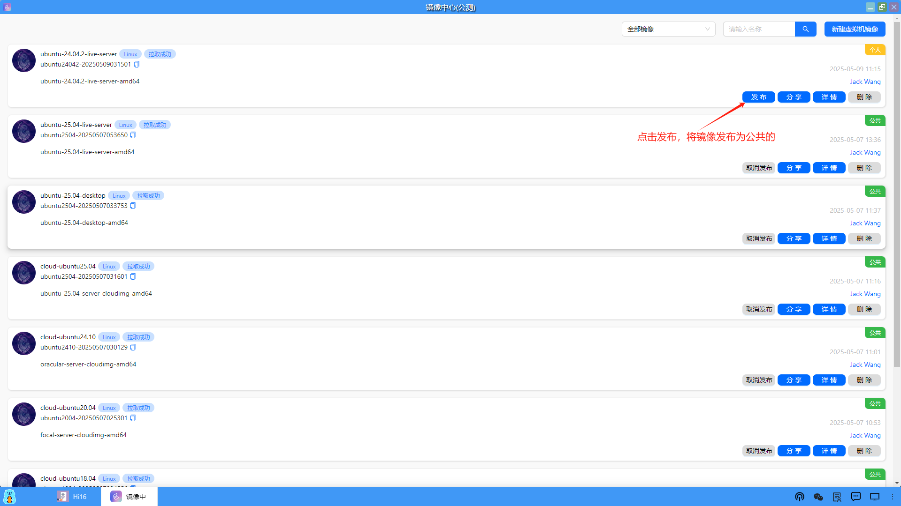
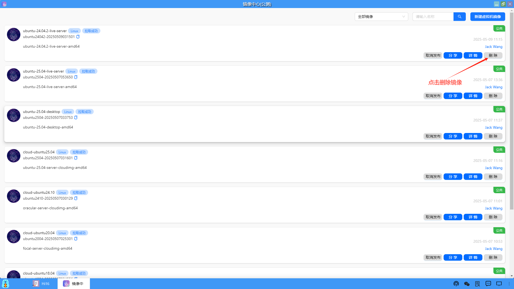
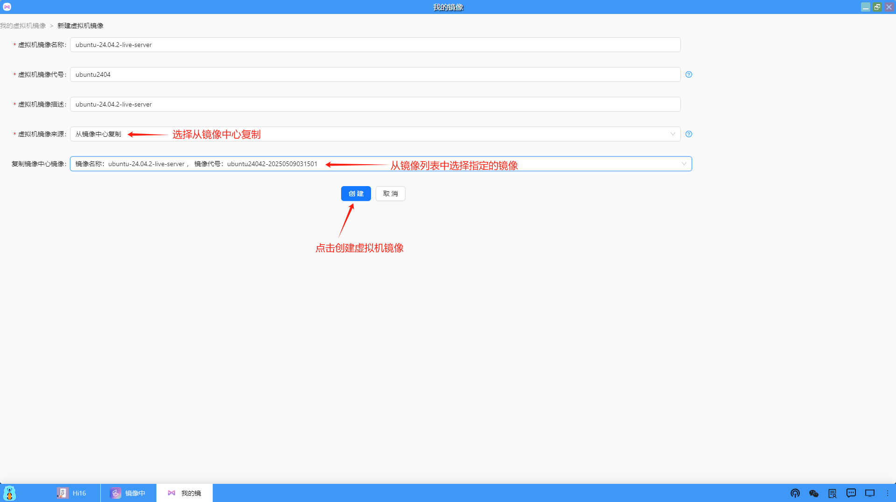
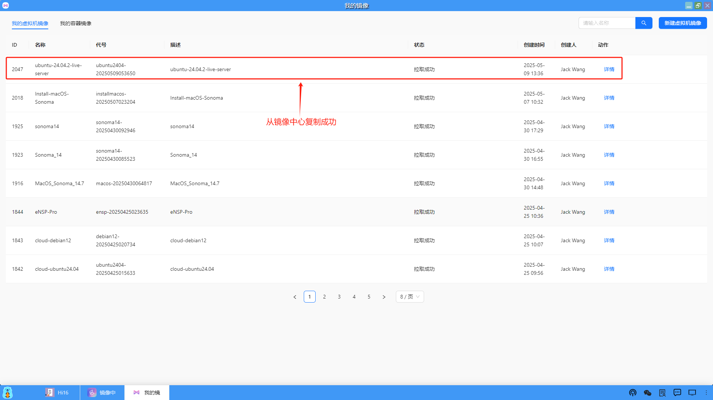
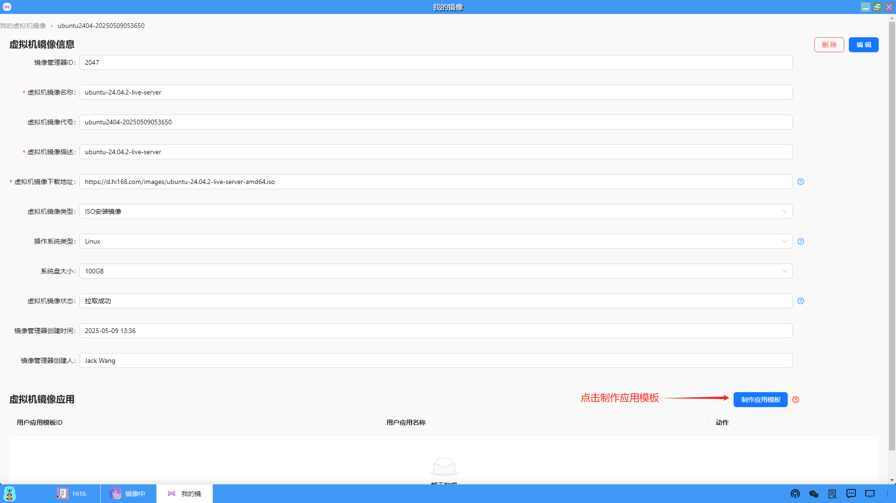
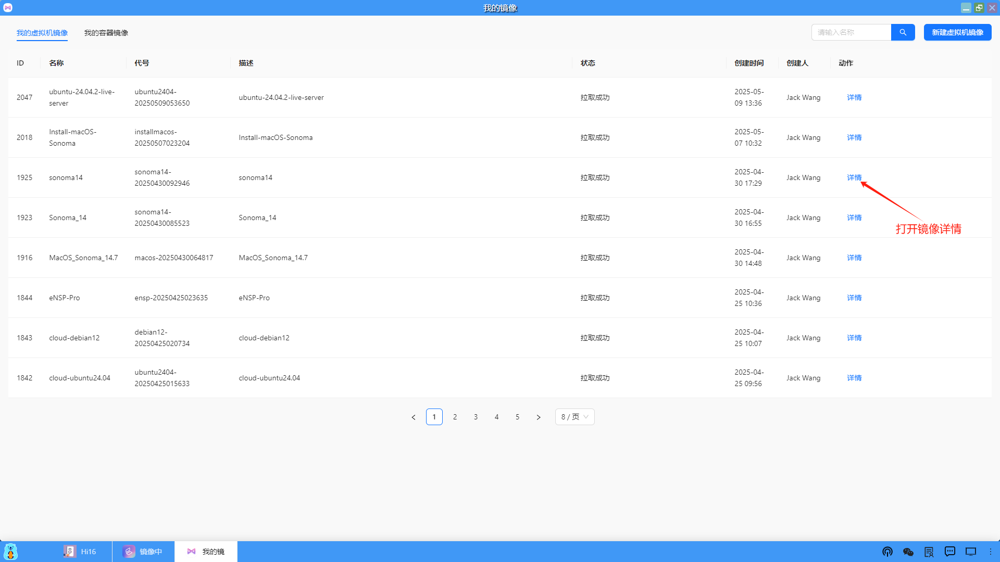
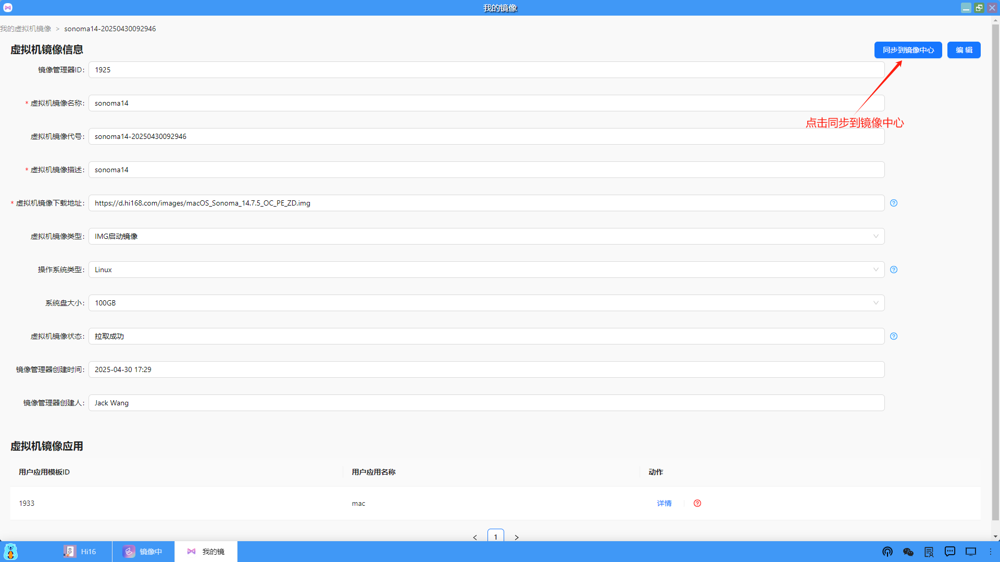
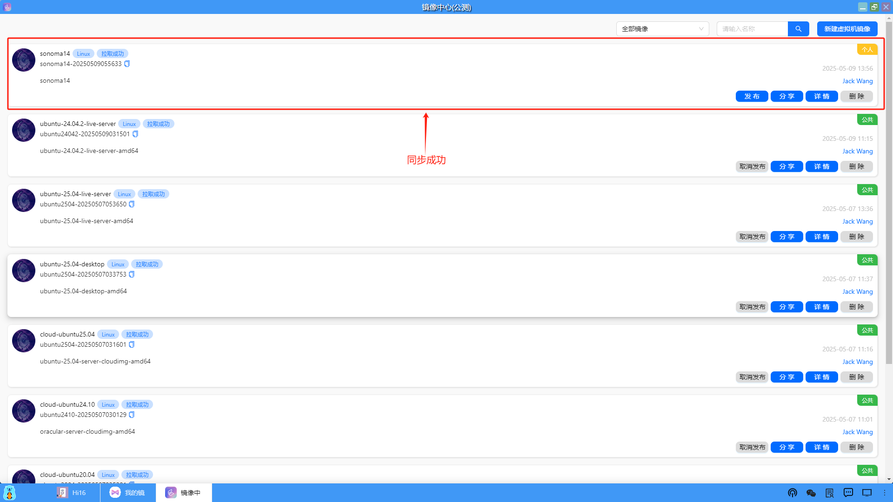

### 镜像操作
在镜像列表中，用户可以对指定的镜像进行如下的操作，十分方便。

#### 1、查看和编辑镜像

镜像所有者可以编辑自己的镜像信息。

#### 2、查找镜像

#### 3、分享镜像

#### 4、发布镜像
默认新建的镜像属于个人的，其他用户是看不见的，除非通过分享给其他用户使用。因此，创建镜像的用户可以将镜像发布为公共的，那么所有用户都可以使用了。

#### 5、删除镜像
镜像所有者可以删除自己的镜像。

#### 6、使用镜像
用户从“我的镜像”进入，新建一个虚拟机镜像，这时虚拟机镜像来源可以不通过按指定的URL下载，可以直接从镜像中心复制。

制作应用模板的流程和我的镜像——>新建虚拟机镜像和制作应用模板是相同的。

#### 7、同步镜像
用户之前在我的镜像中通过URL下载并创建的镜像，也可以一键同步到镜像中心并发布，供所有用户使用。

