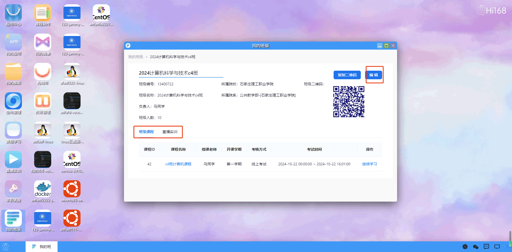

## 我的班级

#### 概述
我的班级菜单是一个特定功能，用于学生或教师在在线学习平台中管理和参与他们所属的班级活动。
包括班级信息在"我的班级"菜单中，学生可以查看他们所属班级的相关信息，包括班级名称、培训的课程和直播内容、授课教师等。

用户双击打开“我的班级”后，首先展示一个班级列表界面，列出所有的班级信息。每个班级信息应包括：班级名称，让用户可以快速识别不同的班级，参加人数，显示当前该班级的学员人数。其他相关信息，如培训难度、课程还有关联的培训直播和课时数等。

<!-- 
#### 功能介绍
**创建班级：**在右上方提供一个“创建班级”按钮，用户点击后可以设置班级相关信息，并最终创建班级。
用户需要填写以下班级信息：  
班级名称：填写班级的名称。  
培训难度：设定该班级的培训难度级别。  
课时数：填写该班级的总课时数。  
定价：设定该班级的培训价格。  
培训课程：列出该班级所包含的培训课程。  
培训直播：指定该班级是否包含培训直播课程。  
封面：上传班级的封面图片，用于展示班级信息。  
用户填写完班级相关信息后，点击“创建”或“发布”按钮，即可将该班级创建并发布到平台上供学员报名参加。 -->
