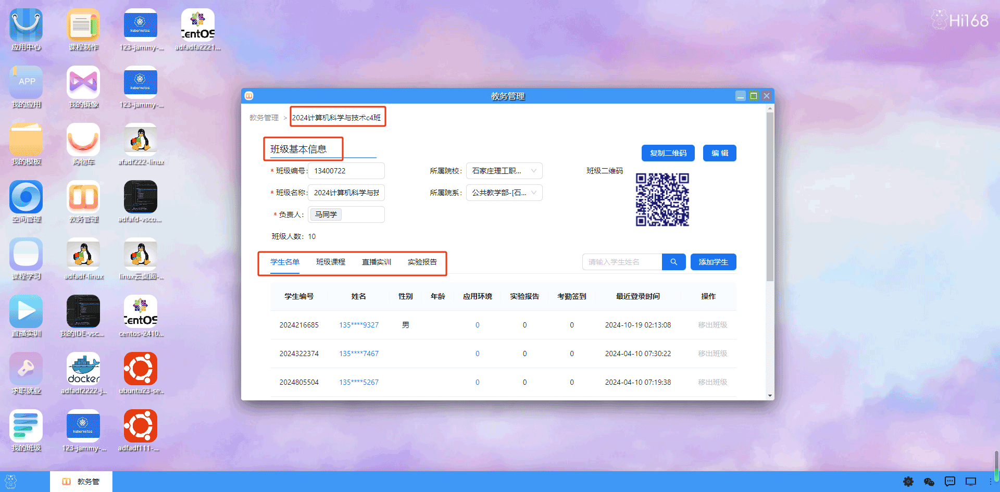
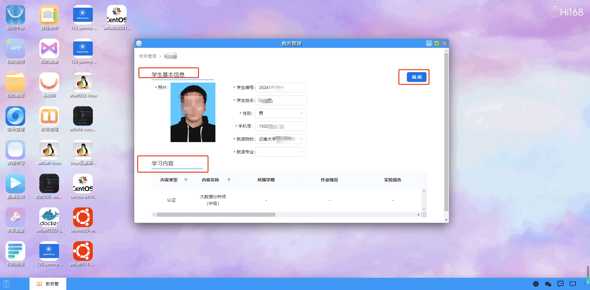

## 教务管理

高效的教务管理系统，您可以轻松管理班级、学生信息，以及查看和管理班级的详细信息，包括班级二维码、学生名单、班级课程、直播实训和实验报告等内容。    
双击打开教务管理后，您将进入主界面，主界面上方有导航栏，班级管理和学生列表两个主要分类。

班级管理：显示所有班级及其基本信息，班级二维码，班级的学生名单，班级课程，直播实训，实验报告等。

学生列表：显示所有学生及其基本信息，学习内容等。

班级详细信息：查看班级的基本详细信息，包括班级名称、班主任、所属年级等。  
查看班级的二维码，用于学生扫码加入班级。  
查看班级的学生名单。  

班级课程：查看班级的课程信息，主要包括课程信息，考核方式时间，实训计划等

每个课程里面可以查看学生的学生情况包括视频课的进度，签到考勤，作业完成情况，实验报告提交情况和进行成绩算法等

