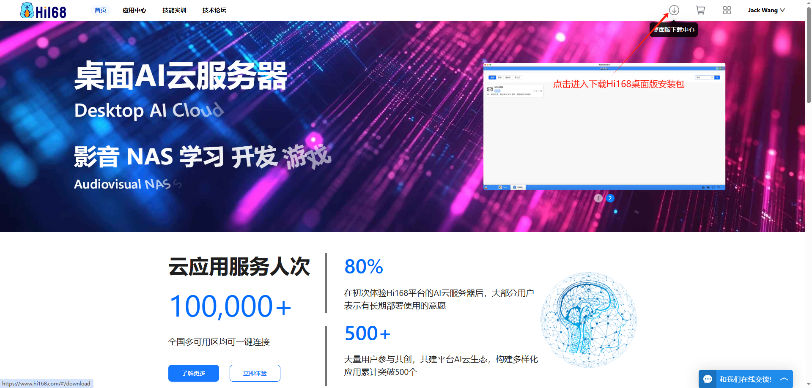
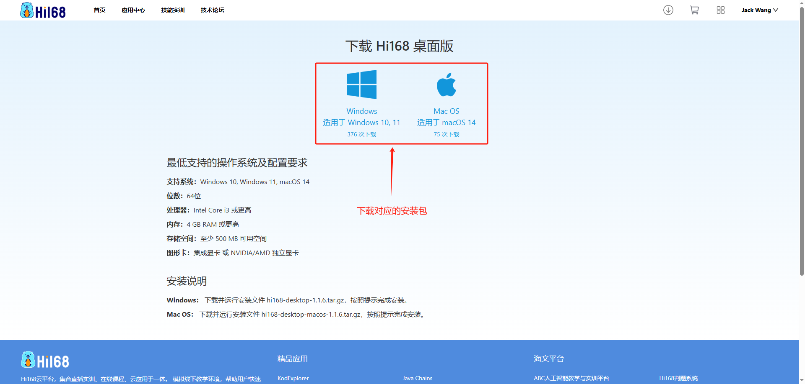
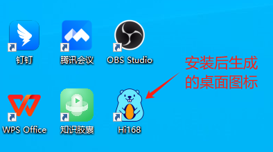

### 下载 Hi168 桌面版
用户在使用Hi168平台时，既可以使用浏览器版的Hi168（https://www.hi168.com）, 并可以切换到桌面端风格使用。

除了浏览器版的Hi168，用户可以下载Hi168桌面版，直接安装在本地计算机上使用，无需再通过打开浏览器使用Hi168了，如下方式：
#### 下载入口一：

#### 下载入口二：

#### 安装运行：
安装成功后，在本地计算机桌面上生成一个图标，直接运行登录即可使用。

