### 例子一：部署eNSP应用
我们部署一个eNSP模拟器的虚拟机应用，借助云端互联，通过远程桌面连接到eNSP应用，并且可以正常使用。步骤如下：
#### 1、找到需要部署的应用模板
（1）从桌面端进入应用中心模块

（2）根据关键字搜索到对应的应用模板

#### 2、部署应用
（1）点击应用模板部署

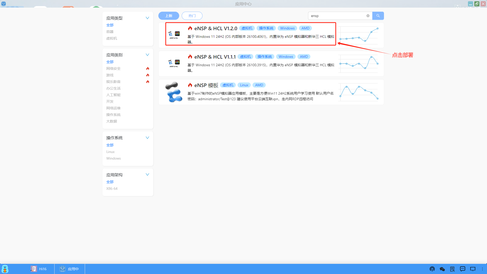

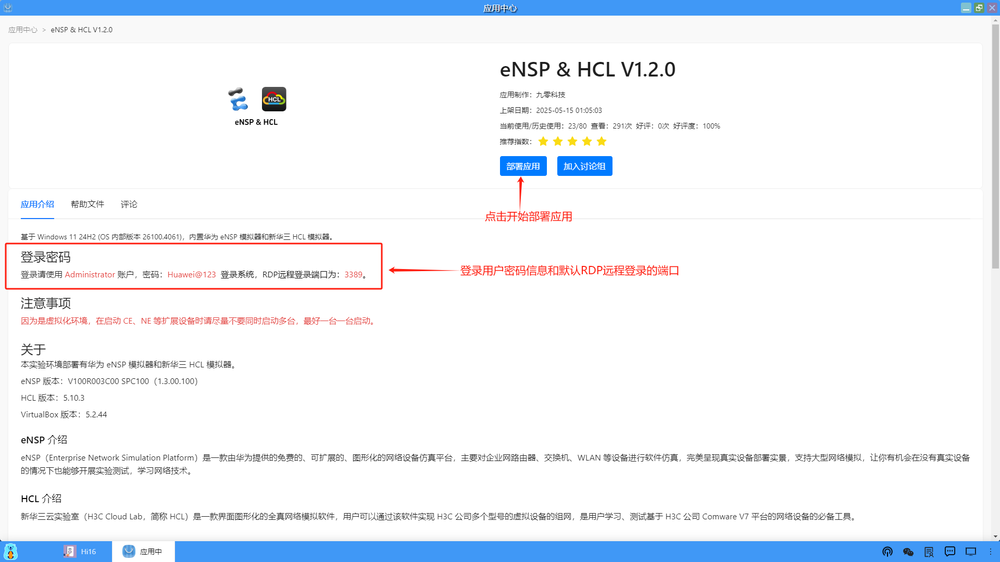

（2）设置部署应用的名称和设置算力服务，点击“确认”开始部署

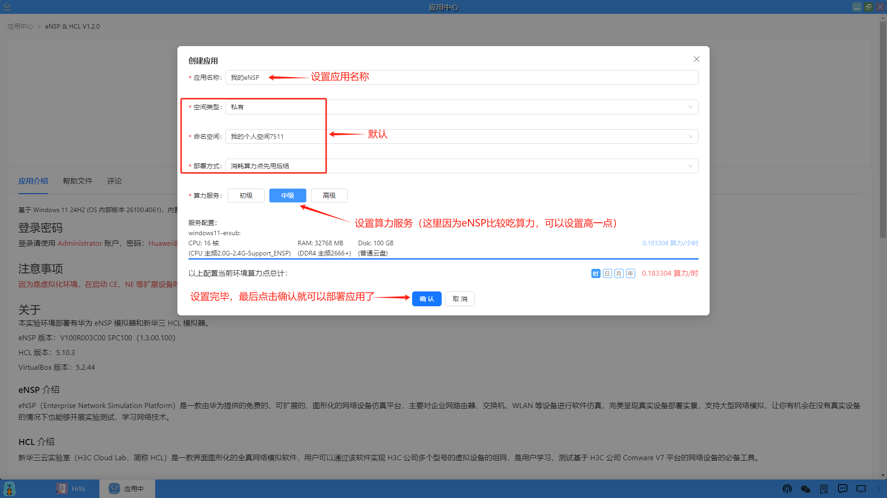

（3）部署应用后，切换到桌面，在桌面上就会创建一个应用的图标
<li>正在部署：</li>

<li>部署成功：</li>

（4）点击图标打开应用

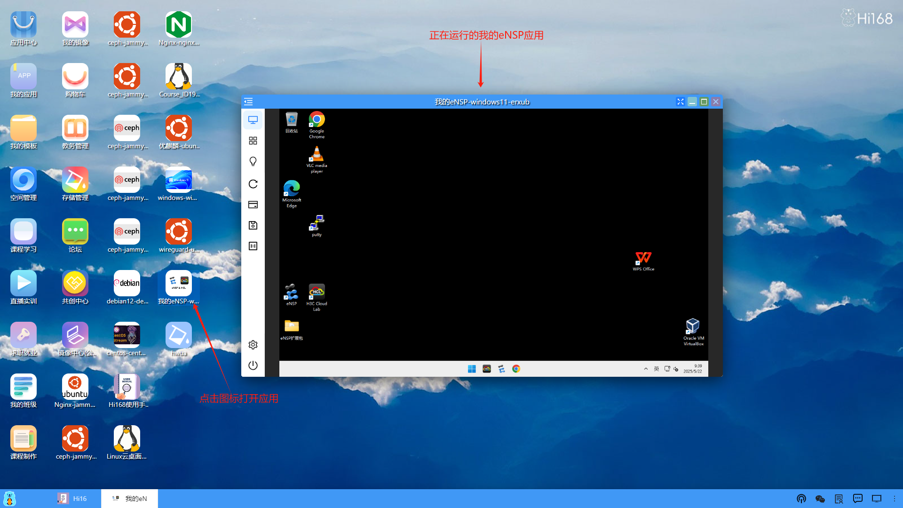

（5）运行eNSP模拟器

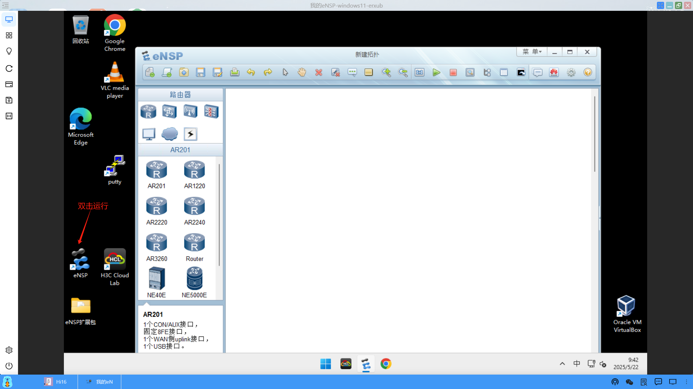

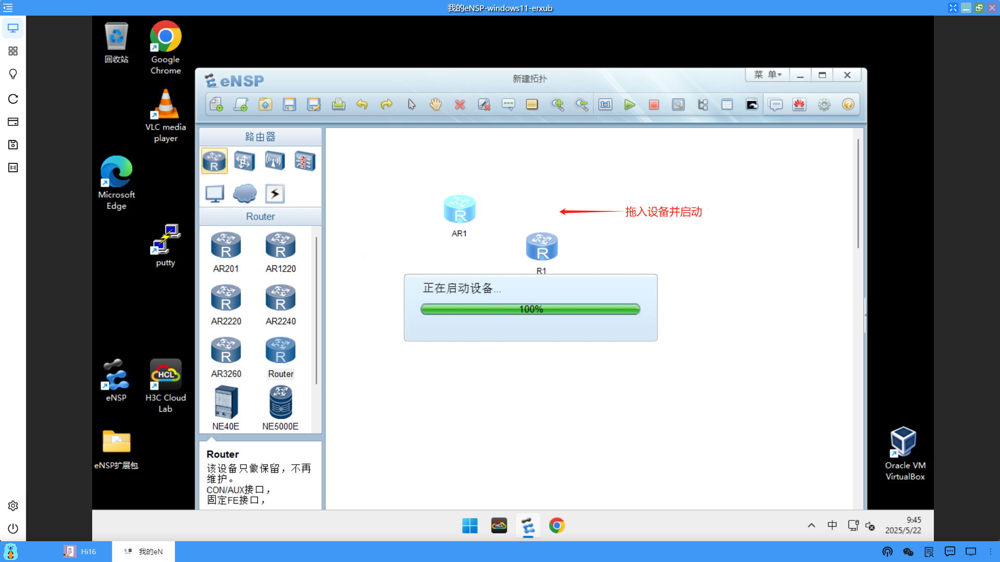

（6）运行H3C Cloud Lab

到这里，部署的eNSP应用运行一切正常。

#### 3、测试云端互联
接下来我们需要测试一下云端和本地是否打通，这个就需要借助深算工场的云端互联功能了，我们来测试一下云端互联。

（1）首先打开云端互联，请参考【五、云端互联——>单客户端】。

（2）找到需要测试的云端虚拟机的ip（以部署的这个eNSP为例）

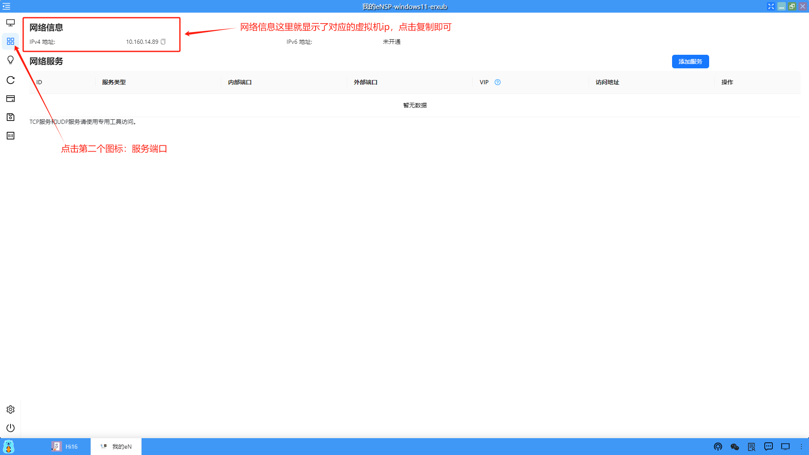

（3）打开本地的CMD命令终端，使用ping 云端虚拟机的ip，测试一下本地和云端的虚拟机是否能ping的通。

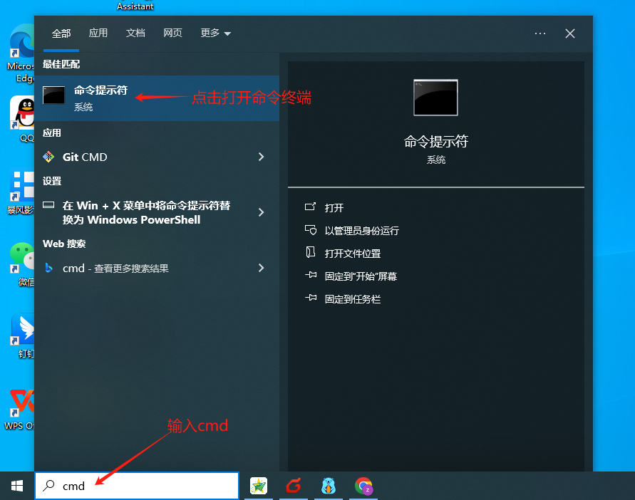

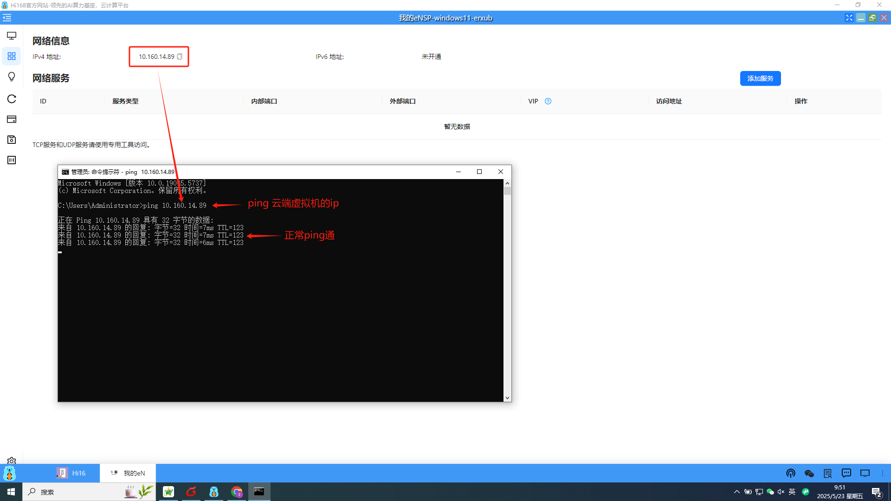

这样，云端互联就测试通过了。

注意：云端互联的详细内容和问题解决，可以参考帮助手册中的【五、云端互联】。

#### 4、使用本地远程桌面连接应用
云端的eNSP应用和云端互联可以正常使用后，最后我们通过本地的远程桌面连接到云端的eNSP应用，这样操作起来会更加便捷。

（1）打开本地的远程桌面连接

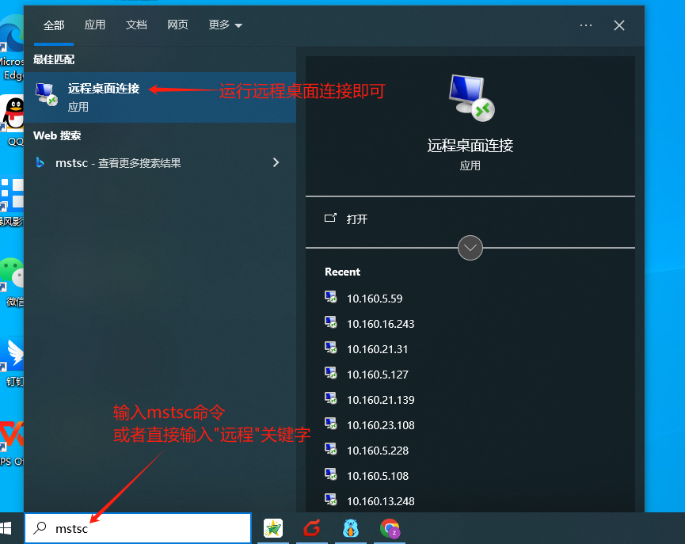

（2）在打开的远程桌面连接中输入云端虚拟机（eNSP应用）的ip

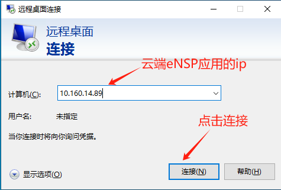

（3）输入eNSP应用的用户名和密码，点击"确定"和"是"即可

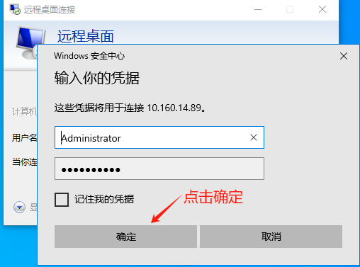

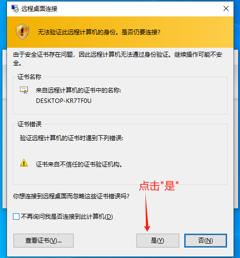

（4）远程桌面连接成功，就像本地操作一样使用云端的eNSP应用（虚拟机）

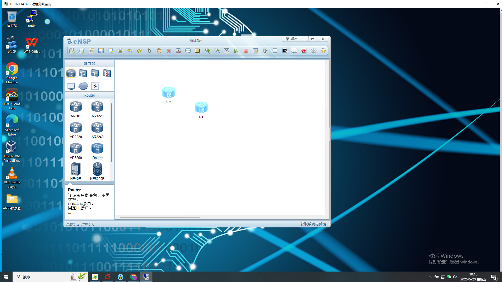