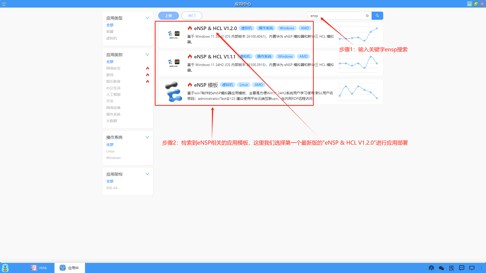
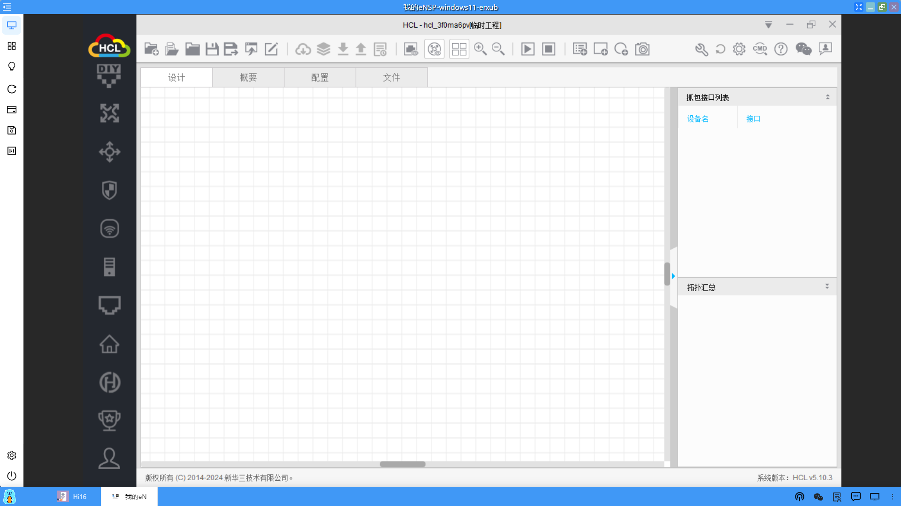

### 例子一：部署eNSP应用
我们部署一个eNSP模拟器的虚拟机应用，借助云端互联，通过远程桌面连接到eNSP应用，并且可以正常使用。步骤如下：
#### 1、找到需要部署的应用模板
（1）从桌面端进入应用中心模块

（2）根据关键字搜索到对应的应用模板

#### 2、部署应用
（1）点击应用模板部署

（2）设置部署应用的名称和设置算力服务，点击“确认”开始部署

（3）部署应用后，切换到桌面，在桌面上就会创建一个应用的图标
<li>正在部署：</li>

<li>部署成功：</li>

（4）点击图标打开应用

（5）运行eNSP模拟器

（6）运行H3C Cloud Lab

到这里，部署的eNSP应用运行一切正常。

#### 3、测试云端互联

#### 4、使用本地远程桌面连接应用