### 例子三：安装Ubuntu24.04操作系统
第三个例子，我们下载Ubuntu24.04的安装镜像（iso或img格式），安装Ubuntu24.04 操作系统，并发布成公共模板。

#### 1、下载Ubuntu24.04镜像（这里以cloud image为例）
Ubuntu24.04 cloud image地址，可以从cloud-images.ubuntu.com官网上下载，地址：https://cloud-images.ubuntu.com/noble/current/noble-server-cloudimg-amd64.img，
由于是国外网站，受限于管控不太容易下载，也可以到清华、中科大、阿里云的开源软件镜像站上面去下载。

在深算工场平台上提供了URL地址方式下载，我们可以使用镜像中心下载安装。深算工场的镜像中心，类似于阿里云镜像站，将市面上主流的操作系统镜像（iso、img、qcow2）都已经上传上去了，用户可以直接使用。

通过关键字搜索到Ubuntu24.04 cloud image。

#### 2、制作应用模板
（1）我们可以基于Ubuntu24.04 cloud image来制作应用模板，安装Ubuntu24.04系统了，点击界面上的"制作应用模板"即可。

（2）填入应用模板的相关信息，其它按默认设置，设置完毕后，点击"创建"即可。

（3）进入桌面中心的"应用模板"模块，可以看到创建成功的应用模板。

#### 3、部署应用
创建应用模板成功后，我们就可以采用此模板部署一个应用，开始安装Ubuntu24.04的操作系统了。

（1）点击"部署"，开始部署应用。

（2）设置应用名称和算力服务，点击"确定"开始部署。

（3）正在部署中

（4）应用部署成功

（5）点击打开应用，我们发现已经安装完毕进入到登录界面，这里是因为采用cloud image这个云版的Ubuntu，这是一个已经安装好的成型操作系统，它会使用cloud-init进行参数初始化，包括登录用户名、密码，网络、其它初始化脚本都可以，只要在对应的yaml文件中配置即可，深算工场已经做了相应的设置，用户只要直接使用即可。
这里登录的初始用户密码是: hwua/hwua123456

#### 4、系统的配置
系统安装好了，接下来就是做一些基本的配置，比如：软件源的设置、SSH、ttyd工具包、Trzsz上传下载工具、dhclient工具、webshell工具包等安装。

（1）hwua用户登录（用户名：hwua  密码：hwua123456）

（2）切换到root用户

    # 切换到root用户
    sudo su
    cd
    clear

（3）修改root用户密码

    # 修改root密码（密码设置为：hwua123456，需要输入两次）
    passwd

（4）修改apt软件源为阿里云

    # 编辑ubuntu.sources
    vim /etc/apt/sources.list.d/ubuntu.sources

    # 将里面两个URIs的内容修改为阿里云的地址
    URIs: https://mirrors.aliyun.com//ubuntu

（5）更新软件源

    # 执行命令更新
    apt update

（6）安装net-tools工具包，可以使用ifconfig查看ip地址

    # 安装net-tools 
    apt install net-tools

    # ifconfig命令查看ip
    ifconfig

（7）安装SSH，便于本地通过SSH远程登录到云端的虚拟机
    
    # 安装SSH
    apt install ssh 

    # 查看ssh状态
    systemctl status ssh

    # 查看ssh的监听端口22
    netstat -tlnp

    # 修改ssh的配置文件，允许root用户能够远程通过密码登录
    vim /etc/ssh/sshd_config
    # 将#PermitRootLogin prohibit-password的"#"去掉， 修改为：PermitRootLogin yes
    vim /etc/ssh/sshd_config.d/60-cloudimg-settings.conf
    # 将 PasswordAuthentication no修改为：PasswordAuthentication yes

    # 重启ssh服务让其配置生效
    systemctl restart ssh

到这里，ssh安装配置好以后，我们就可以通过本地的ssh客户端软件通过ssh方式远程登录到这个虚拟机应用了，相关命令的执行，直接可以通过复制粘贴了。

（8）本地SSH软件远程登录连接
这方面的软件很多，这里我们使用的是MobaXterm，打开软件执行如下命令，输入root密码即可。

    # 注意：ip为虚拟机的地址
    ssh root@10.160.8.146

接下来，命令执行就可以直接复制粘贴了。

（9）设置软件源修改为永久

由于云版Ubuntu的cloud-init会对apt软件源每次系统重启进行初始化，那么之前配置的信息又被恢复了，所以我们需要禁用 Cloud-init 对APT源的托管，方式如下：

    # 编辑文档/etc/cloud/cloud.cfg.d/99-disable-apt-sources.cfg
    vim /etc/cloud/cloud.cfg.d/99-disable-apt-sources.cfg

    # 输入如下内容
    # 禁用 Cloud-init 对 APT 源的管理
    apt:
      preserve_sources_list: true
    # 或者直接禁用全局源管理
    manage_etc_apt_sources_list: false

（10）安装简体中文

    # 安装中文包
    apt update
    apt install language-pack-zh-hans

    # 在.bashrc中添加环境变量
    vim ~/.bashrc
    # 添加如下环境变量
    export LANG="zh_CN.UTF-8"
    export LANGUAGE="zh_CN:zh:en_US:en"

    # 保存，source 一下 ~/.bashrc即可

（11）安装ttyd工具

    # 下载ttyd工具包
    wget https://d.hi168.com/hi168-public/ttyd.20241115v2.tar.gz

    # 安装ttyd工具包
    mv ttyd.20241115v2.tar.gz /var/lib
    cd /var/lib
    tar zxvf ttyd.20241115v2.tar.gz
    cd /var/lib/ttyd
    ./start-ttyd.sh

    # 添加ttyd开机自启动
    # 打开crontab编辑器：
    crontab -e
    在crontab中输入以下开机自启动命令：
    @reboot /var/lib/ttyd/start-ttyd.sh 2>&1 &

（12）安装Trzsz上传下载工具

    # 执行以下命令安装trzsz工具
    apt update && sudo apt install software-properties-common
    add-apt-repository ppa:trzsz/ppa && sudo apt update
    apt install trzsz

（13）安装dhclient工具

    # 执行以下命令安装dhclient工具
    apt install isc-dhcp-client

    # 创建dhclient执行脚本
    which dhclient > /var/lib/ttyd/config-nic.sh
    chmod +x /var/lib/ttyd/config-nic.sh

    # 检查dhclient执行脚本是否正确
    cat /var/lib/ttyd/config-nic.sh
    # 显示内容
    /usr/sbin/dhclient

    # 在crontab中输入以下开机自启动命令
    crontab -e
    @reboot /var/lib/ttyd/config-nic.sh 2>&1 &

（14）安装webshell工具

    # 下载webshell工具包
    wget https://d.hi168.com/hi168-public/webshell.20241118v2.tar.gz

    # 安装webshell工具包
    mv webshell.20241118v2.tar.gz /var/lib
    cd /var/lib
    tar zxvf webshell.20241118v2.tar.gz

    #  添加webshell开机自启动
    crontab -e
    @reboot /var/lib/webshell/launch-vmshell-daemon.sh

（15）关闭防火墙

为确保ttyd、webshell以及后续自定义安装服务的端口能够被外部访问，需要关闭虚拟机防火墙。不同操作系统关闭防火墙的方式不同。

    systemctl stop ufw
    systemctl disable ufw
    ufw status

到这一步，我们的Ubuntu24.04就安装和配置完成了，当然这里还可以预装用户所需要的各种软件，大家可以选择性的安装进去，最后就是将这个应用制作成应用模板并发布，供所有人使用。

#### 5、制作应用模板

（1）从桌面上进入到"我的应用"，找到并进入部署的这个应用。

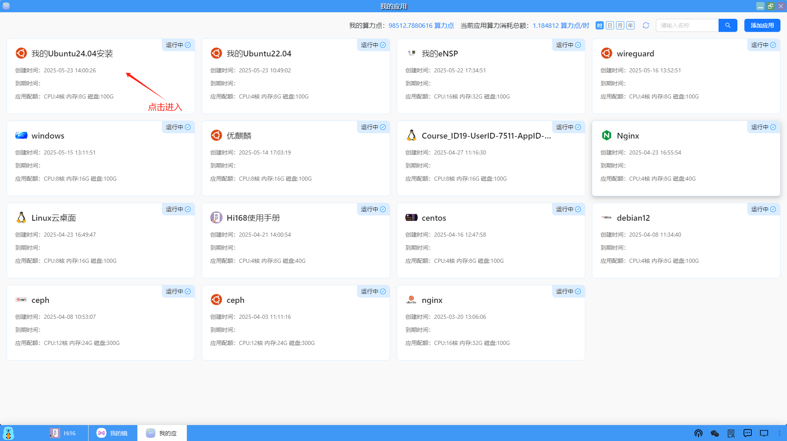

（2）点击右上角的"创建模板"

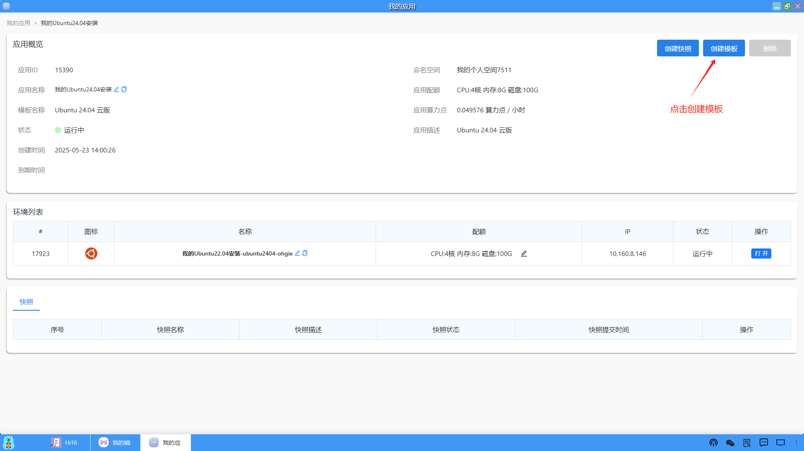

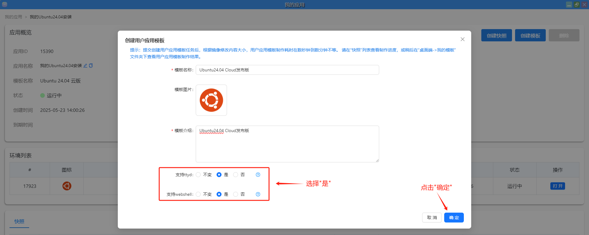

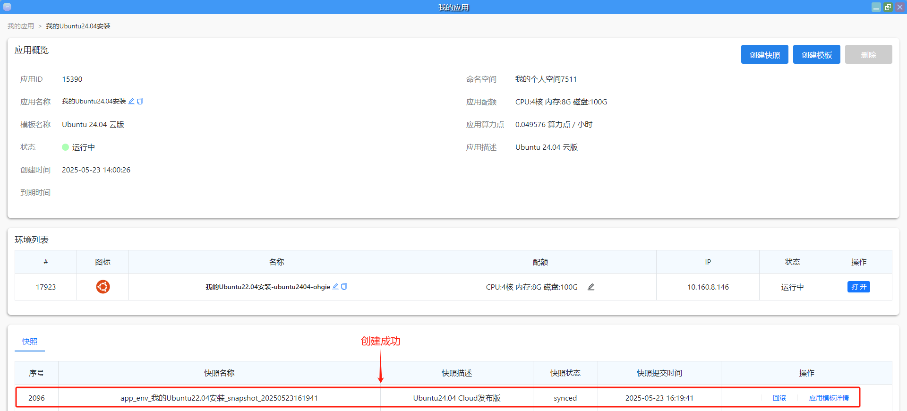

（3）从桌面上进入"我的模板"，就可以看到制作成功的这个模板。

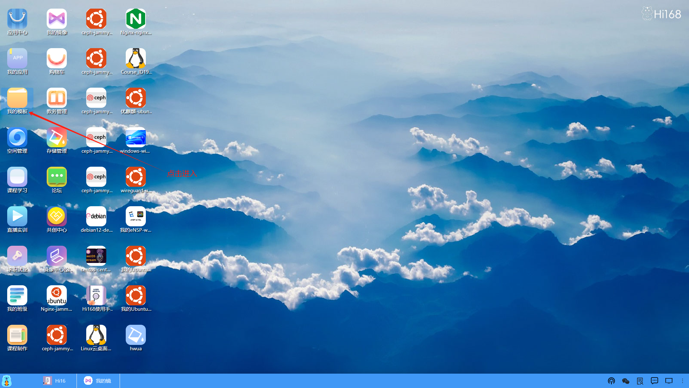

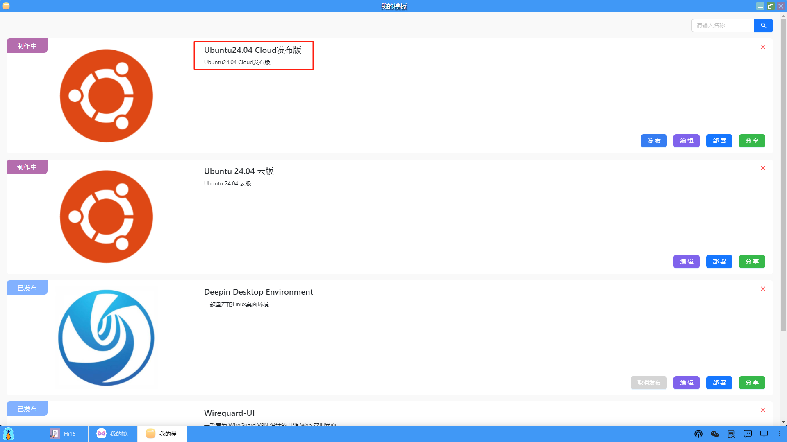

（4）编辑模板内容

可以讲算力服务的初级、中级和高级的配置调整一下。

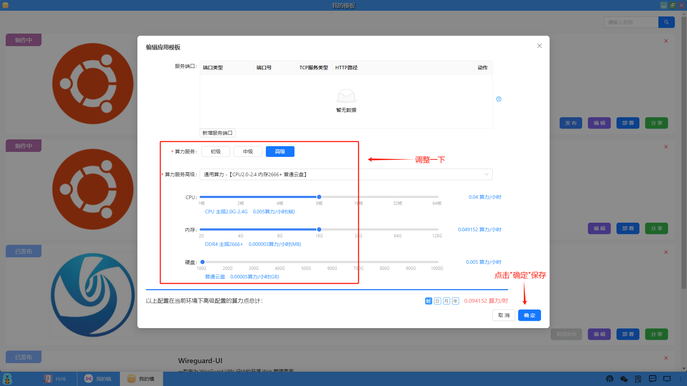

（5）不发布，将模板分享给指定的用户使用

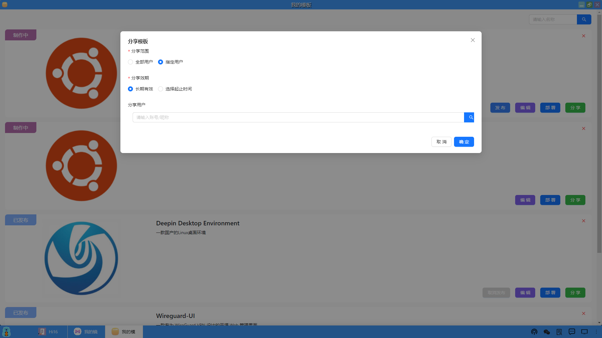

（6）发布模板到应用中心，供所有人使用

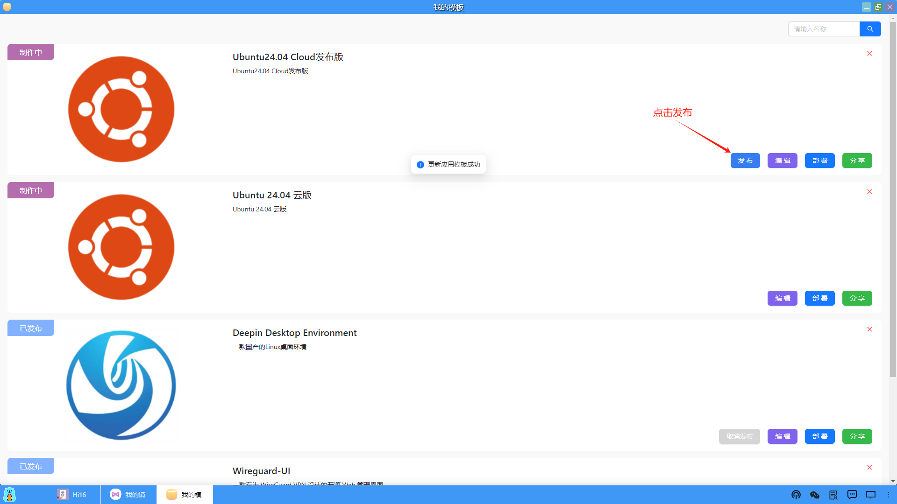

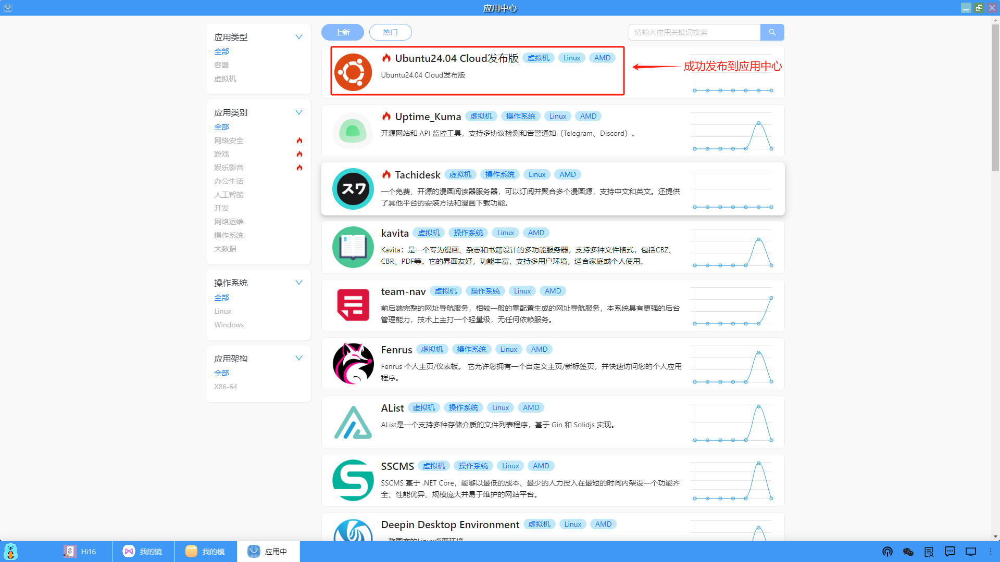

（7）接下来所有用户就可以使用这个应用模板来部署Ubuntu24.04这个应用了，过程和之前部署应用相同的。

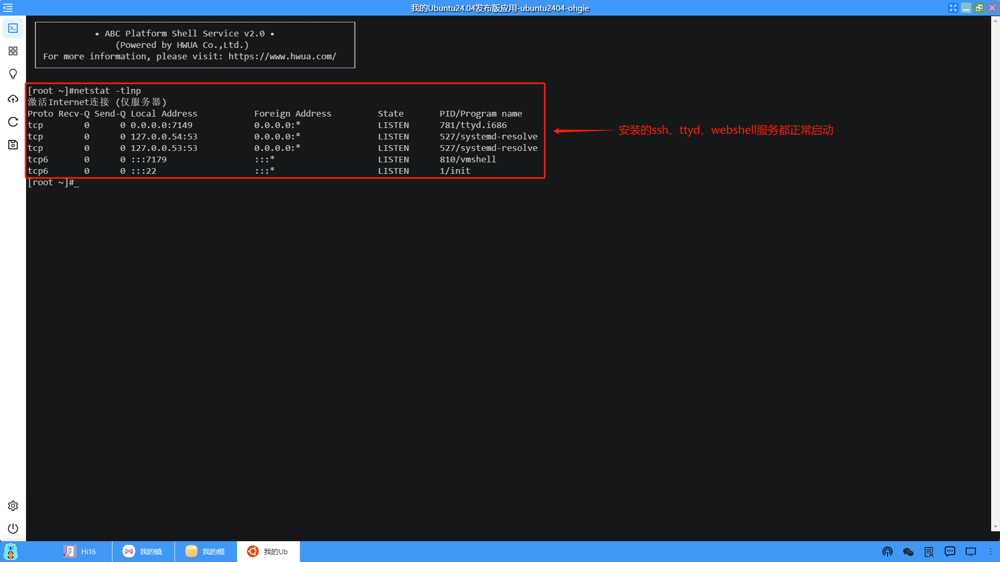

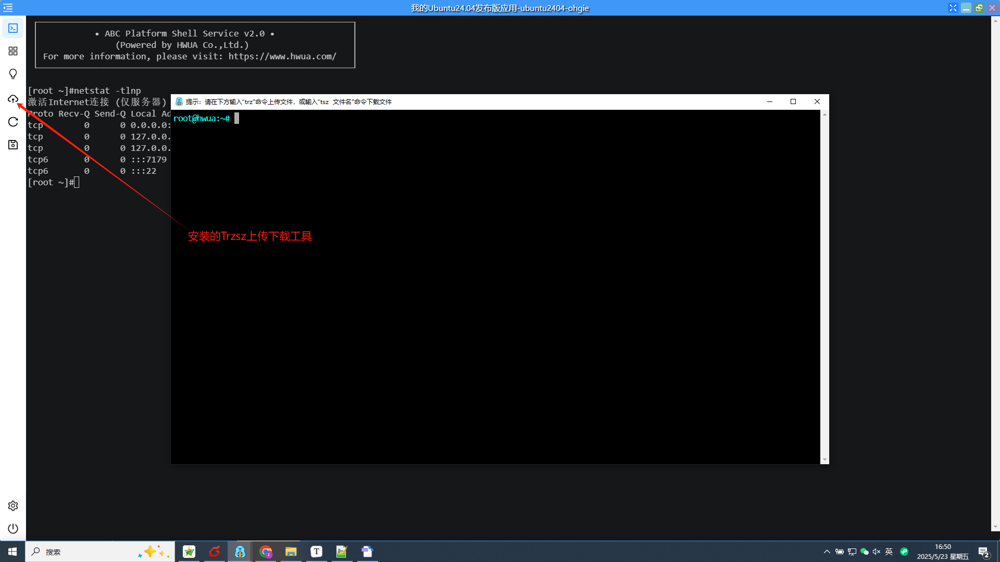