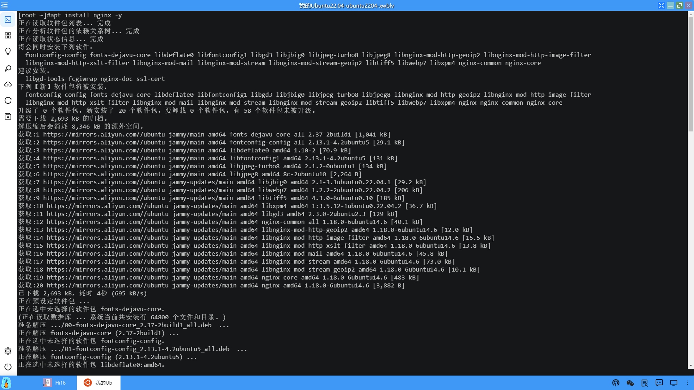
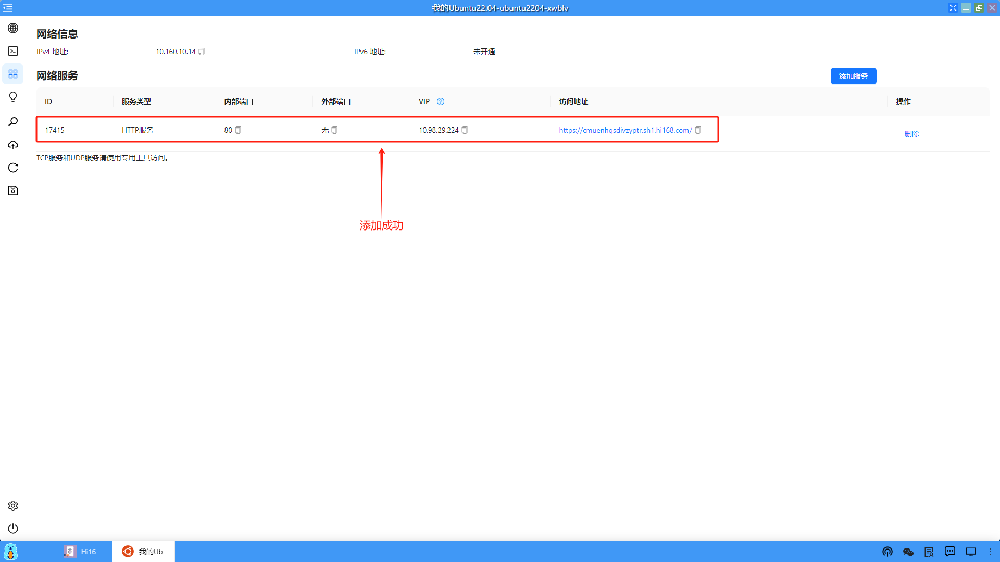

### 例子二：部署Ubuntu应用并安装Web服务
第二个例子，我们部署一个ubuntu的虚拟机应用，在ubuntu中安装一个web服务（如：Nginx），通过浏览器能够正常访问。同时开启服务端口，通过云端互联，本地可以直接访问Web服务。

#### 1、找到需要部署的应用模板（以Ubuntu22.04为例）
（1）从桌面端进入应用中心模块

（2）根据关键字搜索到对应的应用模板

#### 2、部署应用
（1）点击应用模板部署

（2）设置部署应用的名称和设置算力服务，点击“确认”开始部署

（3）部署应用后，切换到桌面，在桌面上就会创建一个应用的图标

<li>正在部署：</li>

<li>部署成功：</li>

（4）点击图标打开应用

（5）查看Ubuntu的版本

#### 3、安装Nginx
这里我们在Ubuntu22.04中安装一个Web服务，以Nginx为例。

（1）更新一下软件源

    apt update

（2）安装Nginx

    apt install nginx -y

（3）查看Nginx的运行状态
    
    systemctl status nginx

（4）设置开机自启动Nginx

    systemctl enable nginx

#### 4、访问Nginx Web服务页面
Nginx服务的默认Http服务端口是80，我们可以在服务端口中开放此端口，默认会打开一个浏览器页面，载入Nginx服务的页面。

（1）在服务端口中添加HTTP服务

 

 （2）打开Nginx的Web服务页面

 

（3）通过公网地址访问Nginx Web服务页面

