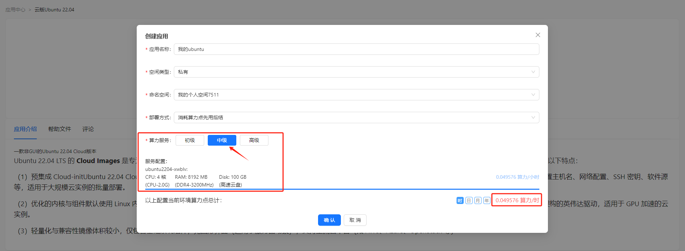

## 费用规则
#### 概述
Hi168平台是一个领先的AI算力基座和云计算平台，在此平台上用户可以进行人工智能、大数据、云计算、区块链、后端开发等所有和计算机相关的训练和实验，用户可以方便地在平台上创建各种虚拟机环境进行操作，和在本地计算机上的体验是完全一致的，为用户节省了大量计算机硬件配置方面的消耗，大大降低了算力的开销。下面我们来解释一下算力和计费的相关概念和规则。

#### 1、算力概念
计算机的算力（Computational Power）是指计算机系统在单位时间内处理数据、执行计算或完成任务的能力。它是衡量计算机性能的核心指标之一，直接影响系统的运算速度、处理复杂任务的效率以及支持的应用场景。
##### （1）算力的核心要素
###### 硬件基础：
<li>处理器（CPU/GPU/TPU等）：</li>
CPU（中央处理器）：通用计算，擅长逻辑控制和串行任务。 
GPU（图形处理器）：专为并行计算设计，适合图形渲染、深度学习等。 
TPU（张量处理器）：谷歌专为机器学习优化的芯片，加速矩阵运算。 
<li>核心数量与频率：核心数越多，并行处理能力越强；频率（GHz）越高，单核运算速度越快。</li>
<li>内存与带宽：高速内存（如DDR5、HBM）和带宽决定了数据吞吐效率，避免“算力瓶颈”。</li>
<li>硬盘（存储设备）：虽然不直接参与算力（计算能力）的核心运算，但在数据供给和数据保存时，其存储性能（IOPS、吞吐量、延迟等）对算力的发挥和整体系统性能有重要影响。</li>

###### 架构设计：
<li>指令集（如x86、ARM）：影响指令执行效率。</li>
<li>并行计算能力：如GPU的CUDA核心、CPU的多线程技术。</li>
<li>能效比：单位功耗下的性能表现（如每瓦特算力）。</li>

###### 软件优化：
<li>算法效率（如快速排序 vs 冒泡排序）。</li>
<li>并行编程框架（如OpenMP、MPI、CUDA）。</li>
<li>编译器优化（将代码转化为更高效的机器指令）。</li>

##### （2）算力的衡量指标
<li>FLOPS（Floating-Point Operations Per Second）：每秒浮点运算次数，常用于科学计算和AI领域。例如：1 TFLOPS = 每秒1万亿次浮点运算。</li>
<li>IPS（Instructions Per Second）：每秒执行指令数，适用于通用计算任务。</li>
<li>TOPS（Tera Operations Per Second）：专用于AI芯片的算力单位（如自动驾驶芯片）。</li>
<li>实际任务基准测试：如MLPerf（机器学习基准）、Geekbench（综合性能测试）。</li>

##### （3）算力的应用场景
<li>人工智能与深度学习：训练大规模神经网络（如GPT-4）需要千亿级算力（千PetaFLOPS）。</li>
<li>科学计算：气候模拟、核聚变研究依赖超算（如Frontier超算，1.1 ExaFLOPS）。</li>
<li>区块链与加密货币：比特币挖矿依赖哈希算力（Hash Rate），以TH/s（万亿次哈希每秒）衡量。</li>
<li>实时渲染与游戏：GPU算力决定图形渲染速度（如NVIDIA RTX 4090：83 TFLOPS）。</li>
<li>边缘计算：低功耗设备（如手机、物联网终端）的本地算力需求增长。</li>

#### 2、算力模板
用户在Hi168上部署应用时需要选择算力服务（初级、中级、高级），其服务配置包括CPU、内存和云盘的算力计算，这里根据不同的应用模板使用了不同的算力模板，算力模板中配置的硬件和算力计算也是不同的。下表是Hi168平台目前使用的各种算力模板，包括：模板名称、模板配置、硬件型号、硬件类型、硬件单位、算力值、算力单位和总算力等。

<table border='1'>
    <tr>
        <th>序号</th><th>模板名称</th><th>模板配置</th><th>硬件型号</th><th>硬件类型</th><th>硬件单位</th><th>算力值</th><th>算力单位</th><th>总算力</th><th>算力单位/计费周期</th>
    </tr>
    <tr>
        <td rowspan='3'>1</td><td rowspan='3'>AMD EYPC 9654 2.4GHz</td><td>AMD EYPC 9654 2.4GHz</td><td>AMD EPYC 9654 96-Core Genoa 2.4GHz</td><td>CPU</td><td>核</td><td>0.01000000</td><td>小时</td><td rowspan='3'>0.01005300</td><td rowspan='3'>小时</td>
    </tr>
    <tr>
        <td>DIMM DDR4</td><td>DIMM DDR4 Synchronous Registered (Buffered) 3200 MHz</td><td>RAM</td><td>MB</td><td>0.00000300</td><td>小时</td>
    </tr>
    <tr>
        <td>高速云盘</td><td>高速云盘</td><td>Disk</td><td>GB</td><td>0.00005000</td><td>小时</td>
    </tr>
    <tr>
        <td rowspan='3'>2</td><td rowspan='3'>CPU(2.0G)-DDR4(3200)-CPU(support_ensp=true)</td><td>CPU-2.0G</td><td>AMD EPYC 7702 64-Core Processor-2.0G</td><td>CPU</td><td>核</td><td>0.00500000</td><td>小时</td><td rowspan='3'>0.00505300</td><td rowspan='3'>小时</td>
    </tr>
    <tr>
        <td>DDR4-3200MHz</td><td>DIMM DDR4 Synchronous Registered (Buffered) 3200 MHz</td><td>RAM</td><td>MB</td><td>0.00000300</td><td>小时</td>
    </tr>
    <tr>
        <td>高速云盘</td><td>高速云盘</td><td>Disk</td><td>GB</td><td>0.00005000</td><td>小时</td>
    </tr>
    <tr>
        <td rowspan='3'>3</td><td rowspan='3'>CPU(2.0G)-DDR4(3200)</td><td>CPU-2.0G</td><td>AMD EPYC 7702 64-Core Processor-2.0G</td><td>CPU</td><td>核</td><td>0.00500000</td><td>小时</td><td rowspan='3'>0.00505300</td><td rowspan='3'>小时</td>
    </tr>
    <tr>
        <td>DDR4-3200MHz</td><td>DIMM DDR4 Synchronous Registered (Buffered) 3200 MHz</td><td>RAM</td><td>MB</td><td>0.00000300</td><td>小时</td>
    </tr>
    <tr>
        <td>高速云盘</td><td>高速云盘</td><td>Disk</td><td>GB</td><td>0.00005000</td><td>小时</td>
    </tr>
    <tr>
        <td rowspan='3'>4</td><td rowspan='3'>Intel CPU 2.5G</td><td>Intel CPU 2.5G</td><td>Intel Xeon Platinum 8175M 2.5G</td><td>CPU</td><td>核</td><td>0.01500000</td><td>小时</td><td rowspan='3'>0.01505300</td><td rowspan='3'>小时</td>
    </tr>
    <tr>
        <td>DIMM DDR4</td><td>DIMM DDR4 Synchronous Registered (Buffered) 3200 MHz</td><td>RAM</td><td>MB</td><td>0.00000300</td><td>小时</td>
    </tr>
    <tr>
        <td>高速云盘</td><td>高速云盘</td><td>Disk</td><td>GB</td><td>0.00005000</td><td>小时</td>
    </tr>
    <tr>
        <td rowspan='3'>5</td><td rowspan='3'>Tesla T4-DDR4 3200-8336C CPU</td><td>Intel(R) Xeon(R) Platinum 8336C CPU</td><td>Intel(R) Xeon(R) Platinum 8336C CPU @ 2.30GHz</td><td>CPU</td><td>核</td><td>0.00400000</td><td>小时</td><td rowspan='3'>0.10400150</td><td rowspan='3'>小时</td>
    </tr>
    <tr>
        <td>Tesla T4(nvidia.com/gpu.product)</td><td>Tesla T4</td><td>GPU</td><td></td><td>0.10000000</td><td>小时</td>
    </tr>
    <tr>
        <td>DDR4 3200 MHz</td><td>DIMM DDR4 Synchronous Registered (Buffered) 3200 MHz</td><td>RAM</td><td>MB</td><td>0.00000150</td><td>小时</td>
    </tr>
    <tr>
        <td rowspan='3'>6</td><td rowspan='3'>Intel XEON5</td><td>DDR5 4800</td><td>DDR5 4800</td><td>RAM</td><td>MT/s</td><td>0.30000000</td><td>小时</td><td rowspan='3'>1.80005000</td><td rowspan='3'>小时</td>
    </tr>
    <tr>
        <td>Intel XEON5</td><td>Intel XEON 8538C</td><td>CPU</td><td>G</td><td>1.50000000</td><td>小时</td>
    </tr>
    <tr>
        <td>高速云盘</td><td>高速云盘</td><td>Disk</td><td>GB</td><td>0.00005000</td><td>小时</td>
    </tr>
    <tr>
        <td rowspan='3'>7</td><td rowspan='3'>AMD EYPC 7C13</td><td>AMD EYPC 9654 2.4GHz</td><td>AMD EPYC 9654 96-Core Genoa 2.4GHz</td><td>CPU</td><td>核</td><td>0.01000000</td><td>小时</td><td rowspan='3'>0.01005300</td><td rowspan='3'>小时</td>
    </tr>
    <tr>
        <td>DIMM DDR4</td><td>DIMM DDR4 Synchronous Registered (Buffered) 3200 MHz</td><td>RAM</td><td>MB</td><td>0.00000300</td><td>小时</td>
    </tr>
    <tr>
        <td>高速云盘</td><td>高速云盘</td><td>Disk</td><td>GB</td><td>0.00005000</td><td>小时</td>
    </tr>
</table>

##### 注：上述表中的算力值核算成人民币为：1个算力值等于1元
这里以应用模板"云版Ubuntu 22.04"为例部署应用：

<li>CPU(CPU-2.0G): 4 核</li>
<li>RAM(DDR4-3200MHz): 8192 MB</li>
<li>Disk(高速云盘): 100 GB</li>

##### 每小时消耗算力：0.049576
##### 计算方式（小时）：
   <li>CPU算力：0.005算力/核/小时 X 4核 = 0.02算力/小时</li>
   <li>内存算力：0.000003算力/MB/小时 X 8192MB = 0.024576算力/小时</li>
   <li>云盘算力：0.00005算力/GB/小时 X 100GB = 0.005算力/小时</li>
   <li>总算力/小时：0.02 + 0.024576 + 0.005 = 0.049576算力/小时</li>

#### 3、算力扣费
<li>部署应用算力点扣减，根据不同规格执行不同的扣减标准，应用部署，按1个小时进行第一次扣费（上述计算方式）。</li>
<li>之后每小时按照部署时的算力点进行扣减（上述计算方式）。</li>
<li>部署停机后，按照上述表中应用占用的存储大小扣减。如：100G云盘，按0.00005算力/G/小时计算，每小时消耗存储算力：100G X 0.00005算力/G/小时 = 0.005算力/小时</li>
<li>应用模板的价格，后续根据实际情况会进行调整。</li>
<li>应用一旦部署，收费价格就不会改变。</li>

#### 4、免费算力
<li>新用户注册赠送20算力。</li>
<li>通过邀请码注册且通过实名认证再赠送20算力。</li>

#### 5、算力购买
<li>免费赠送的算力使用完毕后，可以充值购买算力，按1个算力/元计算。</li>
<li>用户可以在“费用中心”中查看自己的算力余额、算力消耗和算力订单。</li>
<li>用户在充值购买算力后，可能既包括免费算力，也包括充值算力，在使用过程中，默认先使用免费算力。</li>

#### 6、算力退款
<li>用户可以将充值算力退掉，根据充值订单和剩余算力余额来退费。</li>
<li>免费赠送的算力不能退费。</li>
<li>充值算力使用后，按取整进行退费。</li>

#### 7、退款规则
<li>按算力遗留的部分/订单充值算力*订单金额进行退款</li>
<li>举例1：订单 100元送20算力，等于算力充值120。消耗掉10个算力，110/120算力比X100元=退款金额</li>
<li>举例2：订单100元X9折券=算力充值100个，订单金额90元，消耗掉10个算力，10/100X90元=退款金额</li>
<li>如果核算应退款金额为999.23104323，退款金额为999.24元。</li>

