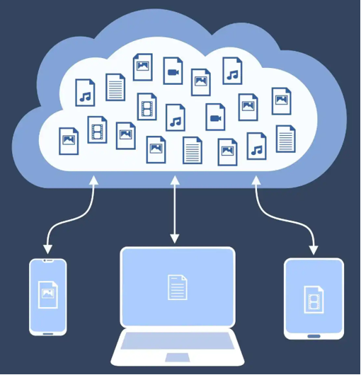
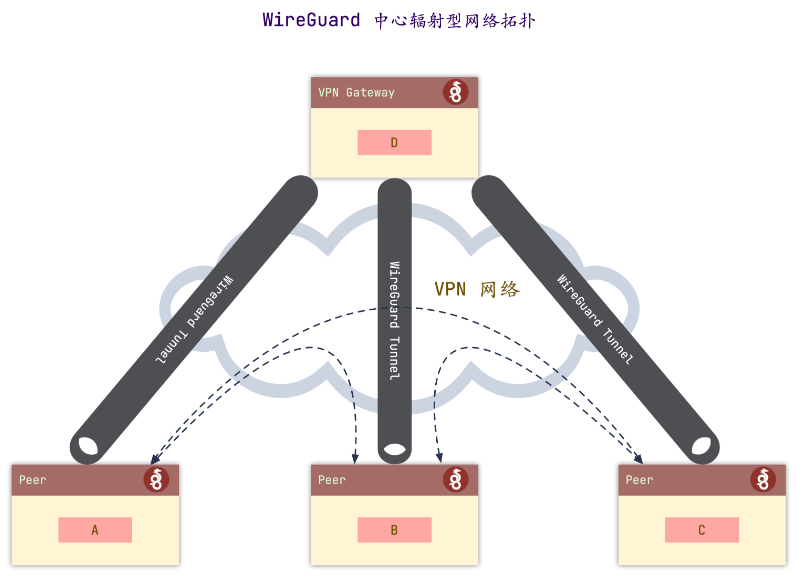
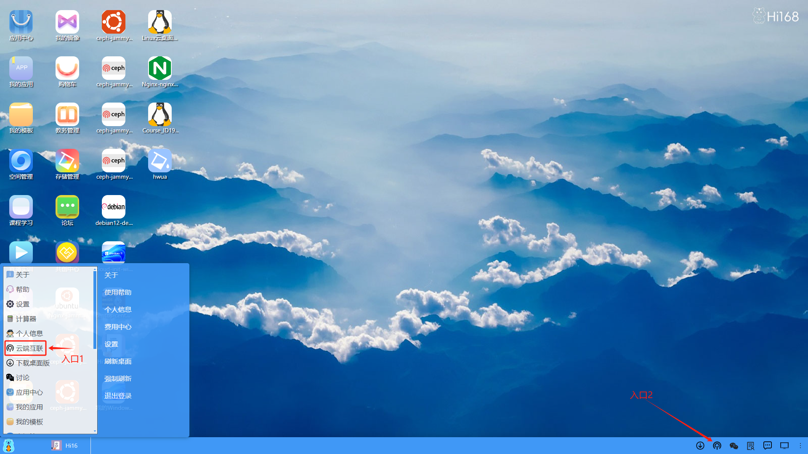

## 云端互联
#### 概述
深算工场为了让云端虚拟机和本地环境彻底打通，建立一个VPN虚拟通道，方便用户在本地可以通过SSH等工具直接连接上云端的虚拟机，省去本地安装虚拟机的繁琐过程，推出了云端互联这个重磅功能，特点包括：

**<li>本地与云端无缝集成</li>**

**<li>本地无需安装虚拟机</li>**

**<li>低配置使用高端集群</li>**

**<li>平替Vmware和Virtualbox</li>**

#### WireGuard介绍

使用云端互联需要WireGuard软件，可以帮助用户在本地和云端建立一个虚拟的VPN隧道。下面先来了解一下WireGuard。
‌WireGuard ‌ 是一个快速、现代且安全的虚拟私人网络（VPN）协议，旨在替代传统的 IPsec 和 OpenVPN 。它利用最先进的加密技术，提供比传统VPN更高的性能和更简单的配置。
WireGuard由 Jason A. Donenfeld 创建并维护。它最初是为 Linux 内核设计的，现已跨平台支持 Windows 、 MacOS 、 BSD 、 iOS 和 Android 等操作系统。WireGuard的核心代码仅四千多
行，被 Linux之父 Linus Torvalds 称为“艺术品”‌。主要特点如下：
<li>高性能‌：WireGuard使用极高速的加密原语，适用于需要高速连接的场景，如远程工作、游戏和视频会议等‌。</li>

<li>‌安全性‌：它采用先进的加密技术，如 ChaCha20 、 Poly1305 和 BLAKE2 ，确保数据传输的安全性‌。</li>

<li>‌易用性‌：配置简单，类似于交换SSH密钥的过程。用户只需交换公钥即可建立连接，无需管理连接或关注状态‌。</li>

<li>‌跨平台支持‌：可以在多种操作系统上运行，适用于不同的设备和场景‌。</li>

<li>‌轻便和高效‌：以UDP协议传输数据，资源占用小，适合嵌入式设备和移动设备‌。</li>

#### 两种进入云端互联的方式

