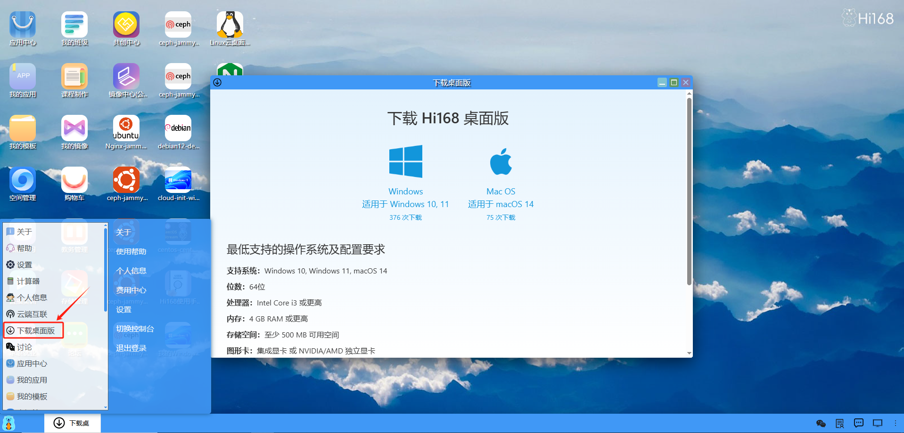

## 下载中心
#### 概述
Hi168下载中心提供了各种操作系统、开发、人工智能、大数据、办公生活、游戏、娱乐影音、网络安全、网络运维等镜像、软件工具、安装包和插件的下载。

<table border='0'>
    <tr><th>序号</th><th>分类</th><th>类型</th><th>名称</th></tr>
    <tr><td rowspan='37'>1</td><td rowspan='37'>操作系统</td><td rowspan='16'>Ubuntu</td><td>ubuntu-25.04-server-cloudimg-amd64.img</td></tr>
    <tr><td>ubuntu-25.04-live-server-amd64.iso</td></tr>
    <tr><td>ubuntu-25.04-desktop-amd64.iso</td></tr>
    <tr><td>ubuntu-24.10-server-cloudimg-amd64.img</td></tr>
    <tr><td>ubuntu-24.10-live-server-amd64.iso</td></tr>
    <tr><td>ubuntu-24.10-desktop-amd64.iso</td></tr>
    <tr><td>ubuntu-24.04-server-cloudimg-amd64.img</td></tr>
    <tr><td>ubuntu-24.04.2-live-server-amd64.iso</td></tr>
    <tr><td>ubuntu-24.04.2-desktop-amd64.iso</td></tr>
    <tr><td>ubuntu-22.04-server-cloudimg-amd64.img</td></tr>
    <tr><td>ubuntu-22.04.5-live-server-amd64.iso</td></tr>
    <tr><td>ubuntu-22.04.5-desktop-amd64.iso</td></tr>
    <tr><td>ubuntu-20.04-server-cloudimg-amd64.img</td></tr>
    <tr><td>ubuntu-20.04.6-live-server-amd64.iso</td></tr>
    <tr><td>ubuntu-18.04-server-cloudimg-amd64.img</td></tr>
    <tr><td>ubuntu-18.04.6-live-server-amd64.iso</td></tr>
    <tr><td rowspan='2'>Ubuntukylin</td><td>ubuntukylin-24.04-amd64.iso</td></tr>
    <tr><td>ubuntukylin-22.04-pro-amd64.iso</td></tr>
    <tr><td>Xubuntu</td><td>xubuntu-24.04.2-desktop-amd64.iso</td></tr>
    <tr><td rowspan='6'>Centos</td><td>CentOS-Stream-GenericCloud-x86_64-10-latest.x86_64.qcow2</td></tr>
    <tr><td>CentOS-Stream-10-latest-x86_64-dvd1.iso</td></tr>
    <tr><td>CentOS-Stream-GenericCloud-9-20250101.0.x86_64.qcow2</td></tr>
    <tr><td>CentOS-8.5.2111-x86_64-dvd1.iso</td></tr>
    <tr><td>CentOS-Stream-GenericCloud-8-20220913.0.x86_64.qcow2</td></tr>
    <tr><td>CentOS-7-x86_64-GenericCloud.qcow2</td></tr>
    <tr><td>Deepin</td><td>deepin-desktop-community-23.1-amd64.iso</td></tr>
    <tr><td>Rocky</td><td>Rocky-9-GenericCloud-Base-9.5-20241118.0.x86_64.qcow2</td></tr>
    <tr><td>OpenEuler</td><td>openEuler-25.03-x86_64-dvd.iso</td></tr>
    <tr><td>Kali</td><td>kali-linux-2025-W20-live-amd64.iso</td></tr>
    <tr><td>Fedora</td><td>Fedora-Cloud-Base-Generic-42-1.1.x86_64.qcow2</td></tr>
    <tr><td>Arch</td><td>Arch-Linux-x86_64-cloudimg.qcow2</td></tr>
    <tr><td>Alpine</td><td>nocloud_alpine-3.21.0-x86_64-uefi-cloudinit-metal-r0.qcow2</td></tr>
    <tr><td>OpenSUSE</td><td>openSUSE-Leap-15.6-DVD-x86_64-Current.iso</td></tr>
    <tr><td>Rhel</td><td>rhel-9.5-x86_64-boot.iso</td></tr>
    <tr><td>Debian</td><td>debian-12-nocloud-amd64.qcow2</td></tr>
    <tr><td>Windows11</td><td>hwua-win11-virtio.img</td></tr>
    <tr><td>WindowsServer2019</td><td>hwua-winserver2019-virtio.img</td></tr>
    <tr>
        <td>2</td><td>开发</td><td>Python</td><td>待更新</td>
    </tr>
    <tr>
        <td>3</td><td>人工智能</td><td>大模型</td><td>待更新</td>
    </tr>
    <tr>
        <td>4</td><td>大数据</td><td>Hadoop</td><td>待更新</td>
    </tr>
    <tr>
        <td>5</td><td>办公生活</td><td>办公软件</td><td>待更新</td>
    </tr>
</table>

## 下载 Hi168 桌面版
#### 概述
用户在使用Hi168平台时，既可以使用浏览器版的Hi168（https://www.hi168.com）, 并可以切换到桌面端风格使用。

除了浏览器版的Hi168，用户可以下载Hi168桌面版，直接安装在本地计算机上使用，无需再通过打开浏览器使用Hi168了，如下方式：
#### 下载入口一：

#### 下载入口二：

#### 安装运行：
安装成功后，在本地计算机桌面上生成一个图标，直接运行登录即可使用。

