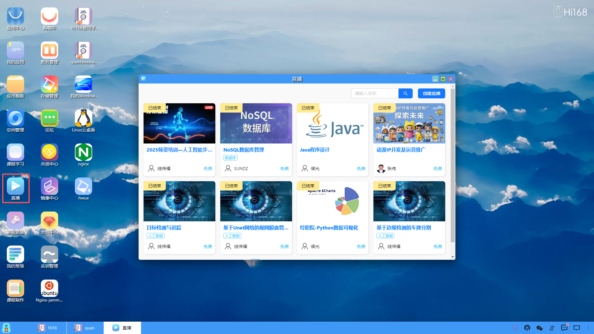

## 直播
#### 概述
深算工场的直播模块是为了帮助教育工作者更好地进行在线教学而开发的一项功能。
该模块支持实时在线直播。以下是该模块的主要特点：
高可靠性：支持多种设备接入，保证学生访问的稳定性和可靠性。
多种交互方式：支持语音、文字、图片、文件交互，在直播中学生和老师可以相互沟通。
灵活性：多种设置实现班级直播、组别直播等多种形式和方式，支持多个用户同时观看一场直播。
该模块的使用可以为老师提供更加丰富的教育教学手段，同时也可以为学生提供更加便捷、高效的在线学习体验。
