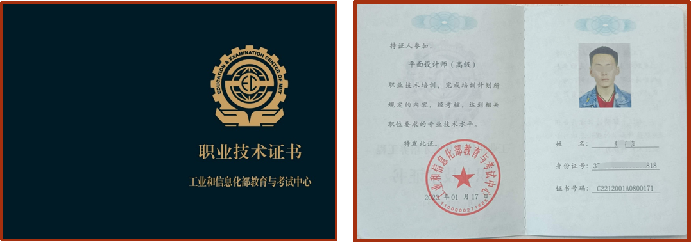

## 培训认证

#### 概述

国家工业和信息化部教育与考试中心，承担中国计算机技术与软件专业技术资格（水平）考试、 电子通信行业职业技能鉴定、 全国信息化人才培养工程等人才培养选拔工作。 
工业和信息化人才培养工程整合行业资源，研究产业政策、制定人才培养方案，形成人才评价标准。 
证书广泛应用于高校人才实践能力评价、人才求职就业专业证明、国家项目资质等方面，在国家数字化产业转型升级过程中发挥了积极的作用。
#### 证书优势
<li>水平能力学习证明</li>
<li>官网权威人才入库</li>
<li>求职拓岗机会倍增</li>
<li>国企岗位补贴晋升</li>
<li>重点项目必备资质</li>

Hi168平台提供了计算机软件、新一代信息技术和互联网应用三个方向的初级、中级、高级的证书培训和考证，如下：

#### 1、计算机软件证书
<li>Java系统开发工程师</li>
<li>Web前端开发工程师</li>
<li>大数据开发工程师</li>
<li>数据库管理师</li>

#### 2、新一代信息技术证书
<li>区块链开发工程师</li>
<li>人工智能应用师</li>
<li>大数据分析师</li>
<li>云运维工程师</li>
<li>智能系统开发工程师（Python）</li>

#### 3、互联网应用证书
<li>电子商务师</li>
<li>平面设计师</li>
<li>全媒体运营师</li>
<li>软件测试工程师</li>
<li>物联网开发工程师</li>

