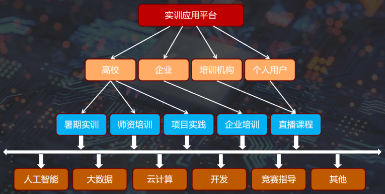

## 实训管理
#### 概述
深算工场实训应用平台是以私域方式提供给高校、企业、培训机构进行线上项目实训的平台，包括：实训管理、项目管理、班级管理、考勤管理、直播管理、课程管理、考试认证、项目评阅、算力管理、应用管理、存储管理、数据分析、签到中心、任务中心、数据中心等模块。

<li><b>私域化管理</b></li>实训应用平台以私域化方式提供高校、企业和培训机构使用，独立性和自主性更强。
<li><b>C2C/B2C模式</b></li>高校、企业、培训机构甚至个人都可以在平台上进行项目实训，不限制使用对象，更加灵活。
<li><b>项目个性化定制</b></li>实训的项目可以个性化定制，可以使用平台上已有的项目，也可以使用教师自己或定制的。
<li><b>流程配套齐全</b></li>深算工场为实训应用平台提供完整的服务流程和模块，打造一个实训、管理、数据的闭环。
<li><b>算力和存储支持</b></li>实训应用平台提供充足的CPU/GPU的算力支持，以及存储桶服务，为各类实训项目保驾护航。

